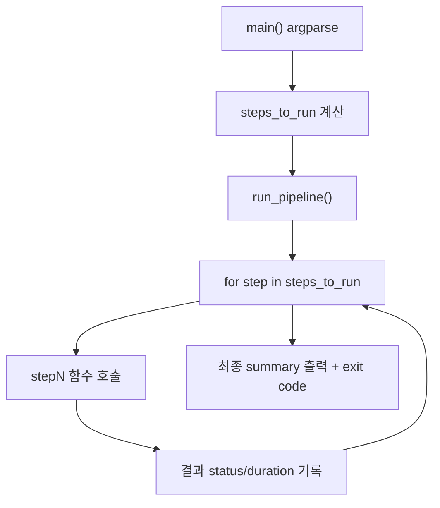

# 순차 실행 스크립트 + 코드 상세 레퍼런스

이 문서는 **“무슨 명령을 어떤 순서로 실행해야 하는지”**와  
각 스크립트가 내부 코드에서 **어떤 함수로 연결되는지**를 함께 설명합니다.  
실행 결과 기록 템플릿은 `/Users/jhj/Desktop/personal/fastcampus_agentops_class/Day3/project/docs/operations_runbook.md`를 사용하세요.

---

## 1. 먼저 결론: 실제 실행 순서

### 경로 A) 빠른 반복 (Human Review 생략)

1. Golden 생성
```bash
.venv/bin/python scripts/run_pipeline.py --from 1 --to 4 --skip-review --num-goldens 50
```
2. Golden 샘플링 평가
```bash
.venv/bin/python scripts/run_pipeline.py --step 5 \
  --categories rag custom \
  --eval-sample-ratio 0.3 \
  --eval-sample-size 80 \
  --eval-sample-seed 42 \
  --eval-stratify-by source_file
```
3. Langfuse 실패 샘플 추출
```bash
.venv/bin/python scripts/run_pipeline.py --step 6 \
  --lf-tags env:prod \
  --lf-hours 24 \
  --lf-limit 500 \
  --lf-sample-ratio 0.2 \
  --lf-sample-size 80 \
  --lf-sample-seed 42 \
  --lf-score-prefix eval \
  --lf-threshold 0.7
```
4. Prompt 개선
```bash
.venv/bin/python scripts/run_pipeline.py --step 8 \
  --opt-iters 2 \
  --opt-max-cases 6 \
  --opt-lf-failures data/eval_results/langfuse_failed_samples.json \
  --opt-lf-hints-max 6
```

### 경로 B) Human Review 포함

1. 합성 데이터 생성: `scripts/01_generate_synthetic.py`
2. 리뷰 CSV 내보내기: `scripts/02_export_for_review.py`
3. CSV 수동 리뷰(approved/feedback 작성)
4. 리뷰 반영 + 보강: `scripts/03_import_reviewed.py`
5. 이후 Step 5 → Step 6 → Step 8 순서 실행

---

## 2. 단일 엔트리포인트: `scripts/run_pipeline.py`

### 이 스크립트를 써야 하는 이유
- 단계 의존성을 이미 코드에 반영해둠
- Step별 옵션이 한 CLI에 모여 있어 재현성 높음
- 각 단계 결과/소요시간/실패 여부를 공통 포맷으로 출력

### 내부 실행 구조



핵심 코드 위치:
- CLI 파싱/옵션 정의: `/Users/jhj/Desktop/personal/fastcampus_agentops_class/Day3/project/scripts/run_pipeline.py`
- Step 함수 매핑(STEPS 레지스트리): 같은 파일
- 순차 실행 엔진(`run_pipeline`): 같은 파일

---

## 3. Step별 스크립트와 코드 연결

아래는 “스크립트 파일 → 실제 실행 함수” 매핑입니다.

### Step 1: `scripts/01_generate_synthetic.py`
- 엔트리: `main()`
- 핵심 호출: `generate_synthetic_dataset(...)`
- 구현 위치: `/Users/jhj/Desktop/personal/fastcampus_agentops_class/Day3/project/src/loop1_dataset/synthesizer.py`
- 입력: `data/corpus/*.md|*.txt`
- 출력: `data/synthetic/synthetic_dataset.json`

### Step 2: `scripts/02_export_for_review.py`
- 엔트리: `main()`
- 핵심 호출: `export_to_review_csv(...)`
- 구현 위치: `/Users/jhj/Desktop/personal/fastcampus_agentops_class/Day3/project/src/loop1_dataset/csv_exporter.py`
- 입력: `data/synthetic/synthetic_dataset.json`
- 출력: `data/review/review_dataset.csv`

### Step 3: `scripts/03_import_reviewed.py`
- 엔트리: `main()`
- 핵심 호출:
  - `import_reviewed_csv(...)`
  - `augment_with_feedback(...)` (옵션)
- 구현 위치:
  - `/Users/jhj/Desktop/personal/fastcampus_agentops_class/Day3/project/src/loop1_dataset/csv_importer.py`
  - `/Users/jhj/Desktop/personal/fastcampus_agentops_class/Day3/project/src/loop1_dataset/feedback_augmenter.py`
- 입력: 리뷰 완료 CSV
- 출력: `data/golden/golden_dataset.json`

### Step 4: `scripts/04_build_golden.py`
- 엔트리: `main()`
- 핵심 호출: `build_golden_dataset(...)`
- 구현 위치: `/Users/jhj/Desktop/personal/fastcampus_agentops_class/Day3/project/src/loop1_dataset/golden_builder.py`
- 역할: Step1~3 흐름을 오케스트레이션

### Step 5: `scripts/05_run_eval.py`
- 엔트리: `main()`
- 핵심 호출: `evaluate_golden_dataset(...)`
- 구현 위치: `/Users/jhj/Desktop/personal/fastcampus_agentops_class/Day3/project/src/loop2_evaluation/batch_evaluator.py`
- 샘플링 옵션:
  - `--sample-ratio`
  - `--sample-size`
  - `--sample-seed`
  - `--stratify-by`
- 출력: `data/eval_results/eval_results.json`

### Step 6: `scripts/06_batch_eval_langfuse.py`
- 엔트리: `main()`
- 기본 모드: `monitor_langfuse_scores(...)`
- 호환 모드: `batch_evaluate_langfuse(...)`
- 구현 위치: `/Users/jhj/Desktop/personal/fastcampus_agentops_class/Day3/project/src/loop2_evaluation/batch_evaluator.py`
- 입력: Langfuse trace + score
- 출력:
  - `data/eval_results/langfuse_monitoring_snapshot.json`
  - `data/eval_results/langfuse_failed_samples.json`

### Step 7: `scripts/07_run_remediation.py`
- 엔트리: `async _main()`
- 핵심 호출: `run_remediation(...)`
- 구현 위치: `/Users/jhj/Desktop/personal/fastcampus_agentops_class/Day3/project/src/loop3_remediation/remediation_agent.py`
- 출력: `data/eval_results/remediation_report.json`

### Step 8: `scripts/08_optimize_eval_prompts.py`
- 엔트리: `main()`
- 핵심 호출:
  - `optimize_all_prompts(...)`
  - `save_optimization_artifacts(...)`
  - `apply_best_prompts_to_file(...)` (`--apply`일 때)
- 구현 위치: `/Users/jhj/Desktop/personal/fastcampus_agentops_class/Day3/project/src/loop2_evaluation/prompt_optimizer.py`
- 출력:
  - `data/prompt_optimization/report.json`
  - `data/prompt_optimization/best_prompts.json`

---

## 4. Step 5/6/8만 별도로 돌리는 실무 루틴

Golden Dataset이 이미 존재한다고 가정하면 아래 3개만 주기적으로 실행합니다.

1) Step 5 (오프라인 샘플링 평가)
```bash
.venv/bin/python scripts/run_pipeline.py --step 5 \
  --categories rag custom \
  --eval-sample-ratio 0.3 \
  --eval-sample-size 80 \
  --eval-sample-seed 42 \
  --eval-stratify-by source_file
```

2) Step 6 (Langfuse 실패 샘플 추출)
```bash
.venv/bin/python scripts/run_pipeline.py --step 6 \
  --lf-tags env:prod \
  --lf-hours 24 \
  --lf-limit 500 \
  --lf-sample-ratio 0.2 \
  --lf-sample-size 80 \
  --lf-sample-seed 42 \
  --lf-score-prefix eval \
  --lf-threshold 0.7
```

3) Step 8 (개선)
```bash
.venv/bin/python scripts/run_pipeline.py --step 8 \
  --opt-iters 2 \
  --opt-max-cases 6 \
  --opt-lf-failures data/eval_results/langfuse_failed_samples.json \
  --opt-lf-hints-max 6
```

---

## 5. 실패 판정 기준을 코드 관점에서 이해하기

### Step 5 실패
- 결과 JSON의 각 항목에서 `passed=False`
- 현재 구현은 “실행된 메트릭이 있고, 모든 score가 0.5 이상”이면 통과
- 필수 입력 부족 메트릭은 `skipped_metrics`로 제외

### Step 6 실패
- `eval.*`(또는 지정 prefix) 점수 < threshold 인 메트릭이 1개 이상이면 실패 trace
- 실패 trace는 `langfuse_failed_samples.json`에 저장되어 Step 8 힌트 입력으로 사용

---

## 6. 실행 전/후 체크리스트

실행 전:
```bash
.venv/bin/python scripts/run_pipeline.py --help
.venv/bin/python scripts/05_run_eval.py --help
```

실행 후 확인 파일:
- `data/golden/golden_dataset.json`
- `data/eval_results/eval_results.json`
- `data/eval_results/langfuse_failed_samples.json`
- `data/prompt_optimization/report.json`

---

## 7. 권장 운영 원칙 (요약)

1. 데이터 변경 후 Step 5
2. 운영 이슈 발생 시 Step 6
3. 실패 샘플 누적 후 Step 8
4. 최종 반영(`--apply`) 전에는 결과 JSON 먼저 검토
