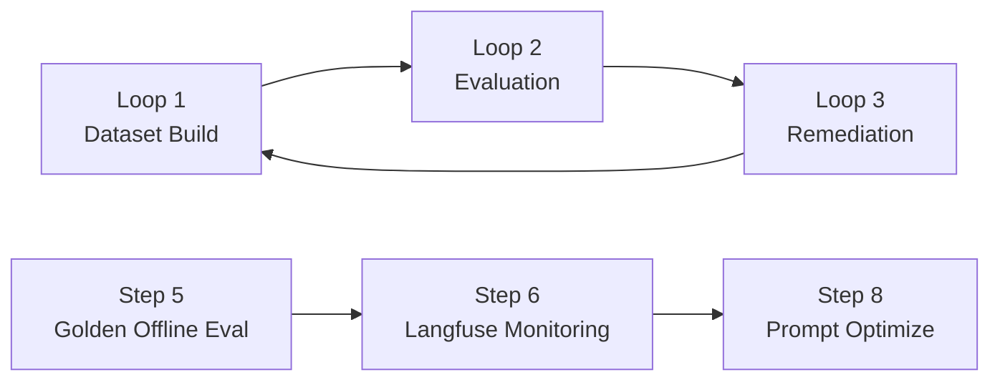

# Day3 AgentOps 실행 큰 그림 가이드

이 프로젝트는 **Dataset → Evaluation → Improve** 폐쇄 루프를 실행하는 실습 코드입니다.  
핵심 원칙은 다음과 같습니다.

- **관측/샘플링/실패 추출**: Langfuse 중심
- **평가 프롬프트 개선**: DeepEval 중심
- **최종 반영 전 검증**: 샘플링 평가 + 필요 시 전체 평가

---

## 1) 전체 구조 (Loop 관점)



- **Loop 1 (Step 1~4)**: Golden Dataset 생성/리뷰/확정
- **Loop 2 (Step 5,6,8)**: 오프라인 평가 + Langfuse 모니터링 + 프롬프트 최적화
- **Loop 3 (Step 7)**: 실패 패턴 기반 개선안 도출

---

## 2) 사전 준비

### 환경 설치

```bash
cd /Users/jhj/Desktop/personal/fastcampus_agentops_class/Day3/project
python3.13 -m venv .venv
.venv/bin/pip install -U pip
.venv/bin/pip install -e .
```

### 환경변수 설정

```bash
cp .env.example .env
```

`.env` 필수/핵심 값:
- `OPENROUTER_API_KEY`
- `OPENROUTER_MODEL_NAME`
- `LANGFUSE_HOST`, `LANGFUSE_PUBLIC_KEY`, `LANGFUSE_SECRET_KEY` (Step 6 운영 시)

---

## 3) 실제 실행 경로 (운영 시나리오별)

### A. Golden Dataset 준비 (Loop 1)

```bash
# 1~4단계 한번에 (리뷰 생략)
.venv/bin/python scripts/run_pipeline.py --from 1 --to 4 --skip-review --num-goldens 50
```

리뷰를 포함하려면:
1. `Step 2`에서 생성된 CSV 리뷰
2. `Step 3` 재실행으로 반영

---

### B. Golden 기반 오프라인 평가 (Step 5)

```bash
.venv/bin/python scripts/run_pipeline.py --step 5 \
  --categories rag custom \
  --eval-sample-ratio 0.3 \
  --eval-sample-size 80 \
  --eval-sample-seed 42 \
  --eval-stratify-by source_file
```

의미:
- `--eval-sample-ratio`: 평가 비율
- `--eval-sample-size`: 최대 샘플 수 상한
- `--eval-sample-seed`: 재현 가능한 샘플링
- `--eval-stratify-by`: 층화 기준(기본 `source_file`)

---

### C. Langfuse 모니터링 스냅샷/실패 추출 (Step 6)

```bash
.venv/bin/python scripts/run_pipeline.py --step 6 \
  --lf-tags env:prod \
  --lf-hours 24 \
  --lf-limit 500 \
  --lf-sample-ratio 0.2 \
  --lf-sample-size 80 \
  --lf-sample-seed 42 \
  --lf-score-prefix eval \
  --lf-threshold 0.7
```

Step 6은 DeepEval 호출 없이 Langfuse score만 집계합니다.

---

### D. 프롬프트 개선 (Step 8)

```bash
.venv/bin/python scripts/run_pipeline.py --step 8 \
  --opt-iters 2 \
  --opt-max-cases 6 \
  --opt-lf-failures data/eval_results/langfuse_failed_samples.json \
  --opt-lf-hints-max 6
```

필요하면 `--opt-apply`로 `src/loop2_evaluation/prompts.py`에 반영합니다.

---

### E. 전체 파이프라인 실행

```bash
.venv/bin/python scripts/run_pipeline.py --all --skip-review --continue-on-error
```

---

## 4) “실패” 판정 기준

### Step 5 (Golden Offline Eval)
- 결과 항목의 `passed=False`를 실패로 판단
- 현재 구현 기준: **실행된 모든 메트릭 점수 >= 0.5**일 때만 통과
- 필수 입력 부족 메트릭은 `skipped_metrics`로 분리

### Step 6 (Langfuse Monitoring)
- `eval.*`(또는 지정 prefix) score가 threshold 미만이면 실패 샘플
- 실패 샘플은 `data/eval_results/langfuse_failed_samples.json`에 저장

---

## 5) 랜덤 샘플링을 “언제” 실행할지 (스케줄러 없이)

현재는 수동/이벤트 기반 트리거를 권장합니다.

1. **Golden 변경 직후**: Step 5 샘플링 평가
2. **프롬프트/체인 수정 직후**: Step 5 동일 seed로 전/후 비교
3. **운영 이슈 발생 시**: Step 6으로 최근 N시간 실패 샘플 추출
4. **릴리즈 직전**: Step 5 전체 평가(또는 고비율)

---

## 6) 결과물(아티팩트) 맵

- Golden Dataset: `data/golden/golden_dataset.json`
- Offline Eval 결과: `data/eval_results/eval_results.json`
- Langfuse 모니터링 스냅샷: `data/eval_results/langfuse_monitoring_snapshot.json`
- Langfuse 실패 샘플: `data/eval_results/langfuse_failed_samples.json`
- Prompt 최적화 리포트: `data/prompt_optimization/report.json`
- 최적 프롬프트: `data/prompt_optimization/best_prompts.json`

---

## 7) 비용 없는(LLM 호출 없는) 사전 점검
```bash
.venv/bin/python scripts/run_pipeline.py --help
.venv/bin/python scripts/05_run_eval.py --help
.venv/bin/pytest tests/test_golden_sampling.py tests/test_langfuse_sampling.py tests/test_prompt_optimizer.py tests/test_custom_metrics.py -q
.venv/bin/python -m compileall src scripts tests
```
