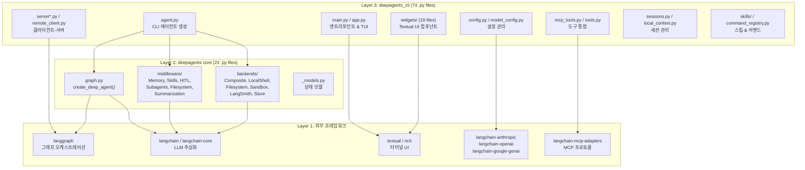

# 00. DeepAgents CLI 프로젝트 구조 개요

> **분석 대상**: langchain-ai/deepagents@26647a346cd3c71ca223ad2dc17db812f7203b0f
> **CLI 버전**: deepagents-cli v0.0.34 | **Core 버전**: deepagents v0.5.0a4 (HEAD), v0.4.11 (published pin)
> **분석일**: 2026-04-04
> **관련 문서**: [01-엔트리포인트](./01-엔트리포인트-앱-라이프사이클.md) | [02a-에이전트-미들웨어](./02a-에이전트-그래프-미들웨어.md)

---

## 1. 프로젝트 개요

**DeepAgents**는 LangChain AI가 개발한 오픈소스 AI 에이전트 프레임워크로, LangGraph 기반의 프로덕션급 코딩 에이전트를 제공합니다. CLI 도구(`deepagents-cli`)는 이 프레임워크 위에 구축된 터미널 기반 대화형 AI 코딩 어시스턴트입니다.

- **라이선스**: MIT
- **Python 요구사항**: >=3.11, <4.0
- **빌드 시스템**: CLI는 `hatchling`, Core는 `setuptools`
- **패키지 관리**: `uv`

---

## 2. Monorepo 구조

```
deepagents/                          # 루트
├── libs/
│   ├── cli/                         # ★ deepagents-cli (분석 주 대상)
│   │   ├── deepagents_cli/          # 74개 .py 소스 파일
│   │   ├── tests/                   # ~80개 테스트 파일
│   │   ├── examples/skills/         # 스킬 예제
│   │   ├── scripts/                 # 설치/유틸 스크립트
│   │   ├── pyproject.toml           # CLI 패키지 설정
│   │   └── Makefile                 # 빌드 자동화
│   │
│   ├── deepagents/                  # ★ deepagents core (분석 보조 대상)
│   │   ├── deepagents/              # 23개 .py 소스 파일
│   │   │   ├── graph.py             # 에이전트 그래프 생성
│   │   │   ├── backends/            # 실행 백엔드 (9개 파일)
│   │   │   └── middleware/          # 미들웨어 체인 (8개 파일)
│   │   └── pyproject.toml
│   │
│   ├── acp/                         # Agent Communication Protocol (범위 밖)
│   ├── evals/                       # 평가 프레임워크 (범위 밖)
│   └── partners/                    # 파트너 통합 (범위 밖)
│       ├── daytona/
│       ├── modal/
│       └── runloop/
```

---

## 3. CLI-Core 의존성 경계 (3-Layer Architecture)



### 핵심 의존 관계 요약

| CLI 모듈 | Core 의존 | 외부 프레임워크 의존 |
|----------|----------|-------------------|
| `agent.py` | `graph.py`, `middleware/*`, `backends/*` | `langgraph`, `langchain` |
| `app.py` | — | `textual`, `rich` |
| `config.py` | — | `langchain-*` (providers) |
| `mcp_tools.py` | — | `langchain-mcp-adapters` |
| `server*.py` | — | `langgraph-sdk`, `langgraph-cli` |
| `sessions.py` | — | `langgraph-checkpoint-sqlite` |

---

## 4. CLI 패키지 파일 분류

### 4.1 Core Application (6개 파일)

| 파일 | 크기 | 역할 |
|------|------|------|
| `main.py` | ~59KB | CLI 엔트리포인트, argparse, 모드 분기 |
| `app.py` | ~198KB | Textual App 클래스, 라이프사이클, 메시지 파이프라인 |
| `agent.py` | ~46KB | 에이전트 생성, 미들웨어 조립, 시스템 프롬프트 |
| `non_interactive.py` | ~34KB | 비대화형/헤드리스 실행 모드 |
| `input.py` | ~24KB | 입력 파싱, 파일 멘션, 미디어 추적 |
| `textual_adapter.py` | ~59KB | LangGraph ↔ Textual 브리지, 스트리밍 |

### 4.2 Configuration (7개 파일)

| 파일 | 크기 | 역할 |
|------|------|------|
| `config.py` | ~84KB | Settings, SessionState, ModelResult 클래스 |
| `model_config.py` | ~57KB | 모델 스펙, 프로파일, 프로바이더 해결 |
| `configurable_model.py` | ~6KB | 설정 가능 모델 추상화 |
| `_server_config.py` | ~13KB | 서버 설정 |
| `_env_vars.py` | 소형 | 환경 변수 핸들링 |
| `_cli_context.py` | ~1KB | CLI 컨텍스트 유틸리티 |
| `_testing_models.py` | ~6KB | 테스트용 모델 설정 |

### 4.3 UI & Widgets (22개 파일)

| 파일 | 크기 | 역할 |
|------|------|------|
| `ui.py` | ~17KB | 도움말 화면 로직 |
| `theme.py` | ~28KB | 브랜드 색상, 테마 관리 |
| `app.tcss` | — | Textual CSS 스타일시트 |
| **widgets/** (19개) | | |
| ├ `chat_input.py` | ~68KB | 채팅 입력 위젯 |
| ├ `thread_selector.py` | ~66KB | 대화 스레드 브라우저 |
| ├ `messages.py` | ~61KB | 메시지 렌더링/표시 |
| ├ `model_selector.py` | ~35KB | 모델 선택기 |
| ├ `autocomplete.py` | ~23KB | 자동완성 제안 |
| ├ `message_store.py` | ~22KB | 메시지 저장 백엔드 |
| ├ `approval.py` | ~17KB | HITL 승인 UI |
| ├ `ask_user.py` | ~15KB | 사용자 질의 위젯 |
| ├ `status.py` | ~12KB | 상태 바 |
| ├ `welcome.py` | ~12KB | 환영 화면 |
| ├ `mcp_viewer.py` | ~11KB | MCP 서버 뷰어 |
| ├ `tool_widgets.py` | ~9KB | 도구 실행 위젯 |
| ├ `diff.py` | ~7KB | 차이점 표시 |
| ├ `history.py` | ~6KB | 대화 히스토리 |
| ├ `loading.py` | ~5KB | 로딩 인디케이터 |
| ├ `theme_selector.py` | ~5KB | 테마 선택기 |
| ├ `tool_renderers.py` | ~4KB | 도구 호출 시각화 |
| └ `_links.py` | 소형 | 링크 유틸리티 |

### 4.4 Tools & MCP (5개 파일)

| 파일 | 크기 | 역할 |
|------|------|------|
| `tools.py` | ~6KB | 웹 검색(`web_search`), URL fetch |
| `mcp_tools.py` | ~25KB | MCP 서버 로딩, 자동 검색, 세션 관리 |
| `mcp_trust.py` | ~5KB | MCP 신뢰/보안 모델 |
| `tool_display.py` | ~11KB | 도구 렌더링 및 표시 |
| `ask_user.py` | ~11KB | AskUser HITL 미들웨어 |

### 4.5 Session & Server (8개 파일)

| 파일 | 크기 | 역할 |
|------|------|------|
| `sessions.py` | ~41KB | 스레드/세션 관리, LangGraph 체크포인트 |
| `local_context.py` | ~24KB | 로컬 컨텍스트 관리 |
| `server.py` | ~16KB | 서버 인프라 |
| `server_manager.py` | ~12KB | 서버 라이프사이클, 워크스페이스 스캐폴딩 |
| `server_graph.py` | ~7KB | LangGraph dev 서버 엔트리포인트 |
| `remote_client.py` | ~17KB | RemoteAgent HTTP+SSE 클라이언트 |
| `token_state.py` | ~1KB | 토큰 사용량 추적 |
| `_session_stats.py` | ~4KB | 세션 통계 |

### 4.6 Commands & Skills (5개 파일)

| 파일 | 크기 | 역할 |
|------|------|------|
| `command_registry.py` | ~9KB | 슬래시 커맨드 레지스트리 (20개 커맨드) |
| `skills/commands.py` | ~37KB | 커맨드 기반 스킬 구현 |
| `skills/load.py` | ~7KB | 스킬 디스커버리 & 로딩 |
| `subagents.py` | ~5KB | 서브에이전트 로더 (YAML frontmatter) |
| `offload.py` | ~13KB | 작업 오프로드 |

### 4.7 File Operations & Utilities (10개 파일)

| 파일 | 크기 | 역할 |
|------|------|------|
| `file_ops.py` | ~17KB | 파일 작업 추적, HITL 미리보기 |
| `clipboard.py` | ~4KB | 클립보드 (pyperclip, OSC 52) |
| `editor.py` | ~4KB | 외부 에디터 통합 |
| `media_utils.py` | ~15KB | 미디어 처리 |
| `unicode_security.py` | ~16KB | 유니코드 보안 검사 |
| `hooks.py` | ~7KB | 훅 디스패치 시스템 |
| `project_utils.py` | ~6KB | 프로젝트 탐지 (git root) |
| `update_check.py` | ~15KB | 버전 업데이트 확인 |
| `output.py` | ~2KB | JSON 출력 헬퍼 |
| `formatting.py` | ~1KB | 텍스트 포맷팅 (시간 표시 등) |

### 4.8 Integrations (3개 파일)

| 파일 | 크기 | 역할 |
|------|------|------|
| `integrations/sandbox_factory.py` | ~30KB | 7+ 샌드박스 백엔드 팩토리 |
| `integrations/sandbox_provider.py` | ~2KB | 샌드박스 프로바이더 인터페이스 |
| `integrations/__init__.py` | 소형 | 패키지 초기화 |

### 4.9 패키지 메타 (4개 파일)

| 파일 | 역할 |
|------|------|
| `__init__.py` | Lazy loading으로 `cli_main` 제공 |
| `__main__.py` | `python -m deepagents_cli` 진입점 |
| `_version.py` | 버전 정보 |
| `_ask_user_types.py` | AskUser 타입 정의 |

---

## 5. Core 패키지 구조 (23개 파일)

### 5.1 그래프 (루트)

| 파일 | 역할 |
|------|------|
| `graph.py` | `create_deep_agent()` — LangGraph `CompiledStateGraph` 생성의 핵심 |
| `_models.py` | 에이전트 상태 모델 정의 |
| `_version.py` | 버전 정보 (`0.5.0a4`) |

### 5.2 Middleware (8개 파일)

| 파일 | 역할 |
|------|------|
| `__init__.py` | 미들웨어 패키지 |
| `_utils.py` | 미들웨어 유틸리티 |
| `memory.py` | `MemoryMiddleware` — 대화 메모리 관리 |
| `skills.py` | `SkillsMiddleware` — 스킬 시스템 미들웨어 |
| `subagents.py` | `SubAgentMiddleware`, `CompiledSubAgent` — 서브에이전트 |
| `async_subagents.py` | `AsyncSubAgentMiddleware` — 비동기 서브에이전트 |
| `filesystem.py` | `FilesystemMiddleware` — 파일시스템 작업 |
| `summarization.py` | 대화 요약 미들웨어 |
| `patch_tool_calls.py` | 도구 호출 패치 |

### 5.3 Backends (9개 파일)

| 파일 | 역할 |
|------|------|
| `__init__.py` | 백엔드 패키지, 주요 클래스 export |
| `protocol.py` | `SandboxBackendProtocol` — 백엔드 프로토콜 정의 |
| `composite.py` | `CompositeBackend` — 여러 백엔드 합성 |
| `local_shell.py` | `LocalShellBackend` — 로컬 셸 실행 |
| `filesystem.py` | `FilesystemBackend` — 파일시스템 작업 |
| `sandbox.py` | 샌드박스 백엔드 |
| `langsmith.py` | LangSmith 샌드박스 통합 |
| `state.py` | 백엔드 상태 관리 |
| `store.py` | 백엔드 스토어 |
| `utils.py` | 백엔드 유틸리티 |

---

## 6. 의존성 분석

### 6.1 핵심 의존성 (Framework)

| 패키지 | 버전 | 역할 |
|--------|------|------|
| `deepagents` | ==0.4.11 (pin), 0.5.0a4 (HEAD) | Core 에이전트 프레임워크 |
| `langchain` | >=1.2.13 | LLM 추상화 레이어 |
| `langgraph` | >=1.1.2 | 그래프 기반 에이전트 오케스트레이션 |
| `langgraph-checkpoint-sqlite` | >=3.0.0 | 세션 영속성 (SQLite) |

### 6.2 클라이언트-서버 아키텍처

| 패키지 | 역할 |
|--------|------|
| `langgraph-sdk` | LangGraph 원격 그래프 클라이언트 |
| `langgraph-cli[inmem]` | 로컬 dev 서버 (인메모리 모드) |
| `httpx` | 비동기 HTTP 클라이언트 |

### 6.3 모델 프로바이더 (3 기본 + 18 선택)

**기본 탑재:** `langchain-anthropic`, `langchain-openai`, `langchain-google-genai`

**선택적:** Cohere, Groq, Ollama, Mistral, DeepSeek, Fireworks, Bedrock, HuggingFace, IBM, LiteLLM, NVIDIA, OpenRouter, Perplexity, VertexAI, xAI, Baseten

### 6.4 UI/터미널

| 패키지 | 역할 |
|--------|------|
| `textual` (>=8.0) | 리치 터미널 UI 프레임워크 |
| `rich` (>=14.0) | 터미널 포맷팅 |
| `prompt-toolkit` | 대화형 입력 처리 |
| `markdownify` | HTML → Markdown 변환 |

### 6.5 도구 & 통합

| 패키지 | 역할 |
|--------|------|
| `tavily-python` | 웹 검색 API |
| `langchain-mcp-adapters` | MCP 프로토콜 통합 |
| `deepagents-acp` | Agent Communication Protocol |
| `langsmith[sandbox]` | LangSmith 샌드박스 |

### 6.6 유틸리티

| 패키지 | 역할 |
|--------|------|
| `pyperclip` | 클립보드 |
| `pillow` | 이미지 처리 |
| `pyyaml` | YAML 파싱 |
| `python-dotenv` | .env 파일 로딩 |
| `aiosqlite` | 비동기 SQLite |
| `tomli-w` | TOML 쓰기 |

---

## 7. 엔트리포인트

```python
# pyproject.toml
[project.scripts]
deepagents = "deepagents_cli:cli_main"
deepagents-cli = "deepagents_cli:cli_main"
```

```python
# __init__.py — Lazy Loading 패턴
def __getattr__(name: str) -> Callable[[], None]:
    if name == "cli_main":
        from deepagents_cli.main import cli_main  # 지연 임포트
        return cli_main
    raise AttributeError(...)
```

`cli_main`은 `main.py`에서 실제로 정의되며, `__init__.py`에서는 `__getattr__`을 통해 lazy loading합니다. 이를 통해 `import deepagents_cli`만으로는 무거운 `main.py`가 로딩되지 않습니다.

---

## 8. 분석 범위

### In Scope ✅

| 패키지 | 경로 | 파일 수 |
|--------|------|---------|
| CLI | `libs/cli/deepagents_cli/` | 74개 .py |
| Core | `libs/deepagents/deepagents/` | 23개 .py |
| **총계** | | **97개 .py** |

### Out of Scope ❌

| 패키지 | 사유 |
|--------|------|
| `libs/acp/` | Agent Communication Protocol — CLI 핵심과 별개 |
| `libs/evals/` | 평가 프레임워크 — CLI 동작과 무관 |
| `libs/partners/` | 파트너 샌드박스 — sandbox_factory에서 참조만 |
| 테스트 (~80개) | 06번 종합 문서에서 패턴만 참조 |

---

## 9. 핵심 아키텍처 패턴 미리보기

본 문서에서는 개요만 제시하며, 각 패턴의 상세 분석은 후속 문서에서 다룹니다.

| # | 패턴 | 핵심 위치 | 상세 분석 |
|---|------|----------|----------|
| 1 | Lazy Loading | `__init__.py`, `main.py` | [01번](./01-엔트리포인트-앱-라이프사이클.md) |
| 2 | Async/Await | 전체 | [01번](./01-엔트리포인트-앱-라이프사이클.md) |
| 3 | Message Queue Pipeline | `app.py` | [01번](./01-엔트리포인트-앱-라이프사이클.md) |
| 4 | LangGraph Agent Orchestration | `agent.py`, `[core] graph.py` | [02a번](./02a-에이전트-그래프-미들웨어.md) |
| 5 | Middleware Chain | `agent.py`, `[core] middleware/` | [02a번](./02a-에이전트-그래프-미들웨어.md) |
| 6 | HITL Approval | `ask_user.py`, `approval.py` | [02b번](./02b-도구-MCP-백엔드.md) |
| 7 | MCP Tool Integration | `mcp_tools.py`, `mcp_trust.py` | [02b번](./02b-도구-MCP-백엔드.md) |
| 8 | Client-Server (HTTP+SSE) | `server*.py`, `remote_client.py` | [05번](./05-인프라-세션-서버.md) |

---

*다음 문서: [01-엔트리포인트-앱-라이프사이클](./01-엔트리포인트-앱-라이프사이클.md)*
