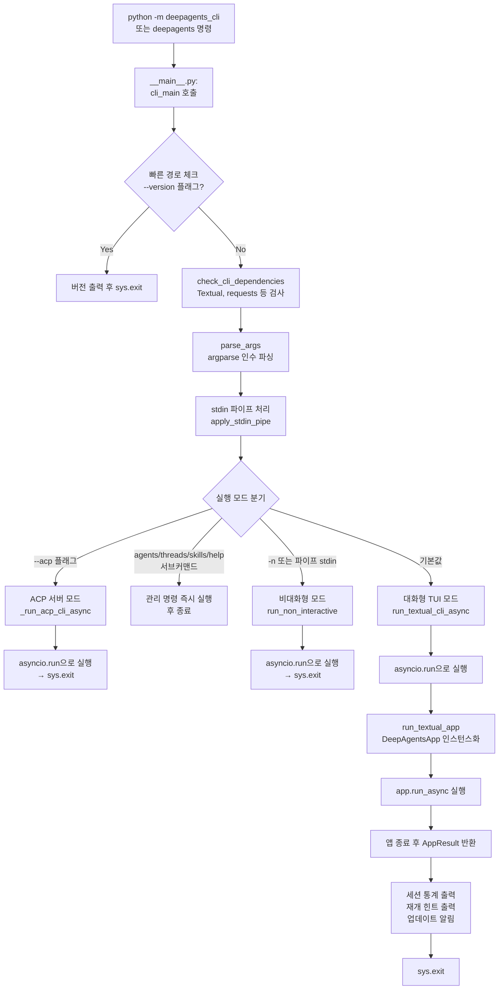
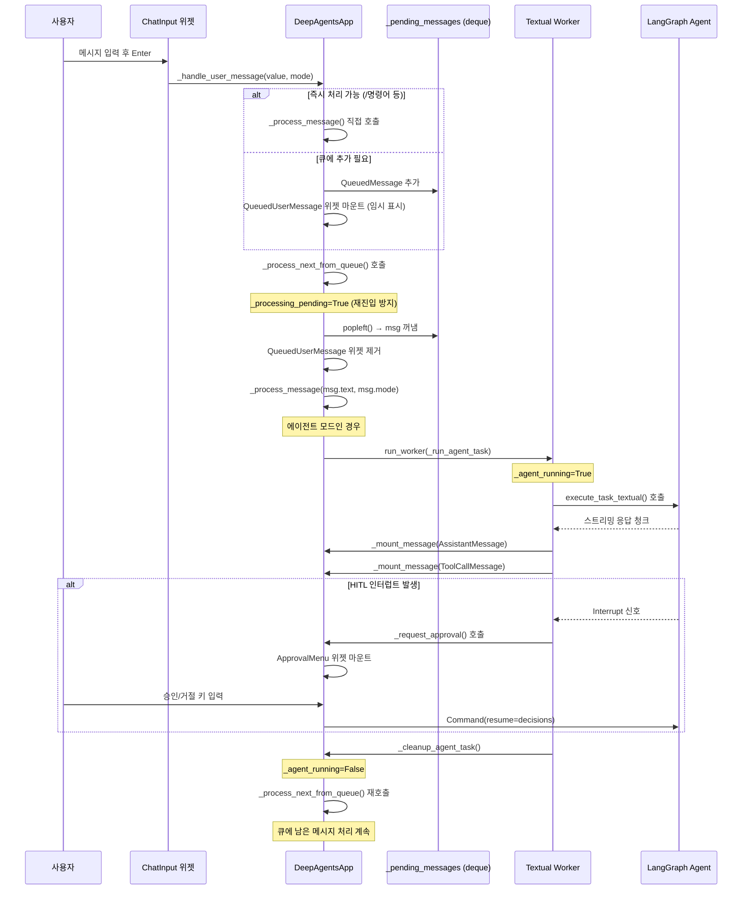

> **분석 대상**: langchain-ai/deepagents@26647a346cd3c71ca223ad2dc17db812f7203b0f
> **CLI 버전**: deepagents-cli v0.0.34 | **Core 버전**: deepagents v0.5.0a4
> **분석일**: 2026-04-04
> **관련 문서**: [00-구조 개요](./00-프로젝트-구조-개요.md) | [02a-에이전트-미들웨어](./02a-에이전트-그래프-미들웨어.md)

---

# CLI 엔트리포인트 및 앱 라이프사이클 분석

## 목차
1. [CLI 실행 흐름 개요](#1-cli-실행-흐름-개요)
2. [main.py 분석](#2-mainpy-분석)
3. [app.py 분석](#3-apppy-분석)
4. [비대화형 모드](#4-비대화형-모드-non_interactivepy)
5. [입력 처리](#5-입력-처리-inputpy)
6. [Lazy Loading 패턴](#6-lazy-loading-패턴-__init__py)
7. [핵심 패턴 요약](#7-핵심-패턴-요약)

---

## 1. CLI 실행 흐름 개요

DeepAgents CLI는 크게 세 가지 실행 경로를 지원한다: **대화형(Interactive) TUI**, **비대화형(Non-interactive) 헤드리스**, **ACP 서버** 모드. 아래 다이어그램은 `cli_main()` 진입부터 종료까지의 전체 흐름을 보여준다.



### 핵심 설계 원칙: 지연 임포트(Lazy Import)

CLI 시작 시간을 최소화하기 위해 무거운 의존성은 실제 사용 직전까지 임포트를 미룬다. `main.py:9`에서 `warnings.filterwarnings`를 적용한 직후에야 `argparse`를 임포트하고, `console`과 `settings`는 `parse_args()` 이후에 임포트한다(`main.py:1187`). 이 패턴 덕분에 `--help`나 `--version`처럼 짧은 경로는 무거운 LangChain/LangGraph 스택을 전혀 로드하지 않는다.

---

## 2. main.py 분석

### 2.1 `cli_main()` — 진입점 함수

**위치**: `main.py:1148`

`cli_main()`은 콘솔 스크립트(`pyproject.toml`의 `[project.scripts]`)로 등록된 진입 함수다. 내부 구조는 다음과 같다:

#### macOS gRPC 포크 버그 대응 (`main.py:1152-1153`)
```python
if sys.platform == "darwin":
    os.environ["GRPC_ENABLE_FORK_SUPPORT"] = "0"
```
macOS에서 gRPC가 포크 후 행(hang)에 빠지는 알려진 버그를 환경 변수로 사전 차단한다. 이런 플랫폼별 워크어라운드는 CLI 도구에서 흔한 패턴이다.

#### 버전 빠른 경로 (`main.py:1161-1175`)
```python
if len(sys.argv) == 2 and sys.argv[1] in {"-v", "--version"}:
    ...
    print(f"deepagents-cli {__version__}\ndeepagents (SDK) {sdk_version}")
    sys.exit(0)
```
`argparse`조차 로드하지 않고 버전을 출력한다. 부트스트랩 비용이 0에 가까운 "패스트 패스(fast path)" 전략이다.

#### 의존성 체크 (`main.py:1180`)
```python
check_cli_dependencies()
```
`textual`, `requests`, `python-dotenv`, `tavily-python`이 설치되어 있는지 확인하고, 없으면 `pip install deepagents[cli]` 안내 후 종료한다. ACP 모드(`--acp`)에서는 Textual이 필요 없으므로 이 체크를 건너뛴다.

### 2.2 argparse 구성 (`parse_args()`, `main.py:231`)

argparse 설정에서 주목할 점은 두 가지다:

#### 커스텀 헬프 액션 (`main.py:244-288`)
표준 `argparse`의 `-h` 대신, Rich 포맷 헬프 화면을 출력하는 커스텀 Action 클래스(`_ShowHelp`)를 공장 함수(`_make_help_action`)로 생성한다. 이 팩토리 패턴을 쓰는 이유는 `argparse.Action`이 클래스여야 하지만, 각 서브커맨드마다 다른 헬프 함수를 캡처해야 하기 때문이다.

#### 지연 헬프 래퍼 (`main.py:293-299`)
```python
def _lazy_help(fn_name: str) -> Callable[[], None]:
    def _show() -> None:
        from deepagents_cli import ui
        getattr(ui, fn_name)()
    return _show
```
`ui` 모듈(Rich 임포트 포함)은 사용자가 실제로 `-h`를 입력할 때만 로드된다. 파싱 시점에는 로드하지 않는다.

### 2.3 세 가지 실행 모드 분기 (`main.py:1456-1601`)

| 조건 | 모드 | 함수 |
|------|------|------|
| `args.non_interactive_message` 있음 | 비대화형 | `run_non_interactive()` |
| `--acp` 플래그 | ACP 서버 | `_run_acp_cli_async()` |
| 그 외 기본값 | 대화형 TUI | `run_textual_cli_async()` |

#### stdin 파이프 처리 (`apply_stdin_pipe()`, `main.py:908-1046`)
`deepagents` 명령에 파이프로 텍스트를 전달할 때의 동작:

```
cat context.txt | deepagents -n "요약해줘"
→ non_interactive_message = "{context.txt 내용}\n\n요약해줘"

echo "README.md를 고쳐줘" | deepagents
→ non_interactive_message = "README.md를 고쳐줘"

cat error.log | deepagents -m "분석해줘"
→ initial_prompt = "{error.log 내용}\n\n분석해줘"  (대화형 유지)
```

파이프 입력을 소비한 후 `/dev/tty`를 fd 0에 다시 연결하는 TTY 복구 로직(`main.py:1019-1046`)이 있다. 이 처리 덕분에 `-m` 경로에서는 파이프 입력 후에도 Textual TUI가 정상적으로 키보드 입력을 받을 수 있다.

#### 스레드 해결 전략 (`main.py:1526-1527`)
```python
resume_thread = args.resume_thread  # "__MOST_RECENT__", "<id>", or None
thread_id = None if resume_thread else generate_thread_id()
```
`-r` 플래그가 있을 때 동기 DB 조회를 `cli_main()` 안에서 하지 않고, TUI 시작 후 비동기로 해결(`_resolve_resume_thread`)한다. 이로써 DB I/O가 첫 화면 렌더링을 지연시키지 않는다.

---

## 3. app.py 분석

`app.py`는 약 5000줄의 핵심 파일로, Textual 기반 TUI 애플리케이션의 전체 로직을 담는다.

### 3.1 `DeepAgentsApp` 클래스 구조

**위치**: `app.py:424`

```python
class DeepAgentsApp(App):
    TITLE = "Deep Agents"
    CSS_PATH = "app.tcss"
    ENABLE_COMMAND_PALETTE = False  # 커스텀 슬래시 커맨드 시스템 사용
```

Textual의 `App` 클래스를 상속하며, Textual의 내장 커맨드 팔레트 대신 자체 슬래시 커맨드(`/model`, `/threads` 등) 시스템을 구현한다.

### 3.2 주요 메서드와 라이프사이클 훅

앱 초기화부터 종료까지의 라이프사이클을 단계별로 분석한다.

#### 단계 1: `__init__()` — 상태 초기화 (`app.py:509`)

무거운 임포트나 I/O 없이 인스턴스 변수만 설정한다. 주목할 초기화 항목들:

```python
self._pending_messages: deque[QueuedMessage] = deque()  # app.py:683
self._processing_pending = False                         # app.py:688
self._deferred_actions: list[DeferredAction] = []        # app.py:694
self._message_store = MessageStore()                     # app.py:697
self._connecting = server_kwargs is not None             # app.py:609
```

`_connecting` 플래그는 서버 시작 전인지를 나타낸다. `server_kwargs`가 있으면 앱이 "Connecting..." 상태로 시작해 배경에서 서버를 구동한다.

#### 단계 2: `compose()` — UI 레이아웃 (`app.py:758`)

```python
def compose(self) -> ComposeResult:
    with VerticalScroll(id="chat"):
        yield WelcomeBanner(...)
        yield Container(id="messages")
    with Container(id="bottom-app-container"):
        yield ChatInput(...)
    yield StatusBar(cwd=self._cwd, id="status-bar")
```

위젯 트리를 구성한다. 이 시점에는 실제 데이터 로딩이 없고 위젯 인스턴스만 생성한다.

#### 단계 3: `on_mount()` — 마운트 후 초기화 (`app.py:786`)

첫 프레임 렌더링을 지연시키지 않기 위해 I/O와 무거운 임포트를 모두 지연한다.

```python
async def on_mount(self) -> None:
    import gc
    gc.freeze()  # GC 순회 최적화로 첫 프레임 빠르게

    # 위젯 참조 확보
    self._status_bar = self.query_one("#status-bar", StatusBar)
    self._chat_input = self.query_one("#input-area", ChatInput)

    # 첫 프레임 렌더링 중 임포트 예열 (GIL 충돌 무해)
    self.run_worker(
        asyncio.to_thread(self._prewarm_deferred_imports),
        exclusive=True, group="startup-import-prewarm",
    )

    # git 브랜치 비동기 감지 후 나머지 초기화 예약
    self._startup_task = asyncio.create_task(
        self._resolve_git_branch_and_continue()
    )
```

`gc.freeze()`를 호출해 임포트/compose 중에 할당된 객체를 영구 세대로 이동, GC 순회 비용을 줄인다. 이는 성능 최적화의 미묘한 예시다.

#### 단계 4: `_post_paint_init()` — 첫 프레임 이후 초기화 (`app.py:882`)

`call_after_refresh`를 통해 첫 프레임이 그려진 뒤 호출된다. 여기서 모든 백그라운드 워커가 시작된다:

```python
async def _post_paint_init(self) -> None:
    # UI 어댑터 생성 (에이전트 없이도 동작)
    self._ui_adapter = TextualUIAdapter(...)

    # 스킬 디렉토리 탐색
    self.run_worker(self._discover_skills(), group="startup-skill-discovery")

    # 세션 상태 초기화
    self.run_worker(self._init_session_state, group="session-init")

    # 서버 시작 (메인 작업)
    if self._server_kwargs is not None:
        self.run_worker(self._start_server_background, group="server-startup")

    # 업데이트 체크, 모델/스레드 캐시 예열, 도구 체크
    self.run_worker(self._check_for_updates, group="startup-update-check")
    self.run_worker(self._prewarm_model_caches, group="startup-model-prewarm")
    self.run_worker(self._prewarm_threads_cache, group="startup-thread-prewarm")
    self.run_worker(self._check_optional_tools_background, group="startup-tool-check")
```

각 워커에 `group` 이름을 지정해 워커 타입별로 관리한다. `exclusive=True`는 동일 그룹의 중복 실행을 방지한다.

#### 단계 5: `exit()` — 종료 처리 (`app.py:4151`)

```python
def exit(self, result=None, return_code=0, message=None) -> None:
    # 진행 중인 턴의 통계를 세션 통계에 병합
    inflight = self._inflight_turn_stats
    if inflight is not None:
        self._session_stats.merge(inflight)

    # 큐 비우기 + 워커 취소 (서브프로세스 SIGTERM)
    self._discard_queue()
    if self._shell_running: self._shell_worker.cancel()
    if self._agent_running: self._agent_worker.cancel()

    # 동기 훅 디스패치 (이벤트 루프 종료 전)
    _dispatch_hook_sync("session.end", payload, hooks)

    # iTerm2 커서 가이드 복구
    _write_iterm_escape(_ITERM_CURSOR_GUIDE_ON)
    super().exit(...)
```

`exit()`를 오버라이드한 이유: 이벤트 루프가 종료되기 전에 동기 훅을 디스패치해야 하기 때문이다. 비동기 태스크는 `super().exit()` 이후에 완료되지 않을 수 있다.

### 3.3 상태 머신 (앱 상태 전이)

`DeepAgentsApp`은 명시적인 `enum` 타입의 상태 머신 대신, 여러 불리언 플래그의 조합으로 상태를 표현한다:

```mermaid
flowchart LR
    CONNECTING["_connecting=True\n(서버 시작 중)"]
    READY["서버 준비됨\n_agent 설정됨"]
    IDLE["대기 중\n_agent_running=False\n_shell_running=False"]
    AGENT_BUSY["에이전트 실행 중\n_agent_running=True"]
    SHELL_BUSY["셸 실행 중\n_shell_running=True"]
    APPROVING["승인 대기 중\n_pending_approval_widget 있음"]
    EXITING["_exit=True"]

    CONNECTING -->|ServerReady 메시지| READY
    CONNECTING -->|ServerStartFailed 메시지| READY
    READY --> IDLE
    IDLE -->|메시지 제출| AGENT_BUSY
    IDLE -->|! 셸 명령| SHELL_BUSY
    AGENT_BUSY -->|HITL 인터럽트| APPROVING
    APPROVING -->|승인/거절| AGENT_BUSY
    AGENT_BUSY -->|완료/에러| IDLE
    SHELL_BUSY -->|완료| IDLE
    IDLE -->|Ctrl+D / exit()| EXITING
    AGENT_BUSY -->|Escape/Ctrl+C| IDLE
```

플래그 기반 상태 표현의 핵심 변수들:

| 변수 | 의미 |
|------|------|
| `_connecting` | 서버 시작 대기 중 |
| `_agent_running` | 에이전트 워커 실행 중 |
| `_shell_running` | 셸 명령 워커 실행 중 |
| `_processing_pending` | 큐 처리 중 (재진입 방지) |
| `_thread_switching` | 스레드 전환 중 |
| `_model_switching` | 모델 전환 중 |

### 3.4 메시지 파이프라인 (큐 기반 순차 처리)

#### 큐 구조체

```python
# app.py:683-688
self._pending_messages: deque[QueuedMessage] = deque()
self._queued_widgets: deque[QueuedUserMessage] = deque()
self._processing_pending = False
```

`_pending_messages`에 메시지 데이터를, `_queued_widgets`에 해당 UI 위젯을 1:1로 관리한다. 위젯은 메시지가 처리되기 시작할 때 제거된다(실제 메시지 위젯으로 교체).

#### 메시지 파이프라인 처리 흐름



#### `_process_next_from_queue()` 핵심 로직 (`app.py:3317`)

```python
async def _process_next_from_queue(self) -> None:
    if self._processing_pending or not self._pending_messages or self._exit:
        return  # 재진입 또는 빈 큐 방지

    self._processing_pending = True
    try:
        msg = self._pending_messages.popleft()
        if self._queued_widgets:
            widget = self._queued_widgets.popleft()
            await widget.remove()
        await self._process_message(msg.text, msg.mode)
    finally:
        self._processing_pending = False

    # 에이전트/셸이 실행 중이 아니면 즉시 다음 처리
    busy = self._agent_running or self._shell_running
    if not busy and self._pending_messages:
        await self._process_next_from_queue()  # 재귀
```

이 패턴은 **생산자-소비자** 구조의 단순화된 형태다. `asyncio.Queue` 대신 `deque` + 불리언 플래그를 사용하는 이유는 Textual의 단일 이벤트 루프 스레드에서 동기 제어를 더 직접적으로 표현하기 때문이다.

#### 서버 연결 중 메시지 큐잉

서버가 시작되는 동안 사용자가 메시지를 입력하면, 메시지는 큐에 보관되고 `ServerReady` 이벤트 도달 시 드레인(drain)된다:

```python
# app.py:1334-1339 (on_deep_agents_app_server_ready)
if self._pending_messages and not (self._initial_prompt and ...):
    self.call_after_refresh(
        lambda: asyncio.create_task(self._process_next_from_queue())
    )
```

### 3.5 Worker 스레드 패턴

`DeepAgentsApp`은 Textual의 `run_worker()` API를 적극 활용한다. 주요 워커와 역할:

| 워커 그룹명 | 함수 | 역할 |
|------------|------|------|
| `server-startup` | `_start_server_background` | LangGraph 서버 프로세스 시작 |
| `session-init` | `_init_session_state` | 세션 상태 초기화 |
| `startup-skill-discovery` | `_discover_skills` | 파일시스템에서 스킬 탐색 |
| `startup-import-prewarm` | `_prewarm_deferred_imports` | 무거운 모듈 미리 로드 |
| `startup-model-prewarm` | `_prewarm_model_caches` | 모델 목록/프로파일 캐시 |
| `startup-thread-prewarm` | `_prewarm_threads_cache` | 스레드 메시지 카운트 캐시 |
| `startup-update-check` | `_check_for_updates` | PyPI 업데이트 확인 |
| `startup-tool-check` | `_check_optional_tools_background` | ripgrep 등 선택 도구 확인 |

#### `_start_server_background()` 상세 (`app.py:1208`)

```python
async def _start_server_background(self) -> None:
    # 1. 재개 스레드 해결 (DB 조회)
    if self._resume_thread_intent:
        await self._resolve_resume_thread()

    # 2. 모델 생성 (LangChain 임포트 + SDK 초기화, ~560ms)
    if self._model_kwargs is not None:
        result = create_model(**self._model_kwargs)
        result.apply_to_settings()

    # 3. 서버 시작 + MCP 사전 로드를 병렬 실행
    coros = [start_server_and_get_agent(**self._server_kwargs)]
    if self._mcp_preload_kwargs:
        coros.append(_preload_session_mcp_server_info(**self._mcp_preload_kwargs))

    results = await asyncio.gather(*coros, return_exceptions=True)

    # 4. 결과를 메시지로 이벤트 시스템에 포스트
    self.post_message(self.ServerReady(agent=agent, server_proc=server_proc, ...))
```

`asyncio.gather()`로 서버 시작과 MCP 메타데이터 로드를 동시에 진행해 시작 시간을 최소화한다. `return_exceptions=True`를 사용해 한쪽 실패가 전체를 중단시키지 않도록 한다.

### 3.6 `AppResult` 데이터 클래스 (`app.py:4895`)

```python
@dataclass(frozen=True)
class AppResult:
    return_code: int          # 종료 코드 (0=성공)
    thread_id: str | None     # 최종 스레드 ID (/threads로 전환 시 변경됨)
    session_stats: SessionStats      # 토큰 사용량 등 세션 통계
    update_available: tuple[bool, str | None]  # 업데이트 여부 및 버전
```

불변(frozen) 데이터 클래스로 설계해 호출자가 결과를 변조할 수 없도록 보장한다. `thread_id`가 초기값과 다를 수 있는 이유는 세션 중 `/threads` 명령으로 스레드를 전환할 수 있기 때문이다.

### 3.7 `run_textual_app()` — 최상위 실행 함수 (`app.py:4913`)

```python
async def run_textual_app(...) -> AppResult:
    app = DeepAgentsApp(...)
    try:
        await app.run_async()
    finally:
        # 서버 정리는 앱 종료 방식과 관계없이 보장
        if app._server_proc is not None:
            app._server_proc.stop()

    return AppResult(
        return_code=app.return_code or 0,
        thread_id=app._lc_thread_id,
        session_stats=app._session_stats,
        update_available=app._update_available,
    )
```

`finally` 블록으로 서버 프로세스 정리를 보장한다. 정상 종료, 예외 발생, Ctrl+C 어떤 경우에도 서브프로세스가 고아(orphan)가 되지 않는다.

---

## 4. 비대화형 모드 (`non_interactive.py`)

### 4.1 개요

비대화형 모드는 단일 작업을 자동으로 실행하고 결과를 stdout에 출력한 뒤 종료한다. CI/CD, 스크립팅, 파이프라인 활용에 최적화되어 있다.

```python
# main.py:1492
exit_code = asyncio.run(
    run_non_interactive(
        message=args.non_interactive_message,
        quiet=args.quiet,
        stream=not args.no_stream,
        ...
    )
)
```

### 4.2 출력 분리 전략

quiet 모드(`-q`)의 핵심은 stdout/stderr 분리다:

```python
# non_interactive.py:810
console = Console(stderr=True) if quiet else Console()
```

- `quiet=True`: 모든 상태 메시지(헤더, 스피너, 도구 알림)는 stderr로, 에이전트 응답만 stdout으로
- `quiet=False`: 모든 출력이 stdout으로

에이전트 응답 텍스트는 Rich `Console` 대신 `sys.stdout.write()`를 직접 사용한다(`non_interactive.py:100-101`). 이 덕분에 quiet 모드에서 `Console`을 stderr로 리다이렉트해도 응답 텍스트는 항상 stdout으로 간다.

### 4.3 스트리밍 상태 관리 (`StreamState`, `non_interactive.py:155`)

```python
@dataclass
class StreamState:
    quiet: bool = False           # stdout 진단 출력 억제
    stream: bool = True           # 실시간 스트리밍 여부
    full_response: list[str] = field(default_factory=list)  # 전체 응답 버퍼
    tool_call_buffers: dict[...]  # 진행 중인 도구 호출 버퍼
    pending_interrupts: dict[...]  # 대기 중인 HITL 인터럽트
    hitl_response: dict[...]      # 인터럽트 응답 (재개 시 사용)
    interrupt_occurred: bool = False
    stats: SessionStats
    spinner: _ConsoleSpinner | None
```

단일 데이터클래스에 스트리밍 상태를 집중시켜, 여러 처리 함수 사이에서 공유한다.

### 4.4 HITL 루프 (`_run_agent_loop()`, `non_interactive.py:604`)

비대화형 모드에서도 쉘 명령에 대한 HITL(Human-in-the-Loop) 인터럽트를 처리한다:

```python
async def _run_agent_loop(agent, message, config, ...):
    stream_input = {"messages": [{"role": "user", "content": message}]}

    # 초기 스트림
    await _stream_agent(agent, stream_input, config, state, ...)

    # HITL 루프 (최대 50회)
    iterations = 0
    while state.interrupt_occurred:
        iterations += 1
        if iterations > _MAX_HITL_ITERATIONS:
            raise HITLIterationLimitError(...)

        state.interrupt_occurred = False
        _process_hitl_interrupts(state, console)
        stream_input = Command(resume=state.hitl_response)
        await _stream_agent(agent, stream_input, config, state, ...)
```

`_MAX_HITL_ITERATIONS = 50`으로 무한 루프를 방지한다. 에이전트가 거절된 명령을 계속 재시도할 경우 안전하게 종료한다.

### 4.5 셸 허용 목록 게이팅

```
--shell-allow-list 미설정 → 셸 비활성화, 나머지 도구 자동 승인
--shell-allow-list=recommended → 셸 활성화, 안전한 명령만 허용
--shell-allow-list=all → 셸 활성화, 모든 명령 허용
```

`is_shell_command_allowed()` 함수로 허용 목록 대조 검사를 수행한다(`non_interactive.py:491`).

### 4.6 LangSmith URL 백그라운드 조회 (`non_interactive.py:216`)

```python
def _start_langsmith_thread_url_lookup(thread_id: str) -> ThreadUrlLookupState:
    state = ThreadUrlLookupState()
    threading.Thread(target=_resolve, daemon=True).start()
    return state
```

LangSmith URL 조회를 백그라운드 스레드에서 비동기 시작해 서버 시작 시간을 차단하지 않는다. 결과는 작업 완료 후 사용 가능하면 출력한다.

---

## 5. 입력 처리 (`input.py`)

### 5.1 파일 멘션 파싱 (`parse_file_mentions()`, `input.py:274`)

`@파일경로` 형식의 파일 멘션을 파싱한다:

```python
FILE_MENTION_PATTERN = re.compile(r"@(?P<path>(?:\\.|[A-Za-z0-9._~/\\:-])+)")
EMAIL_PREFIX_PATTERN = re.compile(r"[a-zA-Z0-9._%+-]$")  # 이메일 주소 제외
```

이메일 주소(`user@example.com`)를 파일 멘션으로 잘못 인식하지 않도록 `@` 앞 문자가 이메일 형식이면 건너뛴다. 존재하지 않는 파일은 경고를 출력하고 목록에서 제외한다.

### 5.2 미디어 트래커 (`MediaTracker`, `input.py:107`)

이미지와 동영상을 대화에 붙여 넣을 때 플레이스홀더 토큰으로 관리한다:

```python
class MediaTracker:
    def add_image(self, image_data: ImageData) -> str:
        return self.add_media(image_data, "image")  # "[image 1]" 반환

    def sync_to_text(self, text: str) -> None:
        # 사용자가 플레이스홀더를 지우면 해당 미디어도 제거
        img_found = self._sync_kind_images(text)
        vid_found = self._sync_kind_videos(text)
```

`sync_to_text()`는 현재 입력 텍스트에 `[image 1]` 같은 플레이스홀더가 남아 있는지 확인해, 삭제된 미디어는 트래커에서도 제거한다. 이를 통해 미디어 데이터와 UI 텍스트의 일관성을 유지한다.

### 5.3 붙여넣기 경로 파싱 (`parse_pasted_file_paths()`, `input.py:334`)

파인더/탐색기에서 파일을 드래그앤드롭하거나 경로를 붙여 넣을 때 처리한다. 엄격한(strict) 파싱 전략: 전체 붙여 넣기 페이로드가 유효한 파일 경로로 해석되어야만 파일로 처리하고, 아니면 일반 텍스트로 처리한다.

파싱 우선순위:
1. 다중 경로 파싱 (`parse_pasted_file_paths`)
2. 단일 경로 정규화 (`parse_single_pasted_file_path`)
3. 선행 경로 토큰 추출 (`extract_leading_pasted_file_path`)

#### macOS 유니코드 공백 처리 (`input.py:75-85`)
```python
_UNICODE_SPACE_EQUIVALENTS = str.maketrans({
    "\u00a0": " ",  # NO-BREAK SPACE (macOS 스크린샷 파일명에 사용)
    "\u202f": " ",  # NARROW NO-BREAK SPACE
})
```
macOS에서 스크린샷 파일명에 포함될 수 있는 비ASCII 공백 코드포인트를 일반 공백으로 정규화해 경로 해석 실패를 방지한다.

### 5.4 입력 하이라이팅 패턴

```python
INPUT_HIGHLIGHT_PATTERN = re.compile(
    r"(^\/[a-zA-Z0-9_-]+|@(?:\\.|[A-Za-z0-9._~/\\:-])+)"
)
```
슬래시 커맨드(`/model`, `/help`)와 `@파일멘션`을 렌더링 시 강조 표시하는 데 사용된다.

---

## 6. Lazy Loading 패턴 (`__init__.py`)

### 6.1 `__getattr__` 지연 임포트 전략

**위치**: `__init__.py:18-36`

```python
__all__ = [
    "__version__",
    "cli_main",  # noqa: F822 — lazily resolved by __getattr__
]

def __getattr__(name: str) -> Callable[[], None]:
    if name == "cli_main":
        from deepagents_cli.main import cli_main
        return cli_main
    msg = f"module {__name__!r} has no attribute {name!r}"
    raise AttributeError(msg)
```

Python 3.7+에서 모듈 수준의 `__getattr__`을 정의하면 해당 속성 접근 시점에 임포트가 실행된다. `cli_main`이 `__all__`에 선언되어 있지만 실제 함수는 즉시 로드되지 않는다.

### 6.2 왜 이 패턴을 쓰는가?

`main.py`의 최상위 임포트를 보면 이유가 명확해진다:

```python
# main.py: 상단에서 임포트하는 모듈들
import argparse          # 파싱 기계
import asyncio           # 이벤트 루프
import importlib.util    # 모듈 존재 확인
import json              # JSON 파싱
import os, sys, shutil   # 시스템 유틸리티
import traceback         # 스택 추적
```

이 모듈들은 가볍지만, `main.py`가 실제로 실행되면 추가로 수십 개의 내부 모듈이 임포트된다. `config`, `widgets`, `agent` 같은 서브모듈을 직접 임포트하는 코드가 `from deepagents_cli import config`처럼 패키지 레벨 접근을 사용할 때, `cli_main`을 통한 `main.py` 로드가 불필요하게 발생하지 않도록 한다.

### 6.3 `__main__.py` 진입점

```python
# __main__.py:3-6
from deepagents_cli.main import cli_main

if __name__ == "__main__":
    cli_main()
```

`python -m deepagents_cli` 실행 시 사용된다. 이 경우 `__getattr__` 우회 없이 `main.py`를 직접 임포트한다. `__main__.py`는 항상 직접 실행 컨텍스트이므로 지연 로딩이 불필요하기 때문이다.

---

## 7. 핵심 패턴 요약

자체 CLI 에이전트를 구축할 때 참조할 수 있는 핵심 패턴들:

### 7.1 시작 시간 최소화 패턴

| 기법 | 위치 | 효과 |
|------|------|------|
| `__getattr__` 지연 임포트 | `__init__.py:18` | 패키지 임포트 비용 제거 |
| `--version` 빠른 경로 | `main.py:1161` | argparse 로드 없이 버전 출력 |
| `--help` 지연 UI 로드 | `main.py:293` | Rich 임포트를 -h 시에만 |
| `call_after_refresh` | `app.py:880` | 첫 프레임 렌더 후 초기화 |
| `gc.freeze()` | `app.py:797` | GC 순회 비용 감소 |
| `_prewarm_deferred_imports` | `app.py:1361` | 첫 프레임 중 백그라운드 예열 |

### 7.2 서버-클라이언트 분리 패턴

TUI는 LangGraph 에이전트와 **별도 프로세스**로 동작한다. TUI가 먼저 렌더링된 뒤 백그라운드에서 서버를 시작하고, 준비되면 `ServerReady` 메시지로 통지한다. 이 아키텍처의 장점:
- 서버 시작 중에도 UI 반응성 유지
- 서버 실패 시 UI에서 명확한 오류 표시
- 서버와 UI의 독립적 재시작 가능

### 7.3 메시지 큐 패턴

단순 큐를 구현할 때 `asyncio.Queue` 대신 `deque` + 불리언 플래그를 쓰는 이유:
- Textual의 단일 이벤트 루프 스레드에서 동기 제어가 더 직관적
- `await queue.get()` 대신 `if not queue: return`으로 빠른 체크
- 큐 내용을 직접 조사/수정 가능 (`clear()`, `popleft()`)

### 7.4 조용한 모드(quiet mode) 패턴

파이프라인 통합을 위한 표준 패턴:
```python
console = Console(stderr=True) if quiet else Console()  # 상태 메시지 라우팅
sys.stdout.write(text)  # 에이전트 응답은 항상 stdout (Console 우회)
```
이 패턴으로 `deepagents -n "작업" -q | jq '...'` 같은 파이프라인이 가능해진다.

### 7.5 비동기 초기화 병렬화 패턴

시작 시 여러 독립 작업(서버 시작, MCP 로드, 스킬 탐색, 캐시 예열)을 `asyncio.gather()`와 `run_worker()`로 병렬 실행한다. 각 작업에 `group` 이름을 부여해 로그 추적과 중복 방지에 활용한다.

### 7.6 Worker 취소 및 서브프로세스 정리 패턴

```python
def exit(self):
    self._discard_queue()
    if self._agent_running:
        self._agent_worker.cancel()  # Textual Worker 취소 → SIGTERM → SIGKILL
    super().exit()
```
`exit()`를 오버라이드해 서브프로세스가 고아 프로세스로 남지 않도록 보장한다. `run_textual_app()`의 `finally` 블록도 같은 역할을 이중으로 수행한다.

### 7.7 입력 안전성 패턴

- stdin 파이프 크기 제한: 10 MiB 초과 시 명확한 오류 메시지 (`main.py:977`)
- HITL 인터럽트 최대 반복 횟수 제한: 50회 (`non_interactive.py:85`)
- 멀포밍된 인터럽트 페일-클로즈드(fail-closed): 검증 실패 시 거절로 처리 (`non_interactive.py:273-277`)
- 유니코드 보안 검사: URL과 명령 인수에서 숨겨진 유니코드 탐지 (`non_interactive.py:528-543`)
