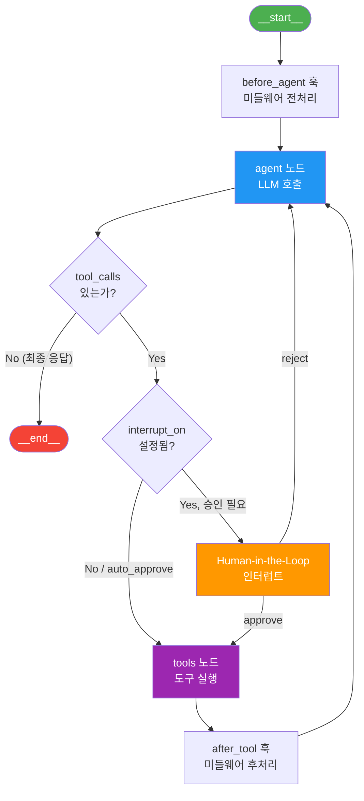
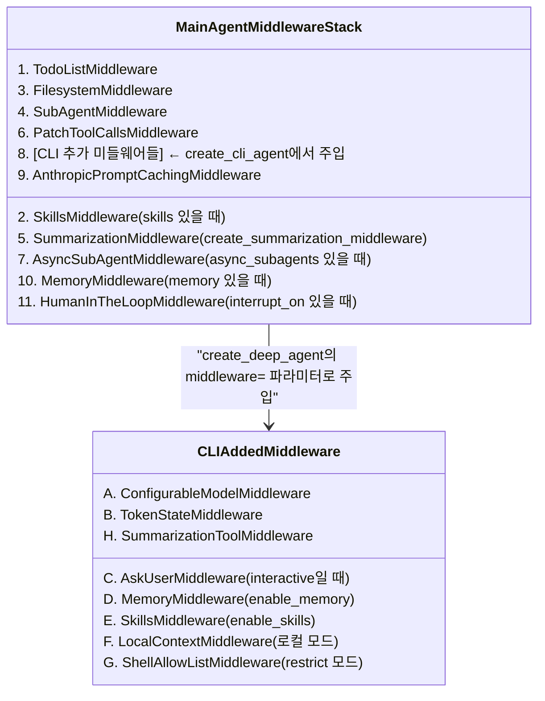
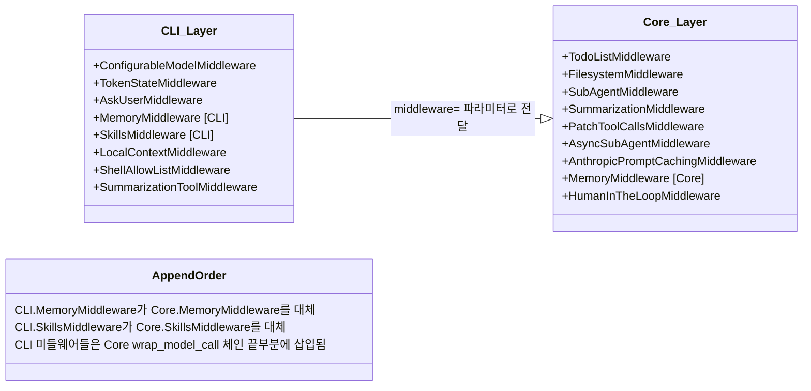

> **분석 대상**: langchain-ai/deepagents@26647a346cd3c71ca223ad2dc17db812f7203b0f
> **CLI 버전**: deepagents-cli v0.0.34 | **Core 버전**: deepagents v0.5.0a4
> **분석일**: 2026-04-04
> **관련 문서**: [00-구조 개요](./00-프로젝트-구조-개요.md) | [01-엔트리포인트](./01-엔트리포인트-앱-라이프사이클.md) | [02b-도구-MCP-백엔드](./02b-도구-MCP-백엔드.md)

---

# 에이전트 그래프 및 미들웨어 체인 아키텍처

## 목차

1. [에이전트 생성 흐름](#1-에이전트-생성-흐름)
2. [LangGraph 그래프 구조](#2-langgraph-그래프-구조)
3. [미들웨어 체인 패턴 (핵심)](#3-미들웨어-체인-패턴-핵심)
4. [서브에이전트 시스템](#4-서브에이전트-시스템)
5. [시스템 프롬프트](#5-시스템-프롬프트)
6. [핵심 패턴 요약](#6-핵심-패턴-요약)

---

## 1. 에이전트 생성 흐름

### 1.1 두 계층 구조

DeepAgents는 **CLI 계층**과 **Core 계층**이 명확히 분리된 2-tier 구조를 가진다.

```
사용자 CLI 명령
    │
    ▼
create_cli_agent()           ← CLI 계층 (agent.py)
    │  - 환경 설정 해석
    │  - CLI 전용 미들웨어 조립
    │  - 백엔드 선택 (로컬 vs 샌드박스)
    │  - 서브에이전트 파일 로드
    │
    ▼
create_deep_agent()          ← Core 계층 (graph.py)
    │  - Core 미들웨어 조립
    │  - LangGraph 그래프 컴파일
    │  - 시스템 프롬프트 합성
    │
    ▼
create_agent()               ← LangChain 내부 (langchain.agents)
    │  - StateGraph 구성
    │  - Pregel 그래프 컴파일
    │
    ▼
CompiledStateGraph (Pregel)  ← 실행 가능한 에이전트
```

### 1.2 `create_cli_agent()` 상세 흐름

**파일**: `libs/cli/deepagents_cli/agent.py:832`

```python
def create_cli_agent(
    model: str | BaseChatModel,
    assistant_id: str,
    *,
    tools, sandbox, sandbox_type, system_prompt,
    interactive, auto_approve, interrupt_shell_only,
    shell_allow_list, enable_ask_user, enable_memory,
    enable_skills, enable_shell, checkpointer,
    mcp_server_info, cwd, project_context, async_subagents,
) -> tuple[Pregel, CompositeBackend]:
```

이 함수의 처리 순서:

1. **에이전트 디렉터리 설정** (line 931-937): `~/.deepagents/{assistant_id}/` 디렉터리와 `AGENTS.md` 생성
2. **스킬 디렉터리 탐색** (line 944-956): 5개 우선순위 경로에서 스킬 소스 수집
3. **커스텀 서브에이전트 로드** (line 985-1000): 파일시스템에서 YAML frontmatter 서브에이전트 로드
4. **미들웨어 스택 조립** (line 1021-1175): 순서대로 CLI 미들웨어 추가
5. **백엔드 선택** (line 1083-1169): 로컬 모드 vs 원격 샌드박스 분기
6. **interrupt_on 설정** (line 1132-1142): auto_approve 여부에 따라 HITL 활성화/비활성화
7. **CompositeBackend 구성** (line 1147-1169): 라우팅 백엔드 조립
8. **`create_deep_agent()` 호출** (line 1182-1191): Core 계층에 위임

### 1.3 `create_deep_agent()` 상세 흐름

**파일**: `libs/deepagents/deepagents/graph.py:84`

```python
def create_deep_agent(
    model, tools, *, system_prompt, middleware,
    subagents, skills, memory, response_format,
    context_schema, checkpointer, store, backend,
    interrupt_on, debug, name, cache,
) -> CompiledStateGraph:
```

이 함수의 처리 순서:

1. **모델 해결** (line 222): `resolve_model()`로 문자열을 `BaseChatModel`로 변환
2. **general-purpose 서브에이전트 구성** (line 226-240): 기본 미들웨어 스택을 갖춘 범용 서브에이전트 조립
3. **커스텀 서브에이전트 처리** (line 245-283): SubAgent / CompiledSubAgent / AsyncSubAgent 구분 처리
4. **메인 에이전트 미들웨어 스택 구성** (line 292-322):
   - Core 미들웨어를 정해진 순서로 쌓음
   - CLI로부터 전달받은 추가 미들웨어 (`middleware` 파라미터)를 뒤에 붙임
5. **시스템 프롬프트 합성** (line 325-331): `system_prompt + "\n\n" + BASE_AGENT_PROMPT`
6. **`create_agent()` 호출** (line 333-354): LangChain 에이전트 생성 및 설정 주입

---

## 2. LangGraph 그래프 구조

### 2.1 그래프 구조 다이어그램



### 2.2 그래프 노드 설명

| 노드 | 역할 | 관련 코드 |
|------|------|-----------|
| `__start__` | 입력 메시지 수신 | LangGraph 내장 |
| `before_agent` | 미들웨어 `before_agent()` 훅 실행 (메모리/스킬 로드) | `AgentMiddleware.before_agent()` |
| `agent` | LLM 호출 (wrap_model_call 체인 통과) | `create_agent()` 내부 |
| `tools` | 선택된 도구 실행 (wrap_tool_call 체인 통과) | LangGraph `ToolNode` |
| `__end__` | 최종 응답 반환 | LangGraph 내장 |

### 2.3 상태 스키마 (State Schema)

`AgentState`는 미들웨어들의 `state_schema`가 병합되어 구성된다.

```python
# 기본 AgentState (langchain.agents)
class AgentState:
    messages: list[AnyMessage]   # 대화 히스토리
    todos: ...                   # TodoListMiddleware 상태
    structured_response: ...     # 구조화 응답

# FilesystemState (FilesystemMiddleware 추가)
class FilesystemState(AgentState):
    files: Annotated[dict[str, FileData], _file_data_reducer]

# MemoryState (MemoryMiddleware 추가)
class MemoryState(AgentState):
    memory_contents: Annotated[dict[str, str], PrivateStateAttr]  # 비공개

# SkillsState (SkillsMiddleware 추가)
class SkillsState(AgentState):
    skills_metadata: Annotated[list[SkillMetadata], PrivateStateAttr]  # 비공개

# SummarizationState (SummarizationMiddleware 추가)
class SummarizationState(AgentState):
    _summarization_event: Annotated[SummarizationEvent | None, PrivateStateAttr]

# AsyncSubAgentState (AsyncSubAgentMiddleware 추가)
class AsyncSubAgentState(AgentState):
    async_tasks: Annotated[dict[str, AsyncTask], _tasks_reducer]
```

**`PrivateStateAttr`**: LangGraph의 private 채널 어노테이션으로, 해당 상태 키는 체크포인터에 저장되지만 LLM에는 전달되지 않는다.

### 2.4 `recursion_limit` 설정

```python
# graph.py:346
.with_config({
    "recursion_limit": 9_999,
    "metadata": {
        "ls_integration": "deepagents",
        "versions": {"deepagents": __version__},
    },
})
```

기본 LangGraph 재귀 한계(25)를 9,999로 크게 높여, 장시간 동작하는 에이전트가 중단되지 않도록 한다.

---

## 3. 미들웨어 체인 패턴 (핵심)

### 3.1 미들웨어란 무엇인가

미들웨어는 `AgentMiddleware`를 상속하는 클래스로, LLM 호출 **전후**에 끼어들어 동작을 수정한다. 평범한 `tool` 함수와 다른 점은 다음과 같다.

| 기능 | 일반 도구 | 미들웨어 |
|------|-----------|----------|
| LLM이 호출 | O | X (자동 호출) |
| 시스템 프롬프트 수정 | X | O (`wrap_model_call`) |
| 도구 목록 동적 변경 | X | O (`wrap_model_call`) |
| 턴 간 상태 유지 | X | O (`state_schema`) |
| LLM 호출 전 실행 | X | O (`before_agent`) |
| 도구 실행 가로채기 | X | O (`wrap_tool_call`) |

**파일**: `libs/deepagents/deepagents/middleware/__init__.py:18-34`

### 3.2 미들웨어 훅 인터페이스

```python
class AgentMiddleware:
    state_schema: type[AgentState]         # 이 미들웨어의 상태 확장 스키마
    tools: list[BaseTool]                  # 이 미들웨어가 추가하는 도구들

    # 에이전트 실행 전 1회 호출 (메모리/스킬 로드 등)
    def before_agent(state, runtime, config) -> StateUpdate | None: ...
    async def abefore_agent(...) -> StateUpdate | None: ...

    # LLM 호출을 래핑 (시스템 프롬프트 주입, 도구 필터링, 메시지 변환)
    def wrap_model_call(request, handler) -> ModelResponse: ...
    async def awrap_model_call(...) -> ModelResponse: ...

    # 도구 실행을 래핑 (결과 후처리, 검증, 차단)
    def wrap_tool_call(request, handler) -> ToolMessage | Command: ...
    async def awrap_tool_call(...) -> ToolMessage | Command: ...
```

### 3.3 Core 미들웨어 체인 구성 순서

`create_deep_agent()`에서 조립되는 메인 에이전트의 미들웨어 순서:



**중요**: `create_deep_agent()`의 `middleware` 파라미터로 전달된 미들웨어들은 `AnthropicPromptCachingMiddleware` 직전에 삽입된다 (`graph.py:314-315`).

### 3.4 Core 미들웨어 상세 분석

#### 3.4.1 TodoListMiddleware

- **출처**: LangChain SDK 내장 (`langchain.agents.middleware`)
- **역할**: `write_todos` 도구를 제공하여 에이전트가 TODO 목록을 관리할 수 있게 함
- **위치**: 스택 가장 앞 (1번)
- **관련 파일**: `graph.py:293`

#### 3.4.2 FilesystemMiddleware

- **출처**: Core (`middleware/filesystem.py`)
- **역할**: 파일시스템 도구 7개 제공 + 대용량 결과 자동 오프로드
- **제공 도구**: `ls`, `read_file`, `write_file`, `edit_file`, `glob`, `grep`, `execute`
- **핵심 동작**:
  - `wrap_model_call`: 백엔드가 `SandboxBackendProtocol`을 구현하지 않으면 `execute` 도구를 요청에서 **동적으로 제거**
  - `wrap_tool_call`: 도구 결과가 20,000 토큰 초과 시 `/large_tool_results/{tool_call_id}` 경로에 저장하고 요약본만 반환
  - HumanMessage가 50,000 토큰 초과 시 `/conversation_history/` 경로에 오프로드 (`lc_evicted_to` 키로 태그)
- **상태**: `FilesystemState.files` (LangGraph reducer로 삭제 지원)
- **관련 파일**: `middleware/filesystem.py:519`

```python
# 동적 execute 도구 필터링 예시 (filesystem.py:1163-1167)
if not backend_supports_execution:
    filtered_tools = [tool for tool in request.tools
                      if tool.name != "execute"]
    request = request.override(tools=filtered_tools)
```

#### 3.4.3 SubAgentMiddleware

- **출처**: Core (`middleware/subagents.py`)
- **역할**: `task` 도구를 제공하여 에이전트가 서브에이전트에게 작업을 위임할 수 있게 함
- **핵심 동작**:
  - 초기화 시 SubAgent 스펙으로부터 실제 LangGraph 그래프를 컴파일
  - `task(description, subagent_type)` 도구 호출 시 해당 서브에이전트 그래프를 동기/비동기로 실행
  - 서브에이전트 결과의 마지막 메시지를 `ToolMessage`로 변환해 메인 에이전트에 반환
  - `_EXCLUDED_STATE_KEYS`로 `messages`, `todos`, `skills_metadata`, `memory_contents` 등을 격리
- **시스템 프롬프트**: `TASK_SYSTEM_PROMPT`를 메인 에이전트 시스템 프롬프트에 추가
- **관련 파일**: `middleware/subagents.py:392`

#### 3.4.4 SummarizationMiddleware

- **출처**: Core (`middleware/summarization.py`)
- **역할**: 컨텍스트 창이 가득 찰 때 오래된 메시지를 요약하여 교체
- **핵심 동작**:
  - `wrap_model_call` 진입 시 토큰 수를 확인하고 임계값 초과 시 자동 요약
  - 기본 트리거: 프로파일 있으면 `("fraction", 0.85)`, 없으면 `("tokens", 170_000)`
  - 기본 유지: 프로파일 있으면 `("fraction", 0.10)`, 없으면 `("messages", 6)`
  - 오래된 메시지는 `/conversation_history/{thread_id}.md`에 오프로드
- **상태**: `_summarization_event` (private, 체크포인터에 저장)
- **관련 파일**: `middleware/summarization.py:209`

#### 3.4.5 PatchToolCallsMiddleware

- **출처**: Core (`middleware/patch_tool_calls.py`)
- **역할**: `before_agent` 훅에서 "미완성 도구 호출(dangling tool call)"을 보정
- **핵심 동작**: AIMessage의 `tool_calls` 중 대응하는 `ToolMessage`가 없는 항목에 대해 취소 메시지를 자동 삽입
- **위치**: 요약/파일시스템 이후, 기타 미들웨어 이전에 배치 (정합성 보정)
- **관련 파일**: `middleware/patch_tool_calls.py:11`

#### 3.4.6 AsyncSubAgentMiddleware

- **출처**: Core (`middleware/async_subagents.py`)
- **역할**: LangGraph Platform에 배포된 원격 에이전트를 비동기 백그라운드 작업으로 실행
- **제공 도구**: `start_async_task`, `check_async_task`, `update_async_task`, `cancel_async_task`, `list_async_tasks`
- **핵심 동작**:
  - `start_async_task`: 원격 서버에 스레드/런 생성 후 즉시 `task_id` 반환
  - `check_async_task`: 런 상태 조회 및 완료 시 결과 반환
  - `update_async_task`: 동일 스레드에 새 런 생성 (`multitask_strategy="interrupt"`)
  - 상태를 `async_tasks` 딕셔너리에 저장 (reducer로 머지)
- **관련 파일**: `middleware/async_subagents.py:862`

#### 3.4.7 MemoryMiddleware

- **출처**: Core (`middleware/memory.py`)
- **역할**: AGENTS.md 파일들을 시스템 프롬프트에 주입
- **핵심 동작**:
  - `before_agent`: 설정된 소스 경로에서 AGENTS.md 파일 다운로드 (최초 1회)
  - `wrap_model_call`: 로드된 메모리 내용을 `<agent_memory>` 태그로 시스템 프롬프트에 추가
  - `memory_contents`는 `PrivateStateAttr`이므로 LLM에 직접 전달되지 않음
- **관련 파일**: `middleware/memory.py:159`

```python
# MEMORY_SYSTEM_PROMPT 요약 (memory.py:97)
# <agent_memory>{agent_memory}</agent_memory>
# + 메모리 업데이트 지침 (언제/어떻게 edit_file로 기억을 저장할지)
```

#### 3.4.8 SkillsMiddleware

- **출처**: Core (`middleware/skills.py`)
- **역할**: Agent Skills 사양에 따른 스킬 디렉터리를 스캔하고 시스템 프롬프트에 주입
- **핵심 동작**:
  - `before_agent`: 소스 경로의 서브디렉터리에서 `SKILL.md` 파일 검색 및 YAML frontmatter 파싱
  - 동일 이름의 스킬은 나중 소스가 덮어씀 (last-wins)
  - `wrap_model_call`: 스킬 목록과 경로를 시스템 프롬프트에 주입 (Progressive Disclosure 패턴)
  - 에이전트는 스킬 이름/설명만 보고, 필요 시 `read_file`로 `SKILL.md` 전체 내용을 읽음
- **관련 파일**: `middleware/skills.py:602`

### 3.5 CLI 전용 미들웨어 상세 분석

`create_cli_agent()`에서 추가되는 미들웨어들로, CLI에서만 사용되는 기능을 담당한다.

#### 3.5.1 ConfigurableModelMiddleware

- **파일**: `deepagents_cli/configurable_model.py`
- **역할**: 실행 중 모델을 동적으로 교체할 수 있는 기능 제공
- **위치**: 미들웨어 스택 맨 앞 (agent.py:1022)
- **특징**: LangGraph의 `configurable` 필드를 통해 런타임에 모델 교체 가능

#### 3.5.2 TokenStateMiddleware

- **파일**: `deepagents_cli/token_state.py`
- **역할**: `_context_tokens` 채널을 그래프 상태에 추가, 현재 컨텍스트 토큰 수 추적
- **위치**: 두 번째 (agent.py:1029)
- **특징**: 체크포인터에 저장되며, offload UI에서 현재 토큰 사용량 표시에 활용

#### 3.5.3 AskUserMiddleware

- **파일**: `deepagents_cli/ask_user.py`
- **역할**: `ask_user` 도구를 제공하여 에이전트가 사용자에게 질문할 수 있게 함
- **위치**: 세 번째, interactive=True일 때만 추가 (agent.py:1032-1035)
- **특징**: non-interactive 모드에서는 비활성화

#### 3.5.4 LocalContextMiddleware

- **파일**: `deepagents_cli/local_context.py`
- **역할**: git 저장소 정보, 디렉터리 트리 등 로컬 컨텍스트를 시스템 프롬프트에 주입
- **위치**: 백엔드가 로컬 실행 가능한 경우만 추가 (agent.py:1111-1114)
- **조건**: `isinstance(backend, (_ExecutableBackend, _AsyncExecutableBackend))`

#### 3.5.5 ShellAllowListMiddleware

- **파일**: `deepagents_cli/agent.py:78`
- **역할**: shell 도구 호출을 allow-list에 대해 사전 검증하여 거부된 명령을 인터럽트 없이 즉각 거부
- **위치**: LocalContextMiddleware 이후 (agent.py:1118-1120)
- **사용 조건**: `interrupt_shell_only=True` AND `auto_approve=False` AND allow-list가 있을 때
- **핵심 동작**: `wrap_tool_call` / `awrap_tool_call`에서 shell 도구 이름 확인 후 명령 검증, 거부 시 `ToolMessage(status="error")` 반환
- **존재 이유**: HITL 인터럽트는 LangSmith 추적을 여러 런으로 분할하는 문제가 있어, 비인터랙티브 모드에서 추적 연속성을 유지하기 위함

```python
# ShellAllowListMiddleware 핵심 동작 (agent.py:153-170)
def wrap_tool_call(self, request, handler):
    if (rejection := self._validate_tool_call(request)) is not None:
        return rejection   # 거부: error ToolMessage 즉시 반환
    return handler(request)  # 허용: 다음 핸들러로 전달
```

### 3.6 미들웨어 합성 순서와 의존성



**키 포인트**: CLI에서 `MemoryMiddleware`와 `SkillsMiddleware`를 별도로 인스턴스화하여 `agent_middleware` 리스트에 추가한다. 이것들은 `create_deep_agent`의 `middleware=` 파라미터로 전달되어 Core의 `AnthropicPromptCachingMiddleware` 직전에 삽입된다 (`graph.py:314-315`). Core의 `memory=` / `skills=` 파라미터는 CLI 경로에서는 사용하지 않는다.

### 3.7 `wrap_model_call` 체인 동작 원리

미들웨어들의 `wrap_model_call`은 체인(chain) 패턴으로 연결된다. 각 미들웨어는 `handler`를 호출함으로써 다음 미들웨어로 제어를 넘긴다.

```
LLM 호출 요청
    │
    ▼
TodoListMiddleware.wrap_model_call(request, handler)
    │ request 수정 없음 (도구만 추가)
    ▼
FilesystemMiddleware.wrap_model_call(request, handler)
    │ execute 도구 필터링, 시스템 프롬프트에 파일시스템 가이드 추가
    ▼
SubAgentMiddleware.wrap_model_call(request, handler)
    │ 시스템 프롬프트에 task 도구 사용 지침 추가
    ▼
SummarizationMiddleware.wrap_model_call(request, handler)
    │ 토큰 초과 시 오래된 메시지 요약으로 교체
    ▼
[CLI 미들웨어들]
    │ SkillsMiddleware: 스킬 목록 주입
    │ MemoryMiddleware: AGENTS.md 내용 주입
    │ LocalContextMiddleware: git/디렉터리 컨텍스트 주입
    ▼
AnthropicPromptCachingMiddleware.wrap_model_call(request, handler)
    │ Anthropic 프롬프트 캐시 최적화
    ▼
HumanInTheLoopMiddleware.wrap_model_call(request, handler)
    │ interrupt_on 설정에 따른 HITL 인터럽트 처리
    ▼
실제 LLM API 호출 (Claude / GPT / 등)
```

### 3.8 `_utils.py`의 `append_to_system_message`

**파일**: `middleware/_utils.py:6`

모든 시스템 프롬프트 주입 미들웨어가 공통으로 사용하는 유틸리티 함수:

```python
def append_to_system_message(system_message, text) -> SystemMessage:
    new_content = list(system_message.content_blocks) if system_message else []
    if new_content:
        text = f"\n\n{text}"   # 기존 내용에 두 줄 띄고 추가
    new_content.append({"type": "text", "text": text})
    return SystemMessage(content_blocks=new_content)
```

이 함수는 시스템 메시지를 멀티블록 구조(`content_blocks`)로 관리하여, 각 미들웨어의 프롬프트 기여분이 순차적으로 누적되도록 한다.

---

## 4. 서브에이전트 시스템

### 4.1 서브에이전트 유형 3가지

```python
# 유형 1: SubAgent (선언적 동기 서브에이전트)
class SubAgent(TypedDict):
    name: str
    description: str
    system_prompt: str
    tools: NotRequired[...]
    model: NotRequired[str | BaseChatModel]
    middleware: NotRequired[list[AgentMiddleware]]
    interrupt_on: NotRequired[...]
    skills: NotRequired[list[str]]

# 유형 2: CompiledSubAgent (사전 컴파일된 서브에이전트)
class CompiledSubAgent(TypedDict):
    name: str
    description: str
    runnable: Runnable   # 이미 컴파일된 LangGraph 그래프

# 유형 3: AsyncSubAgent (원격 비동기 서브에이전트)
class AsyncSubAgent(TypedDict):
    name: str
    description: str
    graph_id: str        # 원격 서버의 그래프/어시스턴트 ID
    url: NotRequired[str]
    headers: NotRequired[dict[str, str]]
```

### 4.2 서브에이전트 생성 흐름

`create_deep_agent()` 내에서 SubAgent 처리 흐름:

```python
# graph.py:247-283 요약
for spec in subagents:
    if "graph_id" in spec:
        # AsyncSubAgent → AsyncSubAgentMiddleware로 라우팅
        async_subagents.append(spec)
    elif "runnable" in spec:
        # CompiledSubAgent → 그대로 사용
        inline_subagents.append(spec)
    else:
        # SubAgent → 기본 미들웨어 스택 조립 후 그래프 컴파일
        subagent_middleware = [
            TodoListMiddleware(),
            FilesystemMiddleware(backend=backend),
            create_summarization_middleware(model, backend),
            PatchToolCallsMiddleware(),
        ]
        # + skills, user 미들웨어, AnthropicPromptCachingMiddleware
        inline_subagents.append(processed_spec)
```

**핵심**: 모든 SubAgent는 메인 에이전트와 동일한 Core 미들웨어 스택(`TodoList`, `Filesystem`, `Summarization`, `PatchToolCalls`)을 기본으로 가진다.

### 4.3 YAML frontmatter 기반 서브에이전트 정의

**파일**: `libs/cli/deepagents_cli/subagents.py`

CLI 사용자는 마크다운 파일로 서브에이전트를 정의할 수 있다:

```markdown
---
name: researcher
description: Research topics on the web before writing content
model: anthropic:claude-haiku-4-5-20251001
---

You are a research assistant with access to web search.

## Your Process
1. Search for relevant information
2. Summarize findings clearly
```

파일 위치:
- 사용자 레벨: `~/.deepagents/agents/{agent_name}/{subagent_name}/AGENTS.md`
- 프로젝트 레벨: `./.deepagents/agents/{subagent_name}/AGENTS.md`

**우선순위**: 프로젝트 레벨이 사용자 레벨을 덮어씀 (`subagents.py:163-172`)

로딩 과정:
1. `list_subagents()` → `_load_subagents_from_dir()` → `_parse_subagent_file()`
2. YAML frontmatter 파싱 (`name`, `description`, `model` 필드 추출)
3. 마크다운 본문이 `system_prompt`가 됨
4. `SubAgent` 딕셔너리로 변환 후 `create_deep_agent(subagents=)` 전달

### 4.4 `general-purpose` 서브에이전트

메인 에이전트와 동일한 도구를 가진 범용 서브에이전트가 기본으로 항상 제공된다.

```python
# subagents.py:283
GENERAL_PURPOSE_SUBAGENT: SubAgent = {
    "name": "general-purpose",
    "description": "General-purpose agent for researching complex questions...",
    "system_prompt": DEFAULT_SUBAGENT_PROMPT,
}
```

동일한 이름의 서브에이전트가 이미 있으면 추가하지 않아, 사용자가 범용 서브에이전트를 커스터마이즈할 수 있다 (`graph.py:287-289`).

### 4.5 서브에이전트 상태 격리

서브에이전트 호출 시 부모 상태의 일부 키는 의도적으로 격리된다:

```python
# subagents.py:126
_EXCLUDED_STATE_KEYS = {
    "messages",          # 독립적인 대화 히스토리
    "todos",             # 서브에이전트의 TODO는 부모에 노출 안 됨
    "structured_response",
    "skills_metadata",   # 서브에이전트가 자체 스킬 로드
    "memory_contents",   # 서브에이전트가 자체 메모리 로드
}
```

### 4.6 비동기 서브에이전트 (TOML 설정)

CLI 사용자는 `~/.deepagents/config.toml`에 원격 LangGraph 배포 서브에이전트를 설정할 수 있다:

```toml
[async_subagents.researcher]
description = "Research agent"
url = "https://my-deployment.langsmith.dev"
graph_id = "agent"
```

로딩: `load_async_subagents()` (`agent.py:192`)

---

## 5. 시스템 프롬프트

### 5.1 시스템 프롬프트 3계층 구조

최종 LLM에 전달되는 시스템 프롬프트는 3계층으로 구성된다:

```
┌─────────────────────────────────────────────┐
│  계층 1: CLI 시스템 프롬프트                     │
│  (system_prompt.md 템플릿 + 동적 섹션)          │
│  - 에이전트 역할, 행동 규칙                       │
│  - 모델 신원 (### Model Identity)               │
│  - 작업 디렉터리 (로컬/샌드박스)                   │
│  - interactive/non-interactive 모드 분기         │
├─────────────────────────────────────────────┤
│  계층 2: Core BASE_AGENT_PROMPT              │
│  (graph.py:38 상수)                          │
│  - Deep Agent 기본 행동 원칙                   │
│  - 작업 수행 방법론 (이해 → 실행 → 검증)           │
│  - 진행 상황 보고 지침                           │
├─────────────────────────────────────────────┤
│  계층 3: 미들웨어 주입 섹션                       │
│  (wrap_model_call 체인에서 동적 추가)             │
│  - FilesystemMiddleware: 파일시스템 가이드         │
│  - SubAgentMiddleware: task 도구 사용법          │
│  - SkillsMiddleware: 사용 가능한 스킬 목록         │
│  - MemoryMiddleware: AGENTS.md 내용            │
│  - AsyncSubAgentMiddleware: 비동기 도구 사용법    │
│  - LocalContextMiddleware: git/디렉터리 컨텍스트  │
└─────────────────────────────────────────────┘
```

### 5.2 `system_prompt.md` 템플릿 구조

**파일**: `libs/cli/deepagents_cli/system_prompt.md`

템플릿 플레이스홀더:

| 플레이스홀더 | 내용 | 생성 함수 |
|------------|------|-----------|
| `{mode_description}` | "interactive CLI" 또는 "non-interactive (headless) mode" | `get_system_prompt()` |
| `{interactive_preamble}` | 인터랙티브/헤드리스 모드 행동 설명 | `get_system_prompt()` |
| `{ambiguity_guidance}` | 모호한 요청 처리 지침 (인터랙티브: 질문, 헤드리스: 가정하고 진행) | `get_system_prompt()` |
| `{model_identity_section}` | `### Model Identity` 섹션 (모델명, 제공자, 컨텍스트 한계) | `build_model_identity_section()` |
| `{working_dir_section}` | 현재 작업 디렉터리 섹션 (로컬 경로 또는 샌드박스 경로) | `get_system_prompt()` |
| `{skills_path}` | 스킬 디렉터리 경로 `~/.deepagents/{id}/skills` | `get_system_prompt()` |

### 5.3 시스템 프롬프트 합성 코드

```python
# graph.py:325-331
if system_prompt is None:
    final_system_prompt = BASE_AGENT_PROMPT
elif isinstance(system_prompt, SystemMessage):
    final_system_prompt = SystemMessage(content_blocks=[
        *system_prompt.content_blocks,
        {"type": "text", "text": f"\n\n{BASE_AGENT_PROMPT}"}
    ])
else:
    # String: 단순 연결
    final_system_prompt = system_prompt + "\n\n" + BASE_AGENT_PROMPT
```

### 5.4 Interactive vs Non-Interactive 모드 프롬프트 차이

| 항목 | Interactive | Non-Interactive |
|------|-------------|-----------------|
| `mode_description` | "an interactive CLI on the user's computer" | "non-interactive (headless) mode" |
| 모호한 요청 처리 | "Ask questions before acting" | "Make reasonable assumptions and proceed" |
| 명령 스타일 | 일반 명령 | `npm init -y`, `apt-get install -y` 등 비인터랙티브 플래그 필수 |
| `enable_ask_user` | True (기본) | False |
| HITL 인터럽트 | 활성 (기본) | 비활성 (`auto_approve=True` or `interrupt_shell_only=True`) |

### 5.5 `### Model Identity` 섹션 동적 생성

**함수**: `build_model_identity_section()` (`agent.py:429`)

```python
section = f"### Model Identity\n\nYou are running as model `{name}`"
if provider:
    section += f" (provider: {provider})"
section += ".\n"
if context_limit:
    section += f"Your context window is {context_limit:,} tokens.\n"
if unsupported_modalities:
    section += f"{joined.capitalize()} input may not be available..."
```

---

## 6. 핵심 패턴 요약

### 6.1 자체 Agent CLI 구축 시 재사용 가능한 패턴

#### 패턴 1: 계층화된 에이전트 생성 (CLI-Core 분리)

```python
# Core: 범용 에이전트 팩토리
def create_my_core_agent(model, tools, middleware, ...):
    return create_agent(model, middleware=middleware, ...)

# CLI: 환경별 설정 조립
def create_my_cli_agent(model, *, interactive, auto_approve, ...):
    middleware = []
    middleware.append(ConfigurableModelMiddleware())
    if interactive:
        middleware.append(AskUserMiddleware())
    middleware.append(MemoryMiddleware(backend=..., sources=[...]))
    # ...
    return create_my_core_agent(model, middleware=middleware)
```

#### 패턴 2: 미들웨어로 시스템 프롬프트 동적 주입

```python
class MyContextMiddleware(AgentMiddleware):
    def wrap_model_call(self, request, handler):
        context = self._gather_context()  # git info, env vars, etc.
        new_system = append_to_system_message(
            request.system_message,
            f"## Current Context\n{context}"
        )
        return handler(request.override(system_message=new_system))
```

#### 패턴 3: 조건부 도구 필터링

```python
class ConditionalToolMiddleware(AgentMiddleware):
    def wrap_model_call(self, request, handler):
        if not self._feature_enabled():
            filtered_tools = [t for t in request.tools if t.name != "my_tool"]
            request = request.override(tools=filtered_tools)
        return handler(request)
```

#### 패턴 4: 대용량 도구 결과 오프로드

```python
class LargeResultMiddleware(AgentMiddleware):
    TOKEN_LIMIT = 20000

    def wrap_tool_call(self, request, handler):
        result = handler(request)
        if isinstance(result, ToolMessage):
            if len(result.content) > 4 * self.TOKEN_LIMIT:
                path = f"/large_results/{request.tool_call['id']}"
                self.backend.write(path, result.content)
                return ToolMessage(
                    content=f"Result saved to {path}. Use read_file to inspect.",
                    tool_call_id=result.tool_call_id,
                )
        return result
```

#### 패턴 5: `before_agent` 훅으로 1회성 로딩

```python
class ResourceMiddleware(AgentMiddleware):
    state_schema = ResourceState  # NotRequired[Annotated[..., PrivateStateAttr]]

    def before_agent(self, state, runtime, config):
        if "resource_data" in state:  # 이미 로드됨 (체크포인트 복원 시)
            return None
        data = self._load_resources()
        return {"resource_data": data}  # 최초 1회만 로드

    def wrap_model_call(self, request, handler):
        data = request.state.get("resource_data", {})
        # data를 시스템 프롬프트에 주입
        return handler(modified_request)
```

#### 패턴 6: YAML frontmatter 기반 플러그인 서브에이전트

```python
# agents/researcher/AGENTS.md
"""
---
name: researcher
description: Researches topics using web search
model: anthropic:claude-haiku-4-5-20251001
---

You are a research assistant...
"""

# 로딩
subagents = list_subagents(user_agents_dir=~/.myapp/agents/)
agent = create_deep_agent(subagents=subagents)
```

#### 패턴 7: CompositeBackend로 경로 기반 라우팅

```python
# 실제 작업: 로컬 파일시스템
# 임시 대용량 결과: 별도 temp 디렉터리
# 대화 히스토리: 별도 temp 디렉터리
composite = CompositeBackend(
    default=LocalShellBackend(root_dir=cwd),
    routes={
        "/large_tool_results/": FilesystemBackend(root_dir=tempfile.mkdtemp()),
        "/conversation_history/": FilesystemBackend(root_dir=tempfile.mkdtemp()),
    }
)
```

### 6.2 CLI-Core 경계 정리

| 구분 | Core 제공 | CLI 추가 |
|------|----------|---------|
| 미들웨어 | TodoList, Filesystem, SubAgent, Summarization, PatchToolCalls, AsyncSubAgent, Memory, Skills, HITL | ConfigurableModel, TokenState, AskUser, LocalContext, ShellAllowList, SummarizationTool |
| 백엔드 | StateBackend (기본), CompositeBackend, FilesystemBackend | LocalShellBackend, 샌드박스 통합 |
| 서브에이전트 | general-purpose (자동), 선언적 SubAgent 처리 | YAML frontmatter 파일 로드, TOML async subagent 설정 |
| 시스템 프롬프트 | BASE_AGENT_PROMPT | system_prompt.md 템플릿 (모드 분기, 모델 신원, 작업 디렉터리) |
| HITL | HumanInTheLoopMiddleware (인터럽트 처리) | interrupt_on 설정 생성, ShellAllowListMiddleware (비인터랙티브 대안) |

### 6.3 미들웨어 설계 원칙

1. **관심사 분리**: 각 미들웨어는 단일 책임 (파일시스템, 메모리, 스킬 등)
2. **체인 패턴**: `handler` 파라미터로 다음 미들웨어에 제어 전달 (인터셉터 패턴)
3. **상태 격리**: `PrivateStateAttr`으로 미들웨어 내부 상태를 LLM으로부터 분리
4. **지연 로딩**: `before_agent`에서 1회 로드, 이후 상태에서 참조
5. **점진적 공개 (Progressive Disclosure)**: 스킬은 메타데이터만 먼저 노출, 필요 시 `read_file`로 전체 내용 읽기
6. **동기/비동기 대칭**: 모든 훅에 `sync`와 `async` 버전이 함께 구현됨
7. **Anthropic 캐시 보존**: `AnthropicPromptCachingMiddleware`를 마지막에 배치하여 프롬프트 캐시 무효화 최소화
