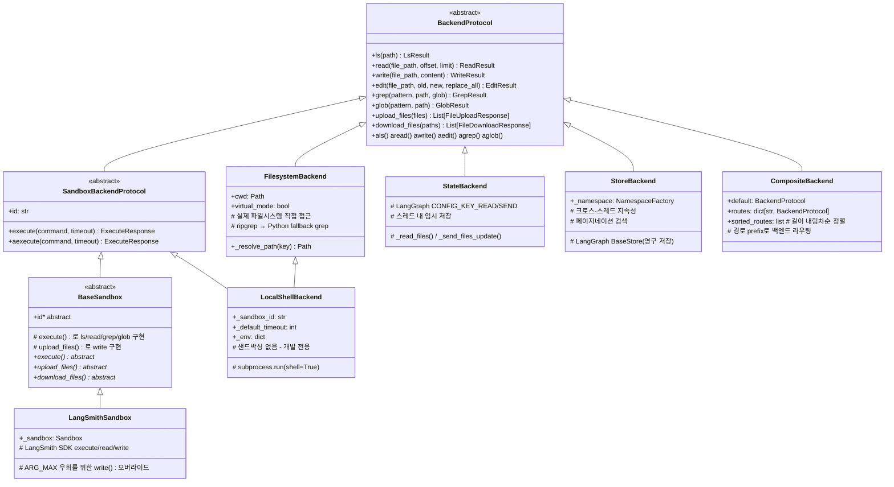
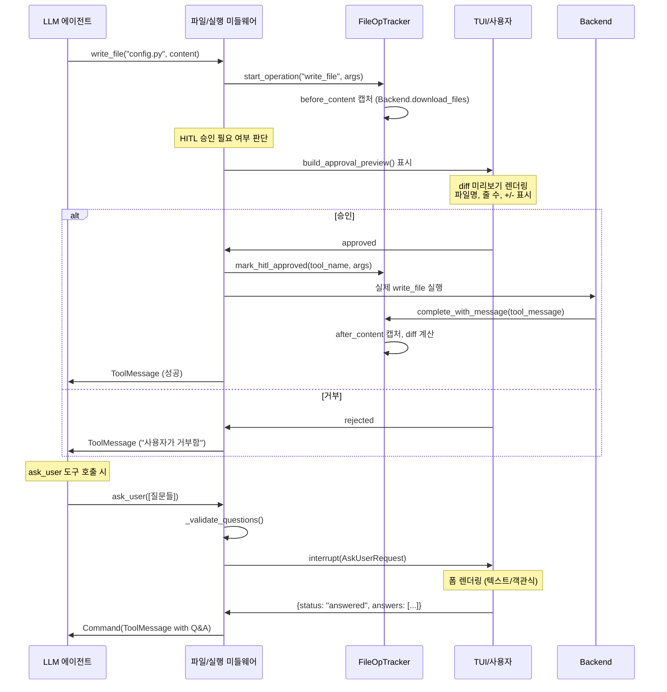

# DeepAgents 도구 시스템, MCP 통합, Backend 추상화 분석

> **분석 대상**: langchain-ai/deepagents@26647a346cd3c71ca223ad2dc17db812f7203b0f
> **CLI 버전**: deepagents-cli v0.0.34 | **Core 버전**: deepagents v0.5.0a4
> **분석일**: 2026-04-04
> **관련 문서**: [02a-에이전트-미들웨어](./02a-에이전트-그래프-미들웨어.md) | [03-설정-모델](./03-설정-모델-관리.md)

---

## 1. 도구 시스템 개요

### 도구 등록 및 바인딩 메커니즘

DeepAgents의 도구 시스템은 LangChain의 `BaseTool` 추상화를 기반으로 하며, 세 가지 출처에서 도구를 수집하여 에이전트에 바인딩한다.

```
[내장 도구]        [MCP 도구]           [미들웨어 도구]
 web_search   +   MultiServerMCP   +   ask_user
 fetch_url        (BaseTool 변환)       write_file (HITL)
                                        edit_file  (HITL)
                                        execute    (HITL)
```

에이전트 초기화 시 `resolve_and_load_mcp_tools()` 를 통해 MCP 도구가 `BaseTool` 리스트로 변환되고, `AskUserMiddleware` 와 파일 조작 미들웨어가 추가 도구를 주입한다.

### 도구 유형 분류

| 유형 | 예시 | 승인 필요 | 설명 |
|------|------|-----------|------|
| 조회 도구 | `web_search`, `fetch_url`, `read_file` | 아니오 | 읽기 전용, 부작용 없음 |
| 파일 변경 도구 | `write_file`, `edit_file` | 설정에 따라 | 파일시스템 변경 |
| 실행 도구 | `execute` | 설정에 따라 | 셸 명령 실행 |
| HITL 질문 도구 | `ask_user` | 항상 | 사용자 입력 대기 |
| MCP 도구 | 서버에 따라 다름 | 설정에 따라 | 외부 MCP 서버 도구 |

---

## 2. 내장 도구 (tools.py)

### 2.1 web_search

**파일**: `tools.py:35-111`

Tavily API를 래핑한 웹 검색 도구이다. 지연 초기화(lazy singleton) 패턴으로 `_tavily_client`를 캐싱한다.

```python
# tools.py:10-11 - 센티널 패턴으로 미초기화 상태와 None(API 키 없음)을 구분
_UNSET = object()
_tavily_client: TavilyClient | object | None = _UNSET
```

**주요 설계 특징**:
- `settings.has_tavily` 조건으로 API 키 없을 때 graceful 실패 (`tools.py:26`)
- `topic` 파라미터로 `"general"`, `"news"`, `"finance"` 세 가지 검색 유형 지원
- Tavily 특정 예외(BadRequestError, InvalidAPIKeyError 등)를 전부 포착하여 에러 딕셔너리 반환
- 시스템 프롬프트에 결과를 raw JSON으로 표시하지 말라는 지시 포함

### 2.2 fetch_url

**파일**: `tools.py:114-167`

URL에서 HTML 콘텐츠를 가져와 `markdownify`로 마크다운으로 변환한다.

```python
# tools.py:150-158
response = requests.get(
    url,
    timeout=timeout,
    headers={"User-Agent": "Mozilla/5.0 (compatible; DeepAgents/1.0)"},
)
markdown_content = markdownify(response.text)
```

**반환 구조**: `url`, `markdown_content`, `status_code`, `content_length` 포함. 성공 여부를 `success` 키로 명시하지 않고 `error` 키의 유무로 판단한다.

---

## 3. MCP 통합 아키텍처 (핵심!)

### 3.1 전체 흐름

```
CLI 시작
  │
  ▼
discover_mcp_configs()          ← 표준 위치 자동 탐색
  │   ~/.deepagents/.mcp.json   (우선순위 낮음)
  │   <project>/.deepagents/.mcp.json
  │   <project>/.mcp.json       (우선순위 높음, Claude Code 호환)
  ▼
classify_discovered_configs()   ← user_configs vs project_configs 분류
  │
  ▼
신뢰 검사 (project_configs에 stdio 서버 존재 시)
  │   trust_project_mcp=True  → 그대로 로드
  │   trust_project_mcp=False → stdio 서버 필터링
  │   trust_project_mcp=None  → TOML 신뢰 저장소 확인
  ▼
merge_mcp_configs()             ← 나중 항목이 덮어씀
  │
  ▼
_load_tools_from_config()
  │   사전 헬스체크 (pre-flight)
  │   MultiServerMCPClient 생성
  │   AsyncExitStack로 세션 관리
  │   load_mcp_tools(서버 이름 prefix=True)
  ▼
List[BaseTool] + MCPSessionManager + List[MCPServerInfo]
```

### 3.2 설정 자동 탐색

**파일**: `mcp_tools.py:201-234`

3곳의 표준 위치를 낮은 우선순위부터 높은 우선순위 순으로 탐색한다:

```python
candidates = [
    user_dir / ".mcp.json",                    # ~/.deepagents/.mcp.json
    project_root / ".deepagents" / ".mcp.json", # 프로젝트 서브디렉터리
    project_root / ".mcp.json",                 # 프로젝트 루트 (Claude Code 호환)
]
```

`project_context`가 제공되면 명시적 경로를 사용하고, 없으면 `find_project_root()`로 git 루트를 탐지하여 fallback으로 CWD를 사용한다.

### 3.3 설정 병합 전략

**파일**: `mcp_tools.py:310-327`

여러 설정 파일을 단순 `dict.update()` 방식으로 병합한다. 같은 서버 이름이면 나중(높은 우선순위) 항목이 이전 것을 완전히 덮어쓴다.

```python
def merge_mcp_configs(configs: list[dict[str, Any]]) -> dict[str, Any]:
    merged: dict[str, Any] = {}
    for cfg in configs:
        servers = cfg.get("mcpServers")
        if isinstance(servers, dict):
            merged.update(servers)
    return {"mcpServers": merged}
```

명시적 `--mcp-config` 경로는 항상 최고 우선순위로 추가되며, 여기서 발생하는 오류는 fatal 처리된다 (`mcp_tools.py:683-690`).

### 3.4 전송 프로토콜 처리

**파일**: `mcp_tools.py:53-124`

세 가지 전송 유형을 지원한다:

| 유형 | 필수 필드 | 선택 필드 | 비고 |
|------|-----------|-----------|------|
| `stdio` (기본값) | `command` | `args`, `env` | 로컬 프로세스 실행 |
| `sse` | `url` | `headers` | Server-Sent Events |
| `http` | `url` | `headers` | streamable_http로 매핑 |

`type`과 `transport` 필드명 모두 인식한다 (`_resolve_server_type`, `mcp_tools.py:57-71`).

### 3.5 사전 헬스체크 (Pre-flight)

**파일**: `mcp_tools.py:455-469`

실제 MCP 세션 핸드셰이크 전에 빠른 실패(fast-fail) 체크를 수행한다:

- **stdio 서버**: `shutil.which(command)`로 PATH에 명령 존재 여부 확인 (`mcp_tools.py:373-392`)
- **SSE/HTTP 서버**: `httpx`로 2초 타임아웃 HEAD 요청 전송 (`mcp_tools.py:395-425`)
  - HTTP 4xx/5xx는 실패로 처리하지 않음 — 전송 레벨 오류만 검사
  - TOCTOU 경합이 있으므로 "best-effort early detection"으로 설명됨

### 3.6 영구 세션 관리 (MCPSessionManager)

**파일**: `mcp_tools.py:355-371`

```python
class MCPSessionManager:
    def __init__(self) -> None:
        self.client: MultiServerMCPClient | None = None
        self.exit_stack = AsyncExitStack()   # 세션 생명주기 관리

    async def cleanup(self) -> None:
        await self.exit_stack.aclose()       # 모든 세션 종료
```

`AsyncExitStack`을 사용하여 모든 서버 세션을 하나의 생명주기 컨텍스트로 관리한다. 각 서버의 세션은 `enter_async_context(client.session(server_name))`로 스택에 등록되며 (`mcp_tools.py:516`), CLI 종료 시 `manager.cleanup()`이 호출되어 전체 세션을 정리한다.

**도구 이름 prefix**: `load_mcp_tools(session, server_name=server_name, tool_name_prefix=True)`로 로드하여 같은 이름의 도구가 다른 서버에서 충돌하지 않도록 `<서버명>_<도구명>` 형태로 prefix를 붙인다.

---

## 4. MCP 신뢰 모델 (mcp_trust.py)

### 4.1 보안 위협 모델

프로젝트 디렉터리의 `.mcp.json`에 정의된 **stdio 서버는 로컬 명령을 실행**하므로, 신뢰할 수 없는 프로젝트를 열었을 때 임의 코드가 실행될 수 있다. 원격 SSE/HTTP 서버는 로컬 코드를 실행하지 않으므로 이 제약에서 제외된다 (`mcp_tools.py:288-307`).

### 4.2 지문(Fingerprint) 기반 신뢰 저장소

**파일**: `mcp_trust.py:27-168`

```
신뢰 결정 흐름:
┌─────────────────────────────────────────────┐
│  프로젝트 stdio MCP 서버 발견                 │
│         │                                   │
│  compute_config_fingerprint()               │
│  ← 정렬된 설정 파일들의 SHA-256 해시         │
│  형식: "sha256:<hex>"                        │
│         │                                   │
│  is_project_mcp_trusted(project_root, fp)   │
│  ← ~/.deepagents/config.toml 조회           │
│  [mcp_trust.projects]                        │
│  "/path/to/project" = "sha256:..."           │
│         │                                   │
│  일치 → 로드   불일치/없음 → stdio 필터링    │
└─────────────────────────────────────────────┘
```

**지문 계산** (`mcp_trust.py:27-42`):
- 여러 설정 파일을 경로 기준으로 정렬
- 각 파일의 raw bytes를 SHA-256 해시에 누적
- 결과를 `"sha256:<64자 hex>"` 형태로 반환

**원자적 저장** (`mcp_trust.py:63-91`):
```python
# 충돌 방지를 위해 임시 파일로 먼저 쓰고 rename
fd, tmp_path = tempfile.mkstemp(dir=config_path.parent, suffix=".tmp")
...
Path(tmp_path).replace(config_path)  # 원자적 교체
```

**설정 변경 감지**: 설정 파일 내용이 변경되면 지문이 달라지므로 자동으로 신뢰가 철회된다. 사용자가 `--trust-project-mcp` 플래그를 사용하거나 `trust_project_mcp()` 함수를 호출해야만 새 지문으로 재승인된다.

**신뢰 관리 API**:
```python
trust_project_mcp(project_root, fingerprint)    # 신뢰 추가
is_project_mcp_trusted(project_root, fingerprint)  # 확인
revoke_project_mcp_trust(project_root)          # 취소
```

---

## 5. Backend 추상화 레이어

### 5.1 계층 다이어그램



### 5.2 핵심 데이터 타입

**파일**: `backends/protocol.py:52-298`

모든 작업은 구조화된 Result 객체를 반환하며, 예외 대신 `error` 필드로 실패를 표현한다:

```python
@dataclass
class ReadResult:
    error: str | None = None
    file_data: FileData | None = None

@dataclass
class WriteResult:
    error: str | None = None
    path: str | None = None

@dataclass
class EditResult:
    error: str | None = None
    path: str | None = None
    occurrences: int | None = None

@dataclass
class ExecuteResponse:
    output: str          # stdout + [stderr] prefix 줄
    exit_code: int | None = None
    truncated: bool = False
```

**FileData 형식** (`protocol.py:148-163`): v1(리스트) → v2(문자열) 마이그레이션 진행 중. v2는 `content: str`과 `encoding: "utf-8" | "base64"` 필드를 갖는다.

### 5.3 FilesystemBackend

**파일**: `backends/filesystem.py`

실제 파일시스템에 직접 읽기/쓰기한다. `virtual_mode`가 핵심 보안 스위치다:

- **`virtual_mode=False`** (기본값): 절대 경로와 `..` 사용 가능. `root_dir`이 있어도 벗어날 수 있음.
- **`virtual_mode=True`**: `root_dir`을 가상 루트로 사용. `..`와 `~`를 차단하고 경로가 루트 밖으로 나가면 `ValueError` 발생.

**grep 구현** (`filesystem.py:483-596`): ripgrep(`rg --json -F`)을 먼저 시도하고, 없으면 Python의 `re.compile(re.escape(pattern))`으로 폴백한다.

**보안 고려**: `os.O_NOFOLLOW` 플래그로 심볼릭 링크를 통한 쓰기를 차단한다.

### 5.4 LocalShellBackend

**파일**: `backends/local_shell.py`

`FilesystemBackend`를 상속하고 `SandboxBackendProtocol`을 구현한다. `subprocess.run(shell=True)`로 호스트 시스템에서 직접 명령을 실행한다.

```python
# local_shell.py:299-307
result = subprocess.run(
    command,
    check=False,
    shell=True,           # 의도적: LLM 제어 셸 실행 설계
    capture_output=True,
    text=True,
    timeout=effective_timeout,
    env=self._env,
    cwd=str(self.cwd),
)
```

**stdout/stderr 통합**: stderr 각 줄에 `[stderr]` prefix를 붙여 stdout과 합쳐 `output`으로 반환한다.

**경고**: 문서에 명시적으로 "샌드박싱 없음, 개발 전용"이라고 기재되어 있으며, HITL 미들웨어 사용을 강력 권장한다 (`local_shell.py:62-76`).

### 5.5 StateBackend

**파일**: `backends/state.py`

LangGraph의 상태 채널에 파일을 저장한다. 동일 스레드 내에서는 지속되지만 스레드 간 공유는 불가능하다.

```python
# state.py:116-119
def _read_files(self) -> dict[str, Any]:
    config = self._get_config()
    read = config["configurable"][CONFIG_KEY_READ]
    return read("files", fresh=False) or {}  # 현재 슈퍼스텝 시작 시점의 상태 읽기

def _send_files_update(self, update: dict[str, Any]) -> None:
    send = config["configurable"][CONFIG_KEY_SEND]
    send([("files", update)])  # 노드 경계에서 적용됨
```

**중요**: `fresh=False`로 읽으면 현재 슈퍼스텝 내의 쓰기가 반영되지 않는다. 쓰기는 노드 경계에서만 적용된다.

### 5.6 StoreBackend

**파일**: `backends/store.py`

LangGraph `BaseStore`를 사용한 영구 크로스-스레드 저장소다. `NamespaceFactory` 콜러블로 사용자/에이전트별 네임스페이스를 동적으로 결정한다.

```python
# store.py:53-54
NamespaceFactory = Callable[[BackendContext[Any, Any]], tuple[str, ...]]

# 사용 예:
namespace=lambda ctx: ("filesystem", ctx.runtime.context.user_id)
```

**네임스페이스 검증** (`store.py:61-98`): `*`, `?`, `[`, `]` 등의 와일드카드 문자를 차단하여 store 조회 injection을 방지한다.

**페이지네이션** (`store.py:289-333`): `_search_store_paginated()`로 100개 단위로 모든 결과를 가져온다.

**비동기 지원**: `aread()`, `awrite()`, `aedit()`를 네이티브 `store.aget()`/`store.aput()`으로 구현하여 스레드 오프로딩 없이 진정한 비동기 처리를 제공한다.

### 5.7 CompositeBackend

**파일**: `backends/composite.py`

경로 prefix를 기준으로 여러 백엔드에 작업을 라우팅하는 라우터 패턴이다.

```python
# 사용 예:
composite = CompositeBackend(
    default=StateBackend(),       # 임시 파일 → 상태 백엔드
    routes={
        "/memories/": StoreBackend()  # /memories/ 하위 → 영구 저장소
    }
)
```

**라우팅 알고리즘** (`composite.py:87-116`):
1. 경로를 `sorted_routes`(길이 내림차순 정렬)와 비교
2. 일치하는 prefix가 있으면 해당 백엔드로 라우팅하고 prefix를 제거한 경로 전달
3. 없으면 `default` 백엔드 사용

**루트(`/`) 집계**: `ls("/")` 호출 시 기본 백엔드 결과와 모든 라우트 디렉터리를 병합한다.

**배치 최적화** (`composite.py:592-631`): `upload_files()`와 `download_files()`는 백엔드별로 파일을 그룹핑하여 각 백엔드에 한 번만 호출한다.

### 5.8 BaseSandbox / LangSmithSandbox

**파일**: `backends/sandbox.py`, `backends/langsmith.py`

`BaseSandbox`는 `execute()`와 `upload_files()`만 구현하면 되는 최소 인터페이스를 제공한다. 나머지 파일 조작(ls, read, write, edit, grep, glob)은 모두 `execute()`로 샌드박스 내부의 Python 스크립트를 실행하여 구현된다.

**인라인 편집 vs 업로드 편집** (`sandbox.py:503-509`):
- old+new 합산 크기 ≤ 50,000바이트: 단일 `execute()` 왕복으로 처리 (`_edit_inline`)
- 50,000바이트 초과: `/tmp/.deepagents_edit_<uid>_old/new`에 임시 파일 업로드 후 서버 사이드 스크립트로 처리 (`_edit_via_upload`)

**LangSmithSandbox 특화** (`langsmith.py:70-90`): `BaseSandbox.write()`는 파일 내용을 셸 명령에 포함시켜 ARG_MAX 한계에 걸릴 수 있으므로, LangSmith SDK의 HTTP body 기반 `write()`로 오버라이드한다.

---

## 6. HITL 승인 시스템

### 6.1 HITL 승인 흐름 다이어그램



### 6.2 승인이 필요한 작업

파일 변경 도구(`write_file`, `edit_file`)와 셸 실행 도구(`execute`)가 기본적으로 HITL 승인 대상이다. 조회 도구(`read_file`, `grep`, `glob`, `ls`)는 승인이 필요 없다.

`FileOpTracker.mark_hitl_approved()` (`file_ops.py:427-438`)는 승인된 작업을 기록하며, 이는 TUI 표시 레이어에서 "승인됨" 배지를 붙이는 데 사용된다.

### 6.3 AskUser HITL 미들웨어 (ask_user.py)

**파일**: `ask_user.py:205-301`

`AskUserMiddleware`는 `AgentMiddleware`를 상속하며 두 가지 역할을 한다:

1. **도구 주입**: `ask_user` 도구를 에이전트 도구 목록에 추가
2. **시스템 프롬프트 주입**: `wrap_model_call()`/`awrap_model_call()`에서 매 LLM 호출에 `ASK_USER_SYSTEM_PROMPT`를 추가

**interrupt 메커니즘** (`ask_user.py:245-252`):
```python
@tool(description=self.tool_description)
def _ask_user(questions, tool_call_id):
    _validate_questions(questions)
    ask_request = AskUserRequest(
        type="ask_user",
        questions=questions,
        tool_call_id=tool_call_id,
    )
    response = interrupt(ask_request)  # LangGraph interrupt: 그래프 실행 일시 중단
    return _parse_answers(response, questions, tool_call_id)
```

LangGraph `interrupt()`를 사용하여 그래프 실행을 일시 중단하고 TUI에서 사용자 입력을 기다린다. 재개 시 `response`에 `{status: "answered", answers: [...]}`가 주입된다.

**오류 복원력** (`ask_user.py:100-201`): 응답 파싱이 유연하며 `answered`, `cancelled`, `error` 세 가지 상태를 처리한다. 잘못된 페이로드는 `(error: ...)` 답변으로 변환하여 LLM이 계속 진행할 수 있게 한다.

### 6.4 질문 유형 (\_ask\_user\_types.py)

**파일**: `_ask_user_types.py`

```python
class Question(TypedDict):
    question: str
    type: Literal["text", "multiple_choice"]
    choices: NotRequired[list[Choice]]   # multiple_choice에만 사용
    required: NotRequired[bool]          # 기본값: True
```

`multiple_choice` 유형은 항상 자동으로 "Other(직접 입력)" 옵션이 추가된다고 도구 설명에 명시되어 있다.

---

## 7. 파일 작업 추적 (file_ops.py)

### 7.1 FileOpTracker 아키텍처

**파일**: `file_ops.py:273-473`

각 CLI 상호작용 세션에서 `read_file`, `write_file`, `edit_file` 작업을 추적하여 TUI에 진행 상황과 diff를 표시한다.

```
active: dict[tool_call_id → FileOperationRecord]
    ↓ complete_with_message()
completed: list[FileOperationRecord]
```

**추적 흐름**:
1. `start_operation(tool_name, args, tool_call_id)`: 레코드 생성, write/edit의 경우 `before_content` 캡처
2. ToolMessage 도착 시 `complete_with_message(tool_message)`: 성공/실패 판정, `after_content` 읽기, diff 계산

**백엔드 인식 before/after 캡처** (`file_ops.py:304-322`): `backend.download_files()` 를 통해 백엔드 독립적으로 파일 내용을 읽는다. 백엔드가 없으면 직접 파일시스템에서 읽는 폴백이 있다.

### 7.2 diff 미리보기 생성

**파일**: `file_ops.py:54-92`

```python
def compute_unified_diff(before, after, display_path, *, max_lines=800, context_lines=3):
    diff_lines = list(difflib.unified_diff(
        before.splitlines(), after.splitlines(),
        fromfile=f"{display_path} (before)",
        tofile=f"{display_path} (after)",
        lineterm="", n=context_lines,
    ))
    if max_lines and len(diff_lines) > max_lines:
        return "\n".join(diff_lines[:max_lines-1] + ["..."])
    return "\n".join(diff_lines)
```

**ApprovalPreview** (`file_ops.py:19-27`): HITL 승인 다이얼로그에 표시되는 데이터 구조로, `title`, `details` (파일명, 액션, 줄 수), `diff`, `diff_title`, `error` 필드를 갖는다.

**write_file vs edit_file 미리보기** (`file_ops.py:169-268`):
- `write_file`: 기존 파일 존재 시 덮어쓰기 경고 포함, diff 줄 수 100개 제한
- `edit_file`: `perform_string_replacement()`로 실제 치환을 미리 계산하여 정확한 diff 생성, 추가/삭제 줄 수 표시

### 7.3 FileOpMetrics

**파일**: `file_ops.py:95-106`

```python
@dataclass
class FileOpMetrics:
    lines_read: int = 0
    start_line: int | None = None
    end_line: int | None = None
    lines_written: int = 0
    lines_added: int = 0      # diff의 + 줄 수
    lines_removed: int = 0    # diff의 - 줄 수
    bytes_written: int = 0
```

---

## 8. 샌드박스 팩토리 패턴 (sandbox_factory.py)

### 8.1 Provider 추상화 계층

**파일**: `integrations/sandbox_provider.py`, `integrations/sandbox_factory.py`

```
SandboxProvider (추상 기반)
  ├── _LangSmithProvider   → LangSmithSandbox   (BaseSandbox)
  ├── _DaytonaProvider     → DaytonaSandbox      (BaseSandbox)
  ├── _ModalProvider       → ModalSandbox        (BaseSandbox)
  ├── _RunloopProvider     → RunloopSandbox      (BaseSandbox)
  └── _AgentCoreProvider   → AgentCoreSandbox    (BaseSandbox)
```

`SandboxProvider` 인터페이스 (`sandbox_provider.py:26-71`):
```python
class SandboxProvider(ABC):
    @abstractmethod
    def get_or_create(self, *, sandbox_id=None, **kwargs) -> SandboxBackendProtocol: ...
    @abstractmethod
    def delete(self, *, sandbox_id: str, **kwargs) -> None: ...

    # 동기 메서드의 비동기 래퍼 자동 제공
    async def aget_or_create(...): return await asyncio.to_thread(self.get_or_create, ...)
    async def adelete(...): return await asyncio.to_thread(self.delete, ...)
```

### 8.2 통합 진입점 (create_sandbox)

**파일**: `sandbox_factory.py:84-143`

```python
@contextmanager
def create_sandbox(provider, *, sandbox_id=None, setup_script_path=None):
    provider_obj = _get_provider(provider)
    should_cleanup = sandbox_id is None  # 새로 생성한 경우만 cleanup

    backend = provider_obj.get_or_create(sandbox_id=sandbox_id)

    if setup_script_path:
        _run_sandbox_setup(backend, setup_script_path)

    try:
        yield backend
    finally:
        if should_cleanup:
            provider_obj.delete(sandbox_id=backend.id)
```

컨텍스트 매니저 패턴으로 샌드박스 생명주기를 자동 관리한다. `sandbox_id`를 명시하면 기존 샌드박스 재사용이며 자동 종료하지 않는다.

### 8.3 프로바이더별 작업 디렉터리

**파일**: `sandbox_factory.py:74-81`

```python
_PROVIDER_TO_WORKING_DIR = {
    "agentcore": "/tmp",
    "daytona":   "/home/daytona",
    "langsmith": "/tmp",
    "modal":     "/workspace",
    "runloop":   "/home/user",
}
```

### 8.4 준비 상태 폴링 패턴

모든 프로바이더가 동일한 폴링 패턴을 사용한다 (예: `_LangSmithProvider.get_or_create`, `sandbox_factory.py:307-319`):

```python
for _ in range(timeout // 2):     # 2초 간격으로 최대 timeout/2 회 시도
    try:
        result = sandbox.run("echo ready", timeout=5)
        if result.exit_code == 0:
            break
    except Exception:
        pass
    time.sleep(2)
else:
    # 타임아웃 시 정리 후 RuntimeError
    with contextlib.suppress(Exception):
        self._client.delete_sandbox(sandbox.name)
    raise RuntimeError(f"sandbox failed to start within {timeout} seconds")
```

### 8.5 선택적 의존성 처리

**파일**: `sandbox_factory.py:179-205`

```python
def _import_provider_module(module_name, *, provider, package):
    try:
        return importlib.import_module(module_name)
    except ImportError as exc:
        msg = (
            f"The '{provider}' sandbox provider requires the '{package}' package. "
            f"Install it with: pip install 'deepagents-cli[{provider}]'"
        )
        raise ImportError(msg) from exc
```

각 프로바이더의 SDK는 선택적 의존성으로, 사용 시점에만 import한다. `verify_sandbox_deps()`로 서버 subprocess 시작 전 의존성을 미리 확인하여 명확한 에러 메시지를 제공한다.

---

## 9. 도구 표시 시스템 (tool_display.py)

### 9.1 tool-specific 스마트 포맷팅

**파일**: `tool_display.py:98-238`

TUI에서 도구 호출을 표시할 때 모든 인수를 나열하지 않고 가장 중요한 인수만 표시한다:

```python
if tool_name in {"read_file", "write_file", "edit_file"}:
    # → "(*) write_file(config.py)"
elif tool_name == "web_search":
    # → '(*) web_search("how to fix bug")'
elif tool_name == "execute":
    # → '(*) execute("npm install", timeout=5m)'  # 비기본 타임아웃만 표시
elif tool_name == "ask_user":
    # → '(*) ask_user(2 questions)'
```

**보안 기능** (`tool_display.py:77-95`): `strip_dangerous_unicode()`로 숨겨진 유니코드 제어 문자를 제거하고, 제거가 발생한 경우 `[hidden chars removed]` 마커를 붙인다. 이는 터미널 인젝션 공격을 방지한다.

### 9.2 ToolMessage 콘텐츠 포맷팅

**파일**: `tool_display.py:276-298`

이미지/비디오/파일 base64 블록을 `[Image: image/png, ~42KB]`와 같이 요약하여 터미널이 base64 데이터로 넘치는 것을 방지한다.

---

## 10. 핵심 패턴 요약 — 자체 CLI 구축 시 참조

### 10.1 도구/백엔드 설계 패턴

| 패턴 | 구현 위치 | 참조 포인트 |
|------|-----------|-------------|
| Result 객체 패턴 | `protocol.py` | 예외 대신 `error` 필드로 실패 표현 |
| 센티널 패턴 | `tools.py:10-11` | `_UNSET`으로 미초기화 vs None 구분 |
| 지연 초기화 | `tools.py:14-32` | API 클라이언트를 최초 사용 시 생성 |
| 컨텍스트 매니저 생명주기 | `sandbox_factory.py:84-143` | 리소스 자동 정리 보장 |
| prefix 라우팅 | `composite.py:87-116` | 경로 기반 멀티백엔드 라우팅 |
| 비동기 래퍼 | `sandbox_provider.py:49-71` | `asyncio.to_thread()`로 동기 → 비동기 변환 |
| 선택적 import | `sandbox_factory.py:179-205` | 플러그인 의존성 지연 로드 |

### 10.2 MCP 통합 참조 패턴

1. **자동 탐색**: 표준 위치 3곳(`~/.tool/.mcp.json`, `<project>/.tool/.mcp.json`, `<project>/.mcp.json`)을 우선순위 순으로 탐색
2. **신뢰 게이팅**: stdio 서버는 지문 기반 TOML 저장소에서 승인 여부 확인
3. **세션 영속성**: `AsyncExitStack`으로 stdio 서버 재시작 방지
4. **도구 이름 충돌 방지**: `tool_name_prefix=True`로 서버명 prefix 부여

### 10.3 HITL 게이트 설계 패턴

1. **도구 실행 전**: `build_approval_preview(tool_name, args)`로 미리보기 생성 → TUI에 표시
2. **before_content 캡처**: 작업 시작 시점에 현재 파일 내용 저장
3. **after_content 비교**: 작업 완료 후 백엔드에서 다시 읽어 실제 변경 사항 diff 계산
4. **승인 상태 기록**: `mark_hitl_approved()`로 승인 여부를 레코드에 저장

### 10.4 백엔드 선택 가이드

| 용도 | 권장 백엔드 | 이유 |
|------|-------------|------|
| 로컬 개발 CLI | `LocalShellBackend` | 셸 실행 + 파일시스템 통합, HITL 필수 |
| 서버사이드 에이전트 | `StateBackend` | 스레드 격리, 안전, 사이드이펙트 없음 |
| 영구 메모리 | `StoreBackend` | 크로스-스레드 지속성, 네임스페이스 격리 |
| 혼합 저장소 | `CompositeBackend` | `/memories/`는 Store, 나머지는 State |
| 격리된 코드 실행 | `LangSmith/Daytona/Modal/Runloop/AgentCore` | 클라우드 샌드박스 |

### 10.5 주목할 만한 구현 세부사항

- **원자적 파일 쓰기** (`mcp_trust.py:79-91`): `mkstemp` + `Path.replace()`로 부분 쓰기 방지
- **타임아웃 능력 검사** (`protocol.py:788-807`): `@lru_cache` + `inspect.signature()`로 백엔드가 timeout 파라미터를 지원하는지 캐싱
- **유니코드 보안** (`tool_display.py:77-95`): 표시 전 위험 유니코드 제거로 터미널 인젝션 방지
- **대용량 편집 처리** (`sandbox.py:503-613`): 50KB 임계값으로 인라인 vs 임시파일 업로드 자동 선택
- **grep ripgrep 폴백** (`filesystem.py:483-596`): `rg --json -F` 우선, 없으면 Python 재귀 검색으로 폴백
