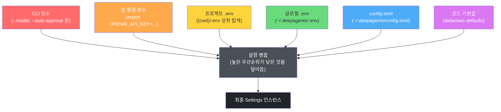

# DeepAgents CLI — 설정 및 모델 관리 시스템 분석

> **분석 대상**: langchain-ai/deepagents@26647a346cd3c71ca223ad2dc17db812f7203b0f
> **CLI 버전**: deepagents-cli v0.0.34 | **Core 버전**: deepagents v0.5.0a4
> **분석일**: 2026-04-04
> **관련 문서**: [02a-에이전트-미들웨어](./02a-에이전트-그래프-미들웨어.md) | [02b-도구-MCP-백엔드](./02b-도구-MCP-백엔드.md) | [04-UI-위젯](./04-UI-위젯-시스템.md)

---

## 목차

1. [설정 시스템 개요](#1-설정-시스템-개요)
2. [Settings 클래스 분석](#2-settings-클래스-분석)
3. [SessionState 분석](#3-sessionstate-분석)
4. [모델 설정 & 프로바이더 시스템](#4-모델-설정--프로바이더-시스템)
5. [ConfigurableModel 추상화](#5-configurablemodel-추상화)
6. [서버 설정](#6-서버-설정)
7. [환경 변수 매핑](#7-환경-변수-매핑)
8. [핵심 패턴 요약](#8-핵심-패턴-요약)

---

## 1. 설정 시스템 개요

### 전체 아키텍처

DeepAgents CLI의 설정 시스템은 **다층 구조(layered architecture)**로 설계되어 있다. 여러 소스에서 설정 값을 읽어 우선순위에 따라 병합하며, 지연 초기화(lazy initialization)와 스레드 안전(thread-safe) 싱글톤 패턴을 적극 활용한다.

```
config.py          — 전역 Settings, SessionState, ModelResult, create_model()
model_config.py    — ModelConfig(TOML), ModelSpec, 프로바이더 레지스트리, 프로파일
_server_config.py  — CLI↔서버 서브프로세스 간 직렬화 채널(ServerConfig)
_env_vars.py       — DEEPAGENTS_CLI_* 환경 변수 상수 레지스트리
_cli_context.py    — 런타임 모델 오버라이드용 CLIContext TypedDict
configurable_model.py — LangGraph 미들웨어(ConfigurableModelMiddleware)
_testing_models.py — 통합 테스트용 결정론적 모델(DeterministicIntegrationChatModel)
```

### 주요 클래스 관계

```
Settings (config.py:846)
  └─ 싱글톤. from_environment()로 생성, _get_settings()로 접근
  └─ 프로바이더별 API 키, 프로젝트 루트, 셸 허용 목록 보관

ModelConfig (model_config.py:778)
  └─ ~/.deepagents/config.toml 파싱 결과. 불변(frozen=True) dataclass
  └─ providers: Mapping[str, ProviderConfig]

ModelResult (config.py:2076)
  └─ create_model()의 반환값. 모델 인스턴스 + 메타데이터 묶음

SessionState (config.py:1393)
  └─ 세션 단위 가변 상태(auto_approve, thread_id 등)

ServerConfig (_server_config.py:106)
  └─ CLI → 서버 서브프로세스 직렬화 페이로드

ConfigurableModelMiddleware (configurable_model.py:145)
  └─ LangGraph AgentMiddleware 구현체
  └─ 런타임 context= 에서 모델/파라미터 오버라이드 적용
```

---

## 2. Settings 클래스 분석

### 설정 우선순위 계층

`config.py`의 `_load_dotenv()` 함수(80번째 줄)와 `Settings.from_environment()` 메서드(912번째 줄)가 함께 아래 우선순위를 구현한다.



**우선순위 상세 설명:**

| 우선순위 | 소스 | 구현 위치 | 비고 |
|--------|------|-----------|------|
| 1 (최고) | CLI 인수 | `main.py` → `ServerConfig.from_cli_args()` | `--model`, `--auto-approve` 등 |
| 2 | 셸 환경 변수 | `os.environ` (override=False로 보호) | `OPENAI_API_KEY` 등 |
| 3 | 프로젝트 `.env` | `_load_dotenv()` 첫 번째 로드 | CWD 상위 방향 탐색 |
| 4 | 글로벌 `.env` | `_load_dotenv()` 두 번째 로드 | `~/.deepagents/.env` |
| 5 | `config.toml` | `ModelConfig.load()` | `~/.deepagents/config.toml` |
| 6 (최저) | 코드 기본값 | dataclass 필드 기본값 | `auto_approve=False` 등 |

`DEEPAGENTS_CLI_` 접두어 우선순위는 별도로 작동한다. `resolve_env_var(name)` 함수(`model_config.py:31`)가 `DEEPAGENTS_CLI_{NAME}`을 먼저 확인하고, 없을 경우 `{NAME}`을 읽는다. 빈 문자열로 설정하면 원래 변수를 명시적으로 차단(suppress)하는 기능도 있다.

### 설정 파일 경로

```python
# model_config.py:220-224
DEFAULT_CONFIG_DIR = Path.home() / ".deepagents"
DEFAULT_CONFIG_PATH = DEFAULT_CONFIG_DIR / "config.toml"

# config.py:75
_GLOBAL_DOTENV_PATH = Path.home() / ".deepagents" / ".env"
```

**`~/.deepagents/config.toml` 구조 예시:**

```toml
[models]
default = "anthropic:claude-sonnet-4-5"   # 명시적 기본 모델
recent = "openai:gpt-4o"                  # 마지막으로 /model로 전환한 모델

[models.providers.ollama]
models = ["llama3.2", "qwen2.5-coder:32b"]
base_url = "http://localhost:11434"

[models.providers.ollama.params]
temperature = 0.7
# 모델별 오버라이드
"qwen2.5-coder:32b" = { temperature = 0.1 }

[models.providers.openrouter]
api_key_env = "OPENROUTER_API_KEY"
models = ["openai/gpt-oss-120b"]

[models.providers.my_custom]
class_path = "my_package.models:MyChatModel"
models = ["my-model-v1"]

[skills]
extra_allowed_dirs = ["/opt/company-skills"]

[warnings]
suppress = ["ripgrep"]

[threads]
relative_time = true
sort_order = "updated_at"
[threads.columns]
git_branch = true
cwd = false
```

### 설정 검증 로직

`ModelConfig._validate()` 메서드(`model_config.py:865`)는 로드 시 일관성을 검사하지만, 예외를 발생시키지 않고 경고 로그만 남긴다:

```python
# 검증 항목 (model_config.py:865-919)
# 1. default_model / recent_model 이 "provider:model" 형식인지 확인
# 2. provider.enabled 가 bool 타입인지 확인
# 3. class_path 가 "module:ClassName" 형식인지 확인
# 4. params 서브테이블의 모델명이 models 목록에 있는지 확인
```

### 지연 부트스트랩(Lazy Bootstrap) 메커니즘

`config.py:152`의 `_ensure_bootstrap()`은 첫 번째 `settings` 접근 시점에 한 번만 실행된다. 이를 통해 `deepagents --help` 같은 가벼운 호출에서 불필요한 디스크 I/O를 방지한다.

```python
# config.py:31-39
_bootstrap_done = False
_bootstrap_lock = threading.Lock()   # 동시 접근 방지
_singleton_lock = threading.Lock()   # 싱글톤 생성 보호

# 부트스트랩 순서 (config.py:152-231):
# 1. 프로젝트 CWD 컨텍스트 탐지
# 2. .env 파일 로드 (project > global)
# 3. _original_langsmith_project 캡처 (오버라이드 전)
# 4. LANGSMITH_PROJECT 오버라이드 설정
# 5. DEEPAGENTS_CLI_ 접두어 LangSmith 변수 전파
```

### Settings 주요 필드

```python
# config.py:846-910
@dataclass
class Settings:
    openai_api_key: str | None         # OPENAI_API_KEY
    anthropic_api_key: str | None      # ANTHROPIC_API_KEY
    google_api_key: str | None         # GOOGLE_API_KEY
    nvidia_api_key: str | None         # NVIDIA_API_KEY
    tavily_api_key: str | None         # TAVILY_API_KEY
    google_cloud_project: str | None   # VertexAI 인증용

    # 런타임 모델 상태 (create_model() 호출 후 설정)
    model_name: str | None = None
    model_provider: str | None = None
    model_context_limit: int | None = None
    model_unsupported_modalities: frozenset[str] = frozenset()

    project_root: Path | None = None   # git 프로젝트 루트
    shell_allow_list: list[str] | None = None
    extra_skills_dirs: list[Path] | None = None
```

**편의 프로퍼티들** (`config.py:1114-1142`): `has_openai`, `has_anthropic`, `has_google`, `has_vertex_ai`, `has_tavily` — 각 API 키/인증 설정 여부를 불리언으로 반환한다.

### 런타임 리로드

`Settings.reload_from_environment()` 메서드(`config.py:982`)는 `/reload` 명령 시 호출된다. 모델 상태(`model_name`, `model_provider`, `model_context_limit`)와 원본 LangSmith 프로젝트(`user_langchain_project`)는 의도적으로 리로드에서 **제외**된다.

---

## 3. SessionState 분석

`SessionState` 클래스(`config.py:1393`)는 단일 CLI 세션 동안 변경될 수 있는 가변(mutable) 런타임 상태를 보관한다.

```python
# config.py:1393-1434
class SessionState:
    def __init__(self, auto_approve: bool = False, no_splash: bool = False):
        self.auto_approve = auto_approve    # 도구 호출 자동 승인 여부
        self.no_splash = no_splash          # 스플래시 화면 표시 여부
        self.exit_hint_until: float | None = None
        self.exit_hint_handle = None
        self.thread_id = generate_thread_id()  # LangGraph 스레드 식별자

    def toggle_auto_approve(self) -> bool:
        """Shift+Tab 키로 auto_approve를 토글하고 새 상태 반환."""
        self.auto_approve = not self.auto_approve
        return self.auto_approve
```

**Settings vs SessionState 역할 구분:**

| 구분 | Settings | SessionState |
|------|----------|--------------|
| 생명주기 | 프로세스 시작 시 생성, 리로드 가능 | 단일 대화 세션 |
| 가변성 | 제한적 (reload_from_environment) | 자유롭게 변경 |
| 주요 데이터 | API 키, 모델 정보, 프로젝트 경로 | auto_approve, thread_id |
| 접근 방식 | 모듈 레벨 싱글톤 | 앱 인스턴스에 보관 |

**thread_id의 역할:** LangGraph 스트림 설정(`build_stream_config()`, `config.py:617`)에 `configurable.thread_id`로 주입된다. 이를 통해 동일 세션 내의 모든 에이전트 호출이 하나의 LangSmith 트레이스 스레드로 연결된다.

---

## 4. 모델 설정 & 프로바이더 시스템

### 모델 스펙 정의 방식

`ModelSpec` (`model_config.py:73`)은 `"provider:model"` 형식의 모델 식별자를 표현하는 불변 데이터클래스다.

```python
# model_config.py:73-145
@dataclass(frozen=True)
class ModelSpec:
    provider: str    # 예: "anthropic"
    model: str       # 예: "claude-sonnet-4-5"

    @classmethod
    def parse(cls, spec: str) -> ModelSpec:
        # "anthropic:claude-sonnet-4-5" → ModelSpec(provider="anthropic", model="claude-sonnet-4-5")
        if ":" not in spec:
            raise ValueError(...)
        provider, model = spec.split(":", 1)
        return cls(provider=provider, model=model)
```

### 프로바이더 해결(Resolution) 메커니즘

`create_model()` 함수(`config.py:2156`)가 모델 생성의 핵심 진입점이다. 프로바이더 해결 순서는 다음과 같다:

```
1. "provider:model" 형식 → ModelSpec.try_parse()로 직접 분리
2. 콜론 없는 베어 모델명 → detect_provider()로 자동 감지
3. 그래도 불명확하면 → init_chat_model()에 위임 (langchain 자체 추론)
```

`detect_provider()` 함수(`config.py:1768`)가 모델 이름 패턴으로 프로바이더를 추론한다:

```python
# config.py:1786-1807
if model_lower.startswith(("gpt-", "o1", "o3", "o4", "chatgpt")):
    return "openai"
if model_lower.startswith("claude"):
    return "anthropic"  # 또는 "google_vertexai" (VertexAI 인증만 있을 경우)
if model_lower.startswith("gemini"):
    return "google_genai"  # 또는 "google_vertexai"
if model_lower.startswith(("nemotron", "nvidia/")):
    return "nvidia"
```

### 기본 모델 자동 감지

`_get_default_model_spec()` 함수(`config.py:1810`)가 다음 순서로 기본 모델을 결정한다:

```python
# config.py:1828-1851
config = ModelConfig.load()
if config.default_model:         # 1. config.toml [models].default
    return config.default_model
if config.recent_model:          # 2. config.toml [models].recent
    return config.recent_model
# 3. API 키 기반 자동 감지 (우선순위 순)
if s.has_openai:    return "openai:gpt-5.2"
if s.has_anthropic: return "anthropic:claude-sonnet-4-6"
if s.has_google:    return "google_genai:gemini-3.1-pro-preview"
if s.has_vertex_ai: return "google_vertexai:gemini-3.1-pro-preview"
if s.has_nvidia:    return "nvidia:nvidia/nemotron-3-super-120b-a12b"
```

### 모델 프로파일 시스템

모델 프로파일은 각 LangChain 프로바이더 패키지의 `data/_profiles.py` 모듈에 `_PROFILES` 딕셔너리로 정의된다. `_load_provider_profiles()` (`model_config.py:336`)가 이를 동적으로 로드한다.

**프로파일 항목 예시:**

```python
_PROFILES = {
    "claude-sonnet-4-5": {
        "tool_calling": True,
        "max_input_tokens": 200000,
        "text_inputs": True,
        "text_outputs": True,
        "image_inputs": True,
        "audio_inputs": False,
        "video_inputs": False,
        "pdf_inputs": True,
    },
    ...
}
```

**모델 필터링 기준** (`model_config.py:472-479`): `get_available_models()`는 다음 조건을 모두 만족하는 모델만 UI에 노출한다:

```python
# 도구 호출 지원 AND 텍스트 입출력 지원
if profile.get("tool_calling", False)
   and profile.get("text_inputs", True) is not False
   and profile.get("text_outputs", True) is not False
```

### 프로파일 병합 레이어

`_build_entry()` 함수(`model_config.py:546`)가 세 레이어를 병합한다:

```
upstream profile (패키지 기본값)
    + config.toml [models.providers.{provider}.profile] 오버라이드
    + CLI --profile-override (최고 우선순위)
    = 최종 ModelProfileEntry { profile: dict, overridden_keys: frozenset }
```

### 프로바이더 인증 정보 확인

`PROVIDER_API_KEY_ENV` 딕셔너리(`model_config.py:226`)에 19개 프로바이더의 API 키 환경 변수가 매핑되어 있다:

```python
# model_config.py:226-246
PROVIDER_API_KEY_ENV: dict[str, str] = {
    "anthropic": "ANTHROPIC_API_KEY",
    "openai": "OPENAI_API_KEY",
    "google_genai": "GOOGLE_API_KEY",
    "azure_openai": "AZURE_OPENAI_API_KEY",
    "cohere": "COHERE_API_KEY",
    "deepseek": "DEEPSEEK_API_KEY",
    "fireworks": "FIREWORKS_API_KEY",
    "groq": "GROQ_API_KEY",
    "mistralai": "MISTRAL_API_KEY",
    "nvidia": "NVIDIA_API_KEY",
    "openrouter": "OPENROUTER_API_KEY",
    # ... 총 19개
}
```

`has_provider_credentials(provider)` 함수(`model_config.py:707`)는 다음 순서로 인증 정보를 확인한다:

1. config.toml의 `api_key_env` 설정 (사용자 오버라이드 우선)
2. `class_path` 프로바이더 → 자체 인증으로 가정 (`True` 반환)
3. `PROVIDER_API_KEY_ENV` 하드코딩 매핑
4. 위 모두 해당 없으면 `None` (알 수 없음)

### 런타임 모델 전환

`/model` 명령이 실행되면 다음 흐름으로 모델이 전환된다:

```
1. 사용자가 /model로 새 모델 선택
2. create_model(new_spec) 호출
3. ModelResult 반환 (모델 인스턴스 + 메타데이터)
4. ModelResult.apply_to_settings() 호출
   → settings.model_name, model_provider, model_context_limit 업데이트
5. save_recent_model(new_spec) 호출
   → ~/.deepagents/config.toml [models].recent 갱신
6. 서버 서브프로세스의 CLIContext에 새 model 스펙 주입
   → ConfigurableModelMiddleware가 다음 요청부터 새 모델 사용
```

서버 서브프로세스 내 모델 전환은 `ConfigurableModelMiddleware`가 담당한다 (5절 참고). CLI 프로세스와 서버 프로세스는 메모리를 공유하지 않으므로, LangGraph `context=` 딕셔너리를 통해 전달된다.

### 커스텀 프로바이더 (class_path)

config.toml에 `class_path`를 지정하면 임의의 `BaseChatModel` 서브클래스를 사용할 수 있다(`_create_model_from_class()`, `config.py:1947`):

```toml
[models.providers.my_local]
class_path = "my_package.chat:MyLocalChatModel"
models = ["local-v1"]
```

```python
# config.py:1947-2007
def _create_model_from_class(class_path, model_name, provider, kwargs):
    module_path, class_name = class_path.rsplit(":", 1)
    module = importlib.import_module(module_path)
    cls = getattr(module, class_name)
    # BaseChatModel 서브클래스인지 검증
    if not (isinstance(cls, type) and issubclass(cls, _BaseChatModel)):
        raise ModelConfigError(...)
    return cls(model=model_name, **kwargs)
```

---

## 5. ConfigurableModel 추상화

### CLIContext TypedDict

`_cli_context.py`는 런타임 모델 오버라이드 페이로드를 정의한다:

```python
# _cli_context.py:15-27
class CLIContext(TypedDict, total=False):
    model: str | None
    """실행 중 교체할 모델 스펙 (예: 'openai:gpt-4o')"""

    model_params: dict[str, Any]
    """temperature, max_tokens 등 호출별 파라미터 오버라이드"""
```

이 딕셔너리는 LangGraph의 `agent.astream(..., context=cli_context)` 형태로 전달된다. `total=False`이므로 두 필드 모두 선택 사항이다.

### ConfigurableModelMiddleware

`configurable_model.py:145`에 정의된 `ConfigurableModelMiddleware`는 `AgentMiddleware`를 구현한다. 그래프를 재컴파일하지 않고 호출별로 모델을 교체할 수 있게 해주는 핵심 컴포넌트다.

**처리 흐름:**

```python
# configurable_model.py:52-142
def _apply_overrides(request: ModelRequest) -> ModelRequest:
    ctx = request.runtime.context  # CLIContext 딕셔너리

    # 1. 모델 교체 필요 여부 확인
    new_model = None
    if model := ctx.get("model"):
        if not model_matches_spec(request.model, model):
            model_result = create_model(model)  # 새 모델 인스턴스 생성
            new_model = model_result.model

    # 2. 파라미터 병합
    if model_params := ctx.get("model_params", {}):
        overrides["model_settings"] = {**request.model_settings, **model_params}

    # 3. Anthropic 전용 설정 제거 (다른 프로바이더로 전환 시)
    if new_model and not _is_anthropic_model(new_model):
        overrides["model_settings"] = {
            k: v for k, v in settings.items()
            if k not in _ANTHROPIC_ONLY_SETTINGS  # {"cache_control"}
        }

    # 4. 시스템 프롬프트의 모델 신원 섹션 패치
    if new_model and request.system_prompt:
        new_identity = build_model_identity_section(...)
        overrides["system_prompt"] = MODEL_IDENTITY_RE.sub(new_identity, prompt)

    return request.override(**overrides)
```

**주의점:** 서버 서브프로세스는 `/model` 명령으로 `settings`가 갱신되지 않는다. 따라서 미들웨어는 `settings` 싱글톤이 아닌 `model_result` 객체에서 메타데이터를 직접 읽는다(`configurable_model.py:117` 주석 참고).

---

## 6. 서버 설정

### ServerConfig 역할

`_server_config.py:106`의 `ServerConfig`는 CLI 프로세스에서 서버 서브프로세스(`langgraph dev`)로 설정을 전달하는 **직렬화 채널**이다. `DEEPAGENTS_CLI_SERVER_` 접두어 환경 변수를 매개로 한다.

```python
# _server_config.py:106-133
@dataclass(frozen=True)
class ServerConfig:
    model: str | None = None
    model_params: dict[str, Any] | None = None
    assistant_id: str = "agent"
    system_prompt: str | None = None
    auto_approve: bool = False
    interrupt_shell_only: bool = False
    shell_allow_list: list[str] | None = None
    interactive: bool = True
    enable_shell: bool = True
    enable_ask_user: bool = False
    enable_memory: bool = True
    enable_skills: bool = True
    sandbox_type: str | None = None
    sandbox_id: str | None = None
    sandbox_setup: str | None = None
    cwd: str | None = None
    project_root: str | None = None
    mcp_config_path: str | None = None
    no_mcp: bool = False
    trust_project_mcp: bool | None = None
```

### 직렬화/역직렬화

```python
# CLI 측 (서버 시작 시)
config = ServerConfig.from_cli_args(...)
env_vars = config.to_env()   # {"MODEL": "anthropic:claude-sonnet-4-5", ...}
# 각 변수를 os.environ에 설정 후 서브프로세스 실행

# 서버 측 (서버 그래프 초기화 시)
config = ServerConfig.from_env()  # os.environ에서 복원
```

**직렬화 규칙:**
- `bool` → `"true"` / `"false"` 문자열
- `dict` → JSON 문자열 (`json.dumps`)
- `list[str]` → 쉼표 구분 문자열
- `None` → 환경 변수 **삭제** (빈 문자열이 아님)
- 삼중 상태 bool (`bool | None`) → `"true"` / `"false"` / 키 없음

### 경로 정규화

`from_cli_args()` 메서드는 상대 경로를 절대 경로로 변환한다. 서버 서브프로세스가 다른 작업 디렉토리에서 실행될 수 있기 때문이다:

```python
# _server_config.py:288
normalized_mcp = _normalize_path(mcp_config_path, project_context, "MCP config")
```

---

## 7. 환경 변수 매핑

### DEEPAGENTS_CLI_* 레지스트리

`_env_vars.py`는 `DEEPAGENTS_CLI_` 접두어를 가진 모든 환경 변수를 모듈 레벨 상수로 정의한다. 드리프트 탐지 테스트(`tests/unit_tests/test_env_vars.py`)가 소스 코드 내 문자열 리터럴 사용을 금지한다.

```python
# _env_vars.py — 전체 상수 목록
AUTO_UPDATE = "DEEPAGENTS_CLI_AUTO_UPDATE"   # 자동 업데이트 활성화
DEBUG = "DEEPAGENTS_CLI_DEBUG"               # 디버그 로깅 파일 출력
DEBUG_FILE = "DEEPAGENTS_CLI_DEBUG_FILE"     # 디버그 로그 파일 경로 (기본: /tmp/deepagents_debug.log)
EXTRA_SKILLS_DIRS = "DEEPAGENTS_CLI_EXTRA_SKILLS_DIRS"  # 추가 스킬 디렉토리 (콜론 구분)
LANGSMITH_PROJECT = "DEEPAGENTS_CLI_LANGSMITH_PROJECT"  # 에이전트 트레이스용 프로젝트명
NO_UPDATE_CHECK = "DEEPAGENTS_CLI_NO_UPDATE_CHECK"      # 업데이트 확인 비활성화
SERVER_ENV_PREFIX = "DEEPAGENTS_CLI_SERVER_"            # 서버 서브프로세스 설정 접두어
SHELL_ALLOW_LIST = "DEEPAGENTS_CLI_SHELL_ALLOW_LIST"    # 자동 승인 셸 명령 목록
USER_ID = "DEEPAGENTS_CLI_USER_ID"                      # LangSmith 트레이스 사용자 ID
```

### DEEPAGENTS_CLI_ 접두어 오버라이드 메커니즘

`resolve_env_var(name)` 함수(`model_config.py:31`)가 동적 오버라이드를 처리한다:

```python
# model_config.py:31-66
def resolve_env_var(name: str) -> str | None:
    if not name.startswith(_ENV_PREFIX):  # "DEEPAGENTS_CLI_"
        prefixed = f"DEEPAGENTS_CLI_{name}"
        if prefixed in os.environ:
            val = os.environ[prefixed]
            return val or None  # 빈 문자열 → None (원본 변수 차단)
    return os.environ.get(name) or None
```

**활용 예시:**

```bash
# OpenAI 키를 CLI 전용으로 분리 (다른 도구의 키와 충돌 방지)
export DEEPAGENTS_CLI_OPENAI_API_KEY="sk-proj-cli-only..."
export OPENAI_API_KEY="sk-proj-other-tool..."

# LangSmith 트레이싱 CLI 전용 설정
export DEEPAGENTS_CLI_LANGSMITH_API_KEY="lsv2_cli..."
export DEEPAGENTS_CLI_LANGSMITH_TRACING="true"
export DEEPAGENTS_CLI_LANGSMITH_PROJECT="my-agent-project"

# 특정 키를 CLI에서 명시적으로 비활성화
export DEEPAGENTS_CLI_ANTHROPIC_API_KEY=""  # 빈 문자열로 차단
```

### ServerConfig 환경 변수 (DEEPAGENTS_CLI_SERVER_*)

CLI 프로세스에서 서버 서브프로세스로 전달되는 변수들:

| 환경 변수 | 타입 | 예시 |
|-----------|------|------|
| `DEEPAGENTS_CLI_SERVER_MODEL` | 문자열 | `anthropic:claude-sonnet-4-5` |
| `DEEPAGENTS_CLI_SERVER_MODEL_PARAMS` | JSON | `{"temperature":0.7}` |
| `DEEPAGENTS_CLI_SERVER_AUTO_APPROVE` | bool 문자열 | `true` |
| `DEEPAGENTS_CLI_SERVER_SHELL_ALLOW_LIST` | 쉼표 구분 | `ls,cat,grep` |
| `DEEPAGENTS_CLI_SERVER_ENABLE_SHELL` | bool 문자열 | `true` |
| `DEEPAGENTS_CLI_SERVER_CWD` | 절대 경로 | `/home/user/project` |
| `DEEPAGENTS_CLI_SERVER_MCP_CONFIG_PATH` | 절대 경로 | `/home/user/.config/mcp.json` |
| `DEEPAGENTS_CLI_SERVER_TRUST_PROJECT_MCP` | bool/없음 | `true` |

---

## 8. 핵심 패턴 요약

자체 에이전트 CLI를 구축할 때 참조할 수 있는 핵심 패턴들을 정리한다.

### 패턴 1: 계층적 설정 로딩

```python
# 우선순위: CLI > 셸 env > 프로젝트 .env > 글로벌 .env > config 파일 > 기본값
# 핵심: python-dotenv의 override=False 활용

import dotenv

# 1. 프로젝트 .env (먼저 로드, 글로벌보다 높은 우선순위)
dotenv.load_dotenv(dotenv_path=find_project_dotenv(), override=False)
# 2. 글로벌 .env (나중 로드, 이미 설정된 값은 덮어쓰지 않음)
dotenv.load_dotenv(dotenv_path=Path.home() / ".myapp" / ".env", override=False)
# 셸 환경 변수는 python-dotenv가 절대 덮어쓰지 않음 (override=False 덕분)
```

### 패턴 2: 접두어 기반 환경 변수 분리

```python
_PREFIX = "MYAPP_CLI_"

def resolve_env_var(name: str) -> str | None:
    """MYAPP_CLI_{name}을 먼저 확인, 없으면 {name} 폴백."""
    prefixed = f"{_PREFIX}{name}"
    if prefixed in os.environ:
        return os.environ[prefixed] or None  # 빈 문자열 → None
    return os.environ.get(name) or None

# 사용법: MYAPP_CLI_OPENAI_API_KEY가 OPENAI_API_KEY보다 우선
api_key = resolve_env_var("OPENAI_API_KEY")
```

### 패턴 3: 지연 초기화 싱글톤

```python
import threading

_singleton_lock = threading.Lock()

def _get_settings() -> Settings:
    cached = globals().get("settings")
    if cached is not None:
        return cached
    with _singleton_lock:  # 이중 확인 잠금(double-checked locking)
        cached = globals().get("settings")
        if cached is not None:
            return cached
        inst = Settings.from_environment()
        globals()["settings"] = inst
        return inst
```

### 패턴 4: 불변 설정 + 원자적 파일 쓰기

```python
import tempfile, tomllib, tomli_w

def save_config_field(field: str, value: str) -> bool:
    config_path = Path.home() / ".myapp" / "config.toml"
    config_path.parent.mkdir(parents=True, exist_ok=True)

    data = {}
    if config_path.exists():
        with config_path.open("rb") as f:
            data = tomllib.load(f)

    data.setdefault("models", {})[field] = value

    # 원자적 쓰기: 임시 파일에 쓰고 rename
    fd, tmp = tempfile.mkstemp(dir=config_path.parent, suffix=".tmp")
    try:
        with os.fdopen(fd, "wb") as f:
            tomli_w.dump(data, f)
        Path(tmp).replace(config_path)  # POSIX 원자적 연산
    except BaseException:
        Path(tmp).unlink(missing_ok=True)
        raise
    return True
```

### 패턴 5: 프로바이더 기반 모델 팩토리

```python
from langchain.chat_models import init_chat_model

def create_model(spec: str) -> BaseChatModel:
    if ":" in spec:
        provider, model_name = spec.split(":", 1)
    else:
        provider = detect_provider(spec) or ""
        model_name = spec

    kwargs = load_provider_kwargs(provider)  # config.toml에서 로드
    return init_chat_model(model_name, model_provider=provider, **kwargs)
```

### 패턴 6: LangGraph 미들웨어를 통한 런타임 모델 교체

```python
from langchain.agents.middleware.types import AgentMiddleware, ModelRequest, ModelResponse

class ConfigurableModelMiddleware(AgentMiddleware):
    def wrap_model_call(self, request: ModelRequest, handler) -> ModelResponse:
        ctx = request.runtime.context or {}
        if new_spec := ctx.get("model"):
            new_model = create_model(new_spec).model
            request = request.override(model=new_model)
        return handler(request)

# 사용: 그래프 재컴파일 없이 호출별 모델 교체
await agent.astream(input, context={"model": "openai:gpt-4o"})
```

### 패턴 7: 프로세스 간 설정 전달 (환경 변수 직렬화)

```python
# 부모 프로세스
@dataclass(frozen=True)
class SubprocessConfig:
    model: str | None = None
    debug: bool = False

    def to_env(self) -> dict[str, str | None]:
        return {
            "MYAPP_SERVER_MODEL": self.model,
            "MYAPP_SERVER_DEBUG": str(self.debug).lower(),
        }

# 자식 프로세스
    @classmethod
    def from_env(cls) -> "SubprocessConfig":
        return cls(
            model=os.environ.get("MYAPP_SERVER_MODEL"),
            debug=os.environ.get("MYAPP_SERVER_DEBUG") == "true",
        )

# None 값 → 환경 변수 삭제 (빈 문자열과 구분)
for suffix, value in config.to_env().items():
    if value is None:
        os.environ.pop(f"MYAPP_SERVER_{suffix}", None)
    else:
        os.environ[f"MYAPP_SERVER_{suffix}"] = value
```

### 패턴 8: 테스트용 결정론적 모델 구현

통합 테스트에서 실제 LLM을 대체할 때 고려할 세 가지 요건:
1. `bind_tools()` 구현 (에이전트 루프가 도구 스키마 바인딩 호출)
2. `profile` 속성 (`tool_calling`, `max_input_tokens` 등 capability negotiation)
3. 프롬프트 기반 결정론적 응답 (프로세스 재시작 후에도 동일 결과)

```python
# _testing_models.py:21-144 참고
class DeterministicIntegrationChatModel(GenericFakeChatModel):
    profile = {"tool_calling": True, "max_input_tokens": 8000}

    def bind_tools(self, tools, **kwargs):
        return self  # no-op passthrough

    def _generate(self, messages, **kwargs):
        # 프롬프트에서 마지막 18개 토큰으로 결정론적 응답 생성
        excerpt = " ".join(prompt.split()[-18:])
        return ChatResult(generations=[ChatGeneration(
            message=AIMessage(content=f"integration reply: {excerpt}")
        )])
```

---

## 부록: 설정 파일 전체 구조 참조

```toml
# ~/.deepagents/config.toml 전체 스키마

[models]
default = "anthropic:claude-sonnet-4-5"  # 명시적 기본 모델
recent = "openai:gpt-4o"                 # 마지막 /model 전환 (자동 저장)

[models.providers.{provider_name}]
enabled = true                    # false로 설정하면 모델 선택기에서 숨김
models = ["model-a", "model-b"]   # 사용 가능한 모델 목록
api_key_env = "MY_API_KEY"        # API 키 환경 변수명
base_url = "http://localhost:1234" # 커스텀 API 엔드포인트
class_path = "pkg.module:MyModel" # 커스텀 BaseChatModel 클래스

[models.providers.{provider_name}.params]
temperature = 0.7        # 프로바이더 전체 기본값
max_tokens = 4096
# 모델별 오버라이드 (sub-table 형식)
"specific-model" = { temperature = 0.1 }

[models.providers.{provider_name}.profile]
max_input_tokens = 128000  # 컨텍스트 크기 오버라이드
tool_calling = true         # 도구 호출 지원 여부 오버라이드

[skills]
extra_allowed_dirs = ["/opt/skills"]  # 스킬 경로 허용 목록 추가

[warnings]
suppress = ["ripgrep", "update"]  # 억제할 경고 키 목록

[threads]
relative_time = true               # 상대 시간 표시 여부
sort_order = "updated_at"          # "updated_at" | "created_at"
[threads.columns]
thread_id = false
messages = true
created_at = true
updated_at = true
git_branch = false
cwd = false
initial_prompt = true
agent_name = false
```
