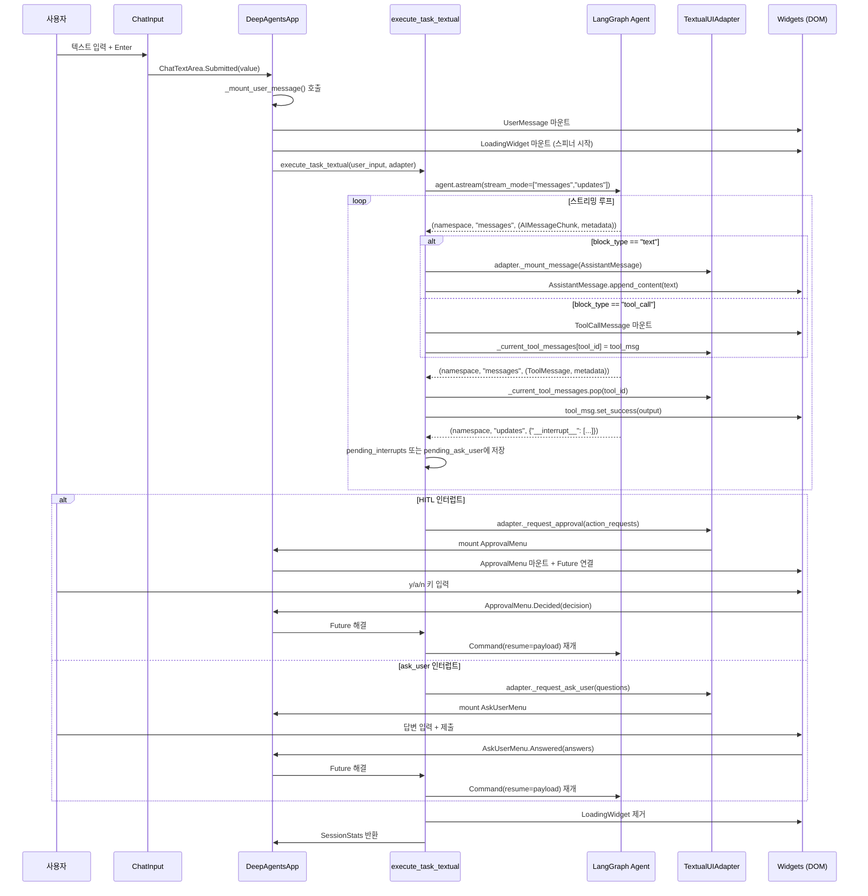

> **분석 대상**: langchain-ai/deepagents@26647a346cd3c71ca223ad2dc17db812f7203b0f
> **CLI 버전**: deepagents-cli v0.0.34 | **Core 버전**: deepagents v0.5.0a4
> **분석일**: 2026-04-04
> **관련 문서**: [01-엔트리포인트](./01-엔트리포인트-앱-라이프사이클.md) | [05-인프라](./05-인프라-세션-서버.md)

# 04. UI 위젯 시스템 — Textual 기반 TUI 아키텍처

---

## 목차

1. [UI 아키텍처 개요](#1-ui-아키텍처-개요)
2. [TextualUIAdapter 분석](#2-textualuiadapter-분석)
3. [위젯 계층 구조](#3-위젯-계층-구조)
4. [핵심 위젯 분석](#4-핵심-위젯-분석)
5. [메시지 파이프라인](#5-메시지-파이프라인)
6. [테마 시스템](#6-테마-시스템)
7. [핵심 패턴 요약](#7-핵심-패턴-요약)

---

## 1. UI 아키텍처 개요

### 1.1 기술 스택

DeepAgents CLI는 Python 기반 TUI(Terminal User Interface) 프레임워크인 **Textual**을 사용한다. Textual은 CSS 스타일링, 반응형 위젯 시스템, 비동기 이벤트 루프를 제공하며 이를 통해 터미널에서 풍부한 인터랙티브 UI를 구현한다.

| 계층 | 기술 | 역할 |
|------|------|------|
| 렌더링 엔진 | Textual + Rich | 터미널 위젯 렌더링, CSS 스타일링 |
| 에이전트 실행 | LangGraph `astream()` | 비동기 스트리밍 실행 |
| 브리지 | `TextualUIAdapter` | 에이전트 출력 → 위젯 변환 |
| 상태 저장 | `MessageStore` | 메시지 가상화 및 상태 관리 |
| 입력 처리 | `ChatInput` / `ChatTextArea` | 사용자 입력, 자동완성, 히스토리 |

### 1.2 전체 화면 구성

앱 화면은 단일 세로 레이아웃으로 구성되며, `app.tcss`에서 다음과 같이 정의한다:

```
┌──────────────────────────────────────┐
│  #chat  (1fr, 스크롤 가능)           │
│  ┌────────────────────────────────┐  │
│  │  WelcomeBanner (#welcome-banner│  │
│  ├────────────────────────────────┤  │
│  │  #messages (layout: stream)    │  │
│  │    UserMessage                 │  │
│  │    AssistantMessage (Markdown) │  │
│  │    ToolCallMessage             │  │
│  │    ApprovalMenu / AskUserMenu  │  │
│  │    ...                         │  │
│  └────────────────────────────────┘  │
├──────────────────────────────────────┤
│  #bottom-app-container               │
│    LoadingWidget (스피너)            │
│    ChatInput (#input-area)           │
│      CompletionPopup (자동완성)       │
│      ChatTextArea                    │
├──────────────────────────────────────┤
│  StatusBar (dock: bottom, height: 1) │
└──────────────────────────────────────┘
```

`#messages` 컨테이너는 Textual 5.2.0+의 `layout: stream` 을 사용한다. 이는 O(1) append 성능을 제공하며, 메시지가 계속 추가되어도 스크롤 위치가 안정적으로 유지된다 (`app.tcss:29-34`).

### 1.3 핵심 설계 원칙

- **비동기 우선**: 모든 에이전트 스트리밍과 UI 업데이트가 `asyncio`를 통해 처리된다
- **위젯 가상화**: `MessageStore`가 경량 데이터클래스로 메시지를 보관하고, 뷰포트에 필요한 위젯만 DOM에 유지한다
- **어댑터 패턴**: `TextualUIAdapter`가 LangGraph 실행 엔진과 Textual UI 사이의 인터페이스를 완전히 분리한다
- **이벤트 버블링**: Textual의 `Message` 시스템으로 위젯 간 통신이 이루어진다 (직접 참조 없음)

---

## 2. TextualUIAdapter 분석

`textual_adapter.py`는 이 시스템의 핵심 브리지 모듈이다. LangGraph 에이전트의 스트리밍 출력을 Textual 위젯 작업으로 변환하는 역할을 담당한다.

### 2.1 클래스 정의 및 콜백 인터페이스

```python
# textual_adapter.py:205-228
class TextualUIAdapter:
    def __init__(
        self,
        mount_message: Callable[..., Awaitable[None]],       # 위젯 마운트
        update_status: Callable[[str], None],                 # 상태바 텍스트 갱신
        request_approval: Callable[..., Awaitable[Any]],     # HITL 승인 요청
        on_auto_approve_enabled: Callable[[], None] | None,  # 자동승인 활성화 콜백
        set_spinner: Callable[[SpinnerStatus], Awaitable[None]] | None,  # 스피너
        set_active_message: Callable[[str | None], None] | None,        # 활성 메시지 ID
        sync_message_content: Callable[[str, str], None] | None,        # 콘텐츠 동기화
        request_ask_user: Callable[...] | None,              # ask_user 인터럽트
    )
```

`TextualUIAdapter`는 생성자에서 모든 UI 작업을 **콜백 함수**로 주입받는다. 이는 어댑터 자체가 Textual 위젯을 직접 참조하지 않도록 하여 테스트 가능성과 교체 가능성을 높인다.

### 2.2 내부 상태

```python
# textual_adapter.py:262-274
self._current_tool_messages: dict[str, ToolCallMessage] = {}
# 현재 실행 중인 툴 호출 ID → ToolCallMessage 위젯 매핑

self._on_tokens_update: _TokensUpdateCallback | None = None
self._on_tokens_hide: Callable[[], None] | None = None
self._on_tokens_show: _TokensShowCallback | None = None
```

어댑터는 `_current_tool_messages` 딕셔너리로 in-flight 툴 호출을 추적한다. 툴 결과(`ToolMessage`)가 도착하면 해당 위젯을 팝하여 성공/실패 상태를 업데이트한다.

### 2.3 execute_task_textual — 핵심 스트리밍 함수

```python
# textual_adapter.py:355-368
async def execute_task_textual(
    user_input: str,
    agent: Any,
    assistant_id: str | None,
    session_state: Any,
    adapter: TextualUIAdapter,
    ...
) -> SessionStats:
```

이 함수가 실제 에이전트 실행의 중심이다. LangGraph의 `astream()`을 통해 3가지 스트림 모드를 처리한다:

```python
# textual_adapter.py:516-523
async for chunk in agent.astream(
    stream_input,
    stream_mode=["messages", "updates"],
    subgraphs=True,
    config=config,
    context=context,
    durability="exit",
):
    namespace, current_stream_mode, data = chunk
```

**스트림 처리 분기**:

| `current_stream_mode` | 처리 내용 |
|----------------------|-----------|
| `"updates"` | `__interrupt__` 감지 → HITL / ask_user 처리 |
| `"messages"` | `HumanMessage`, `AIMessage`, `ToolMessage` 처리 |

메인 에이전트만 화면에 렌더링하며, 서브에이전트 출력은 필터링한다:
```python
# textual_adapter.py:536
is_main_agent = ns_key == ()   # 빈 네임스페이스 = 메인 에이전트
```

### 2.4 콘텐츠 블록 처리

AI 메시지는 `content_blocks` 속성으로 청크 단위로 스트리밍된다:

```python
# textual_adapter.py:744-778
for block in blocks:
    block_type = block.get("type")

    if block_type == "text":
        # AssistantMessage.append_content(text) 호출 → MarkdownStream으로 스트리밍
        await current_msg.append_content(text)

    elif block_type in {"tool_call_chunk", "tool_call"}:
        # 툴 호출 버퍼에 누적 → args JSON 완성 시 ToolCallMessage 마운트
```

툴 호출은 여러 청크로 분산되어 올 수 있으므로 `tool_call_buffers` 딕셔너리에 누적한 뒤 args JSON이 완성되면 비로소 위젯을 마운트한다 (`textual_adapter.py:784-881`).

### 2.5 HITL 인터럽트 처리 흐름

```
LangGraph interrupt 발생
    ↓
pending_interrupts / pending_ask_user 딕셔너리에 저장
    ↓
스트림 완료 후 처리:
    HITLRequest → adapter._request_approval() → asyncio.Future 대기
    AskUserRequest → adapter._request_ask_user() → asyncio.Future 대기
    ↓
사용자 결정 수집 → resume_payload 구성
    ↓
Command(resume=resume_payload) 로 에이전트 재개
```

---

## 3. 위젯 계층 구조

### 3.1 전체 위젯 트리

```mermaid
classDiagram
    direction TB

    class DeepAgentsApp {
        +compose() ComposeResult
        +_message_store: MessageStore
        +_adapter: TextualUIAdapter
    }

    class Screen {
        layers: base autocomplete
        layout: vertical
    }

    class ChatScrollView {
        id: chat
        height: 1fr
    }

    class WelcomeBanner {
        <<Static>>
        thread_id, mcp_tool_count
        +set_connected()
    }

    class MessagesContainer {
        id: messages
        layout: stream
    }

    class BottomContainer {
        id: bottom-app-container
    }

    class LoadingWidget {
        <<Static>>
        +set_status(status)
        +pause() / resume()
    }

    class ChatInput {
        +Submitted: Message
        +Typing: Message
    }

    class CompletionPopup {
        <<VerticalScroll>>
        +update_suggestions()
        +update_selection()
    }

    class ChatTextArea {
        <<TextArea>>
        BINDINGS: shift+enter...
        +_paste_burst_buffer
    }

    class StatusBar {
        <<Horizontal>>
        dock: bottom
        +update_model()
        +update_tokens()
    }

    class ModelLabel {
        <<Widget>>
        provider: reactive
        model: reactive
    }

    DeepAgentsApp --> Screen
    Screen --> ChatScrollView
    Screen --> BottomContainer
    Screen --> StatusBar
    ChatScrollView --> WelcomeBanner
    ChatScrollView --> MessagesContainer
    MessagesContainer --> UserMessage
    MessagesContainer --> AssistantMessage
    MessagesContainer --> ToolCallMessage
    MessagesContainer --> SkillMessage
    MessagesContainer --> ApprovalMenu
    MessagesContainer --> AskUserMenu
    MessagesContainer --> DiffMessage
    BottomContainer --> LoadingWidget
    BottomContainer --> ChatInput
    ChatInput --> CompletionPopup
    ChatInput --> ChatTextArea
    StatusBar --> ModelLabel
```



### 3.2 메시지 위젯 계층

```mermaid
classDiagram
    direction TB

    class Static {
        <<Textual>>
    }
    class Vertical {
        <<Textual>>
    }
    class Container {
        <<Textual>>
    }

    class _TimestampClickMixin {
        +on_click() show timestamp toast
    }

    class UserMessage {
        <<Static + Mixin>>
        _content: str
        +render() Content
    }

    class QueuedUserMessage {
        <<Static>>
        opacity: 0.6
        border-left: $panel
    }

    class AssistantMessage {
        <<Vertical + Mixin>>
        _markdown: Markdown
        _stream: MarkdownStream
        +append_content(text)
        +stop_stream()
    }

    class ToolCallMessage {
        <<Vertical>>
        _tool_name: str
        _args: dict
        _status: str
        _output: str
        +set_success(output)
        +set_error(error)
    }

    class SkillMessage {
        <<Vertical>>
        _expanded: var~bool~
        +toggle_body()
        +watch__expanded()
    }

    class ApprovalMenu {
        <<Container>>
        can_focus = True
        BINDINGS: y/a/n/1/2/3
        +set_future(future)
        class Decided~Message~
    }

    class AskUserMenu {
        <<Container>>
        can_focus = True
        +set_future(future)
        class Answered~Message~
        class Cancelled~Message~
    }

    class AppMessage {
        <<Static>>
    }

    class ErrorMessage {
        <<Static>>
    }

    class DiffMessage {
        <<Vertical>>
        _diff_content: str
        _file_path: str
    }

    class SummarizationMessage {
        <<Static>>
    }

    Static <|-- UserMessage
    Static <|-- QueuedUserMessage
    Static <|-- AppMessage
    Static <|-- ErrorMessage
    Static <|-- SummarizationMessage
    Vertical <|-- AssistantMessage
    Vertical <|-- ToolCallMessage
    Vertical <|-- SkillMessage
    Vertical <|-- DiffMessage
    Container <|-- ApprovalMenu
    Container <|-- AskUserMenu
    _TimestampClickMixin <|-- UserMessage
    _TimestampClickMixin <|-- AssistantMessage
```



### 3.3 모달 스크린 계층

앱은 3가지 모달 스크린을 사용한다:

| 클래스 | 파일 | 역할 | 반환값 |
|--------|------|------|--------|
| `ModelSelectorScreen` | `model_selector.py` | 모델 선택 | `tuple[str, str] \| None` |
| `ThemeSelectorScreen` | `theme_selector.py` | 테마 선택 (라이브 프리뷰) | `str \| None` |
| `ThreadSelectorScreen` | `thread_selector.py` | 대화 스레드 탐색/재개 | `ThreadInfo \| None` |
| `MCPViewerScreen` | `mcp_viewer.py` | MCP 서버/툴 열람 (읽기 전용) | `None` |

모두 `ModalScreen`을 상속하며 `dismiss()` 또는 `Escape` 키로 닫힌다.

---

## 4. 핵심 위젯 분석

### 4.1 ChatInput — 채팅 입력, 키바인딩, 자동완성

`chat_input.py`는 세 개의 주요 클래스로 구성된다.

#### ChatTextArea (chat_input.py:320~)

`TextArea`를 상속하며 채팅에 특화된 동작을 추가한다:

```python
# chat_input.py:323-331
BINDINGS: ClassVar[list[Binding]] = [
    Binding(
        "shift+enter,alt+enter,ctrl+enter",
        "insert_newline",
        "New Line",
        show=False,
        priority=True,
    ),
]
```

**특수 처리 기능**:
- **붙여넣기 버스트 감지**: 터미널에서 파일 경로를 드래그앤드롭하면 빠른 키 이벤트로 변환됨. `_PASTE_BURST_CHAR_GAP_SECONDS = 0.03` 이하 간격의 연속 입력을 버스트로 간주하고 `_PASTE_BURST_FLUSH_DELAY_SECONDS = 0.08` 후 일괄 처리한다 (`chat_input.py:49-53`)
- **Backslash+Enter 감지**: VSCode 내장 터미널 등에서 Shift+Enter가 `\` + Enter로 변환되는 경우를 감지한다 (`_BACKSLASH_ENTER_GAP_SECONDS = 0.15`)
- **히스토리 탐색**: `HistoryPrevious` / `HistoryNext` 메시지를 버블링하여 `ChatInput`의 `HistoryManager`와 연동

**내부 이벤트 메시지**:
- `Submitted`: 텍스트 제출 시 발행
- `HistoryPrevious` / `HistoryNext`: 히스토리 방향키
- `PastedPaths`: 붙여넣은 내용이 파일 경로로 파싱될 때
- `Typing`: 키 입력 활동 알림

#### CompletionPopup (chat_input.py:177~)

`VerticalScroll`을 상속하는 자동완성 팝업 위젯이다:

```python
# chat_input.py:221-222
# 세대 카운터로 재진입 문제 방지
self._rebuild_generation += 1
gen = self._rebuild_generation
self.call_after_refresh(lambda: self._rebuild_options(gen))
```

`_rebuild_options`는 기존 DOM 노드를 재사용하여 깜빡임을 방지한다. 제안이 늘면 새 `CompletionOption` 위젯을 마운트하고, 줄면 초과분을 제거한다.

#### ChatInput (최상위 래퍼)

`Vertical` 컨테이너로 `CompletionPopup`과 `ChatTextArea`를 수직 배치한다. `MultiCompletionManager`를 통해 두 가지 자동완성 컨트롤러를 조율한다:

```python
# autocomplete.py:110~ / chat_input.py
# SlashCommandController: "/" 로 시작하는 슬래시 커맨드 완성
# FuzzyFileController:    "@" 로 시작하는 파일 경로 퍼지 완성
```

### 4.2 messages.py — 메시지 스트리밍 렌더링, Markdown 표시

#### AssistantMessage — MarkdownStream 스트리밍 (messages.py:574~)

```python
# messages.py:634-644
def _ensure_stream(self) -> MarkdownStream:
    if self._stream is None:
        from textual.widgets import Markdown
        self._stream = Markdown.get_stream(self._get_markdown())
    return self._stream

async def append_content(self, text: str) -> None:
    self._content += text
    stream = self._ensure_stream()
    await stream.write(text)   # 청크 단위 스트리밍
```

`MarkdownStream`은 Textual의 Markdown 위젯에 내장된 스트리밍 API로, 청크가 올 때마다 증분 렌더링을 수행한다. 전체 내용을 매번 재파싱하지 않으므로 긴 응답도 부드럽게 표시된다.

스트리밍 완료 시:
```python
async def stop_stream(self) -> None:
    if self._stream is not None:
        await self._stream.stop()
        self._stream = None
```

#### UserMessage — Content.assemble 렌더링 (messages.py:162~)

```python
# messages.py:193-243
def render(self) -> Content:
    # 모드 프리픽스 처리 ("!" → 셸, "/" → 커맨드)
    # @파일 언급 및 /커맨드 하이라이트
    return Content.assemble(*parts)
```

모드별 색상과 `@mention`, `/command` 하이라이트를 `Content.assemble()`로 구성한다.

#### ToolCallMessage — 접을 수 있는 출력 (messages.py:687~)

```python
# 핵심 상태 메서드
def set_success(output: str) -> None   # 초록색, 출력 표시
def set_error(error: str) -> None      # 빨간색, 오류 표시
# Ctrl+O 또는 클릭으로 출력 expand/collapse
```

3줄 미리보기를 기본으로 하고, Ctrl+O로 전체 출력을 토글한다. 실행 중에는 애니메이션 "Running..." 인디케이터를 표시한다.

#### SkillMessage — 레이지 Markdown 렌더링 (messages.py:326~)

```python
# messages.py:501-518
def _ensure_md_rendered(self, body: str) -> None:
    if self._md_rendered or not self._md_widget:
        return
    from rich.markdown import Markdown as RichMarkdown
    self._md_widget.update(RichMarkdown(body))
    self._md_rendered = True
```

스킬 본문은 처음 expand 시에만 Markdown으로 렌더링한다(레이지 렌더링). `_expanded: var[bool]`의 `watch__expanded` 훅이 이를 트리거한다.

### 4.3 approval.py + ask_user.py — HITL UI 패턴

#### ApprovalMenu (approval.py:43~)

HITL(Human-in-the-Loop) 승인 UI로, 에이전트가 도구 호출을 요청할 때 인라인으로 표시된다.

```python
# approval.py:60-73
BINDINGS: ClassVar[list[BindingType]] = [
    Binding("up", "move_up", ...),
    Binding("k", "move_up", ...),        # vim 키
    Binding("down", "move_down", ...),
    Binding("j", "move_down", ...),      # vim 키
    Binding("enter", "select", ...),
    Binding("1", "select_approve", ...),
    Binding("y", "select_approve", ...),  # 빠른 승인
    Binding("2", "select_auto", ...),
    Binding("a", "select_auto", ...),     # 자동승인 전환
    Binding("3", "select_reject", ...),
    Binding("n", "select_reject", ...),   # 빠른 거부
    Binding("e", "toggle_expand", ...),   # 긴 명령어 펼치기
]
```

**툴 렌더러 패턴** (`tool_renderers.py`):

```python
# tool_renderers.py:126-130
_RENDERER_REGISTRY: dict[str, type[ToolRenderer]] = {
    "task": TaskRenderer,           # 태스크 설명만 표시
    "write_file": WriteFileRenderer,  # 전체 파일 내용
    "edit_file": EditFileRenderer,    # unified diff
}
```

등록되지 않은 툴은 `GenericApprovalWidget`(key: value 나열)으로 표시된다. `bash`/`shell`/`execute` 계열은 `_MINIMAL_TOOLS`로 분류되어 명령어만 표시한다.

**asyncio.Future 패턴**으로 사용자 결정을 기다린다:
```python
# approval.py:130
self._future: asyncio.Future[dict[str, str]] | None = None

def set_future(self, future):
    self._future = future

# 사용자가 결정하면:
class Decided(Message):
    decision: dict[str, str]  # {"type": "approve"} 등
```

**보안 검사**: 위험한 유니코드 감지 기능이 내장되어 있다 (`unicode_security.py` 활용). 셸 명령어 인자에서 숨겨진 문자가 감지되면 경고를 표시한다.

#### AskUserMenu (ask_user.py:36~)

에이전트가 사용자에게 직접 질문을 던질 때 사용하는 위젯이다:

```python
# ask_user.py:51-63
class Answered(Message):
    answers: list[str]

class Cancelled(Message):
    pass
```

여러 질문을 지원하며, 객관식 질문에는 "Other (type your answer)" 옵션이 자동으로 추가된다. Tab 키로 다음 질문으로 이동한다.

### 4.4 message_store.py — 메시지 상태 관리

`MessageStore`는 대용량 대화 히스토리를 효율적으로 관리하기 위한 가상화 레이어다.

#### MessageData 데이터클래스 (message_store.py:65~)

```python
@dataclass
class MessageData:
    type: MessageType       # USER, ASSISTANT, TOOL, SKILL, ERROR, APP, SUMMARIZATION, DIFF
    content: str
    id: str                 # "msg-{uuid8}" 형식
    timestamp: float        # Unix epoch

    # TOOL 전용
    tool_name: str | None
    tool_args: dict | None
    tool_status: ToolStatus | None   # PENDING, RUNNING, SUCCESS, ERROR, REJECTED, SKIPPED
    tool_output: str | None
    tool_expanded: bool

    # SKILL 전용
    skill_name: str | None
    skill_body: str | None
    skill_expanded: bool

    is_streaming: bool      # 스트리밍 중인 메시지는 가지치기에서 제외
    height_hint: int | None # 스크롤 위치 보정용 높이 힌트
```

**수정 가능 필드 제한** (`message_store.py:28-37`):
```python
_UPDATABLE_FIELDS: frozenset[str] = frozenset({
    "content", "tool_status", "tool_output",
    "tool_expanded", "skill_expanded", "is_streaming", "height_hint",
})
```

`id`, `type`, `timestamp` 같은 정체성 필드는 수정할 수 없다.

#### to_widget / from_widget 직렬화

```python
# message_store.py:164-236
def to_widget(self) -> Widget:
    match self.type:
        case MessageType.USER:      return UserMessage(...)
        case MessageType.ASSISTANT: return AssistantMessage(...)
        case MessageType.TOOL:
            widget = ToolCallMessage(...)
            widget._deferred_status = self.tool_status   # 지연 상태 복원
            return widget
        ...
```

위젯이 DOM에서 제거(가상화)된 후 다시 마운트될 때 이전 상태(확장 여부, 툴 출력 등)를 복원하기 위해 `_deferred_*` 패턴을 사용한다.

### 4.5 model_selector.py — 모델 전환 UI

`ModelSelectorScreen`은 `ModalScreen[tuple[str, str] | None]`을 상속한다:

```python
# model_selector.py:97-117
class ModelSelectorScreen(ModalScreen[tuple[str, str] | None]):
    BINDINGS: ClassVar[list[BindingType]] = [
        Binding("up", "move_up", ...),
        Binding("k", "move_up", ...),
        Binding("down", "move_down", ...),
        Binding("j", "move_down", ...),
        Binding("tab", "tab_complete", ...),
        Binding("ctrl+s", "set_default", ...),   # 기본 모델 저장
        Binding("escape", "cancel", ...),
    ]
```

- `Input` 위젯으로 실시간 퍼지 검색 (`textual.fuzzy.Matcher` 활용)
- 프로바이더별 그룹핑
- 크리덴셜 없는 모델은 흐리게 표시 (`has_creds: bool | None`)
- 선택 반환: `(model_spec, provider)` 튜플 또는 `None`(취소)

---

## 5. 메시지 파이프라인

### 5.1 전체 흐름 다이어그램



### 5.2 스트리밍 상태 머신

에이전트 응답 중 스피너/로딩 상태 전이:

```
초기 상태: LoadingWidget("Thinking")
    │
    ├─ text 블록 수신 → AssistantMessage 생성, 스피너 숨김
    │
    ├─ tool_call 블록 수신 → ToolCallMessage 마운트, 스피너 숨김
    │      │
    │      └─ ToolMessage 수신 → set_success/set_error
    │             └─ 모든 in-flight 툴 완료 → 스피너 재표시("Thinking")
    │
    ├─ summarization 청크 수신 → 스피너("Offloading")
    │      └─ 일반 청크 재개 → SummarizationMessage 마운트, 스피너 복귀
    │
    └─ interrupt 발생 → 스피너 숨김, ApprovalMenu/AskUserMenu 표시
           └─ 결정 후 → 에이전트 재개, 스피너 재시작
```

### 5.3 파일 언급(@) 처리

```python
# textual_adapter.py:416-436
prompt_text, mentioned_files = await asyncio.to_thread(
    parse_file_mentions, user_input
)
# "@path/to/file" → 파일 내용 인라인 임베드 (256KB 이하)
# 초과 시 참조 링크만 첨부
```

파일 I/O는 `asyncio.to_thread`로 메인 이벤트 루프를 블로킹하지 않도록 한다.

### 5.4 토큰 카운트 표시

```python
# textual_adapter.py:703-727
if hasattr(message, "usage_metadata"):
    usage = message.usage_metadata
    input_toks = usage.get("input_tokens", 0)
    output_toks = usage.get("output_tokens", 0)
    turn_stats.record_request(active_model, input_toks, output_toks)
```

스트리밍 중에는 `_on_tokens_hide()`로 토큰 표시를 숨기고, 완료 후 정확한 값으로 `_on_tokens_update(count)` 콜백을 통해 갱신한다.

---

## 6. 테마 시스템

### 6.1 테마 계층 구조

```
theme.py
  ├── 브랜드 팔레트 상수 (hex 색상 값)
  │    ├── LC_* (다크 테마 원시 값)
  │    └── LC_LIGHT_* (라이트 테마 원시 값)
  ├── ANSI 시맨틱 상수 (Rich console 출력용)
  │    ├── PRIMARY, SUCCESS, WARNING, MUTED, ...
  │    └── MODE_BASH, MODE_COMMAND, DIFF_*, TOOL_*
  ├── ThemeColors (dataclass - 시맨틱 색상 집합)
  │    └── 17개 필드: primary, secondary, accent, panel, success,
  │         warning, error, muted, mode_bash, mode_command,
  │         skill, skill_hover, tool, tool_hover,
  │         foreground, background, surface
  ├── DARK_COLORS / LIGHT_COLORS (내장 ThemeColors 인스턴스)
  └── ThemeEntry (레지스트리 엔트리)
       └── REGISTRY: Mapping[str, ThemeEntry]
```

### 6.2 ThemeColors 데이터클래스

```python
# theme.py:238-309
@dataclass(frozen=True, slots=True)
class ThemeColors:
    primary: str       # 헤딩, 테두리, 링크, 활성 요소
    secondary: str     # 뱃지, 레이블
    accent: str        # 강조 대비 색상
    panel: str         # 섹션 구분 배경
    success: str       # 툴 성공, 승인
    warning: str       # HITL 승인 메뉴 테두리
    error: str         # 오류, 파괴적 액션
    muted: str         # 타임스탬프, 부가 레이블
    mode_bash: str     # 셸 모드 인디케이터
    mode_command: str  # 커맨드 모드 인디케이터
    skill: str         # 스킬 호출 accent
    skill_hover: str   # 스킬 hover 상태
    tool: str          # 툴 호출 accent (= LC_AMBER)
    tool_hover: str    # 툴 hover 상태
    foreground: str    # 본문 텍스트
    background: str    # 앱 배경
    surface: str       # 카드/패널 배경
```

모든 필드는 `#RRGGBB` 형식의 hex 문자열이며, `__post_init__`에서 정규식으로 검증된다.

### 6.3 CSS 변수 시스템

Textual의 CSS 변수는 두 가지 소스에서 공급된다:

**빌트인 Textual 변수** (Textual의 `register_theme()`으로 설정):
- `$primary`, `$background`, `$surface`, `$text-muted`, `$error-muted` 등

**앱 커스텀 변수** (`App.get_theme_variable_defaults()` 재정의):
- `$mode-bash`, `$mode-command`, `$skill`, `$skill-hover`, `$tool`, `$tool-hover`

```css
/* app.tcss 예시 */
ToolCallMessage {
    border-left: wide $tool;      /* 커스텀 변수 */
}
.approval-menu {
    border: solid $warning;       /* 빌트인 변수 */
}
.diff-removed {
    color: $text-error;
    background: $error-muted;
}
```

### 6.4 사용자 정의 테마

`~/.deepagents/config.toml`에서 커스텀 테마를 정의할 수 있다:

```toml
[themes.my-dark-theme]
label = "My Dark Theme"
dark = true
primary = "#7AA2F7"
# 나머지 필드는 dark 기본값 상속
```

`_load_user_themes()` 함수가 이를 로드하고, 기존 빌트인 테마와 이름이 겹치면 색상을 오버라이드한다 (`ThemeColors.merged()` 활용).

### 6.5 ThemeSelectorScreen — 라이브 프리뷰

```python
# theme_selector.py:83-98
def compose(self) -> ComposeResult:
    options = [Option(entry.label, id=name)
               for name, entry in theme.ThemeEntry.REGISTRY.items()]
    # 키 이동 시마다 app.theme = name 으로 즉시 적용 (라이브 프리뷰)
    # Escape → 원래 테마 복원
```

`OptionList`의 포커스 변경 이벤트를 수신하여 `app.theme = option_id`를 설정함으로써 취소 시 원본 테마로 되돌린다.

### 6.6 ASCII 모드

유니코드 그래픽이 지원되지 않는 터미널을 위해 ASCII 폴백이 내장되어 있다:

```python
# config.py (참조)
def is_ascii_mode() -> bool: ...
def get_glyphs() -> Glyphs: ...  # Unicode 또는 ASCII 글리프 반환

# 예시: border 타입 변경
if is_ascii_mode():
    self.styles.border = ("ascii", colors.warning)
```

---

## 7. 핵심 패턴 요약

자체 에이전트 CLI TUI를 구축할 때 참조할 수 있는 핵심 패턴을 정리한다.

### 7.1 어댑터 패턴 — 에이전트와 UI 분리

```python
# 핵심 아이디어: UI 작업을 콜백으로 주입
adapter = TextualUIAdapter(
    mount_message=self._mount_message,   # async
    update_status=self._update_status,
    request_approval=self._request_approval,
    set_spinner=self._set_spinner,
)
await execute_task_textual(user_input, agent, adapter=adapter)
```

**장점**: 에이전트 실행 로직이 UI 프레임워크를 직접 의존하지 않아 단위 테스트 가능, 다른 UI 백엔드로 교체 가능.

### 7.2 asyncio.Future를 이용한 인터럽트 처리

```python
# HITL/ask_user 처리의 핵심 패턴
future: asyncio.Future[dict] = asyncio.get_event_loop().create_future()
approval_widget.set_future(future)
await self._mount_message(approval_widget)

# 에이전트 실행 측에서 대기
result = await future   # 사용자 입력 때까지 블로킹

# 위젯 측에서 해결
def action_select(self):
    self._future.set_result({"type": "approve"})
```

이 패턴은 에이전트의 `asyncio` 코루틴과 Textual 이벤트 루프를 자연스럽게 동기화한다.

### 7.3 메시지 타입별 위젯 팩토리

```python
# MessageData.to_widget() 패턴
match self.type:
    case MessageType.USER:      return UserMessage(content)
    case MessageType.ASSISTANT: return AssistantMessage(content)
    case MessageType.TOOL:      return ToolCallMessage(tool_name, args)
    ...
```

데이터(MessageData)와 표현(Widget)을 분리하면 가상화, 직렬화, 재수화가 가능하다.

### 7.4 Textual reactive 변수를 이용한 상태 관리

```python
# watch_* 훅으로 상태 변화에 반응
_expanded: var[bool] = var(False, toggle_class="-expanded")

def watch__expanded(self, expanded: bool) -> None:
    if expanded:
        self._ensure_md_rendered(body)   # 레이지 렌더링
        self._hint_widget.update("click to collapse")
```

`var(default, toggle_class=...)` 패턴은 상태 변화와 CSS 클래스 토글을 한번에 처리한다.

### 7.5 MarkdownStream을 이용한 스트리밍 렌더링

```python
# AssistantMessage의 스트리밍 패턴
def _ensure_stream(self) -> MarkdownStream:
    if self._stream is None:
        self._stream = Markdown.get_stream(self._get_markdown())
    return self._stream

async def append_content(self, text: str) -> None:
    await self._ensure_stream().write(text)   # 증분 렌더링
```

`MarkdownStream`은 Textual의 `Markdown` 위젯에 내장된 API로, 청크 단위 스트리밍을 효율적으로 처리한다.

### 7.6 레지스트리 패턴 — 툴별 렌더러

```python
# tool_renderers.py 패턴
_RENDERER_REGISTRY: dict[str, type[ToolRenderer]] = {
    "write_file": WriteFileRenderer,
    "edit_file": EditFileRenderer,
}

def get_renderer(tool_name: str) -> ToolRenderer:
    renderer_class = _RENDERER_REGISTRY.get(tool_name, ToolRenderer)
    return renderer_class()
```

새 툴을 추가할 때 레지스트리에만 등록하면 되고, `ApprovalMenu` 코드를 변경할 필요가 없다.

### 7.7 세대 카운터를 이용한 비동기 경쟁 조건 방지

```python
# CompletionPopup._rebuild_options 패턴
self._rebuild_generation += 1
gen = self._rebuild_generation
self.call_after_refresh(lambda: self._rebuild_options(gen))

async def _rebuild_options(self, generation: int) -> None:
    if generation != self._rebuild_generation:
        return   # 더 최신 요청이 있으면 폐기
```

`call_after_refresh`와 세대 카운터의 조합으로 중복 업데이트나 경쟁 조건 없이 UI를 최신 상태로 유지한다.

### 7.8 레이어를 이용한 위젯 z-순서

```css
/* app.tcss */
Screen {
    layers: base autocomplete;
}
```

자동완성 팝업처럼 다른 위젯 위에 떠 있어야 하는 요소는 별도 레이어에 배치하여 z-순서를 제어한다.

---

## 부록: 위젯-파일 매핑 빠른 참조

| 위젯 클래스 | 파일 | 기반 클래스 | 주요 기능 |
|------------|------|------------|---------|
| `ChatInput` | `chat_input.py` | `Vertical` | 채팅 입력 컨테이너 |
| `ChatTextArea` | `chat_input.py` | `TextArea` | 실제 텍스트 입력 |
| `CompletionPopup` | `chat_input.py` | `VerticalScroll` | 자동완성 팝업 |
| `CompletionOption` | `chat_input.py` | `Static` | 자동완성 항목 |
| `UserMessage` | `messages.py` | `Static` | 사용자 메시지 표시 |
| `AssistantMessage` | `messages.py` | `Vertical` | AI 응답 (MarkdownStream) |
| `ToolCallMessage` | `messages.py` | `Vertical` | 툴 호출 표시 |
| `SkillMessage` | `messages.py` | `Vertical` | 스킬 호출 표시 |
| `AppMessage` | `messages.py` | `Static` | 시스템 알림 |
| `ErrorMessage` | `messages.py` | `Static` | 오류 메시지 |
| `DiffMessage` | `messages.py` | `Vertical` | diff 표시 |
| `SummarizationMessage` | `messages.py` | `Static` | 요약 알림 |
| `ApprovalMenu` | `approval.py` | `Container` | HITL 승인 UI |
| `AskUserMenu` | `ask_user.py` | `Container` | 에이전트 질문 UI |
| `MessageData` | `message_store.py` | `dataclass` | 메시지 상태 데이터 |
| `StatusBar` | `status.py` | `Horizontal` | 하단 상태 바 |
| `ModelLabel` | `status.py` | `Widget` | 모델명 표시 (반응형) |
| `LoadingWidget` | `loading.py` | `Static` | 애니메이션 스피너 |
| `WelcomeBanner` | `welcome.py` | `Static` | 시작 화면 배너 |
| `ModelSelectorScreen` | `model_selector.py` | `ModalScreen` | 모델 선택 모달 |
| `ThemeSelectorScreen` | `theme_selector.py` | `ModalScreen` | 테마 선택 모달 |
| `ThreadSelectorScreen` | `thread_selector.py` | `ModalScreen` | 스레드 탐색 모달 |
| `MCPViewerScreen` | `mcp_viewer.py` | `ModalScreen` | MCP 툴 뷰어 모달 |
| `TextualUIAdapter` | `textual_adapter.py` | (없음) | 에이전트↔UI 브리지 |
| `HistoryManager` | `history.py` | (없음) | 명령어 히스토리 |
| `SlashCommandController` | `autocomplete.py` | (없음) | `/` 커맨드 완성 |
| `FuzzyFileController` | `autocomplete.py` | (없음) | `@` 파일 퍼지 완성 |
| `ThemeColors` | `theme.py` | `dataclass` | 시맨틱 색상 집합 |
| `ThemeEntry` | `theme.py` | `dataclass` | 테마 레지스트리 엔트리 |
