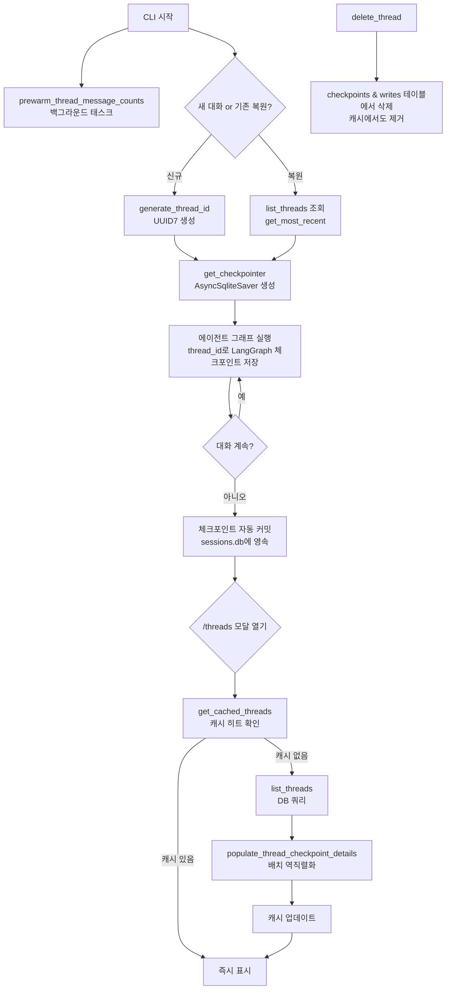
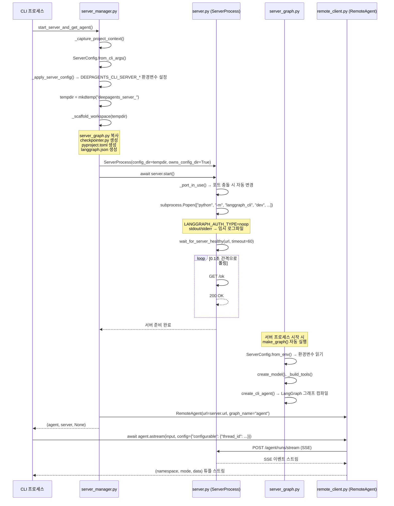
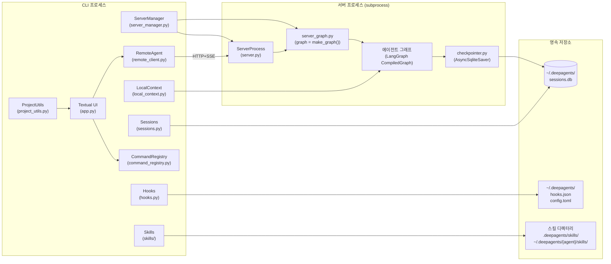

# DeepAgents CLI 인프라 — 세션, 서버, 스킬 시스템 분석

> **분석 대상**: langchain-ai/deepagents@26647a346cd3c71ca223ad2dc17db812f7203b0f
> **CLI 버전**: deepagents-cli v0.0.34 | **Core 버전**: deepagents v0.5.0a4
> **분석일**: 2026-04-04
> **관련 문서**: [03-설정-모델](./03-설정-모델-관리.md) | [04-UI-위젯](./04-UI-위젯-시스템.md) | [06-종합](./06-아키텍처-종합-패턴-레퍼런스.md)

---

## 목차

1. [세션 관리 시스템](#1-세션-관리-시스템)
2. [로컬 컨텍스트 수집](#2-로컬-컨텍스트-수집)
3. [토큰 추적 및 세션 통계](#3-토큰-추적-및-세션-통계)
4. [클라이언트-서버 아키텍처](#4-클라이언트-서버-아키텍처)
5. [스킬 & 슬래시 커맨드 시스템](#5-스킬--슬래시-커맨드-시스템)
6. [훅 시스템](#6-훅-시스템)
7. [파일 작업 & 보안](#7-파일-작업--보안)
8. [프로젝트 탐지](#8-프로젝트-탐지)
9. [업데이트 관리](#9-업데이트-관리)
10. [핵심 패턴 요약](#10-핵심-패턴-요약)

---

## 1. 세션 관리 시스템

### 1.1 전체 아키텍처 개요

`sessions.py` (약 1,300라인)는 DeepAgents CLI의 **대화 영속성 레이어**를 담당한다. 모든 대화 스레드는 `~/.deepagents/sessions.db`라는 단일 SQLite 파일에 LangGraph 체크포인트 형식으로 저장된다.

**핵심 설계 원칙:**
- LangGraph의 `AsyncSqliteSaver`를 통해 체크포인트 관리를 위임 — 직접 체크포인트 스키마를 소유하지 않음
- 별도의 메타데이터 테이블 없이 LangGraph의 `checkpoints` 테이블의 `metadata` JSON 컬럼을 `json_extract()`로 직접 쿼리
- 인메모리 캐싱 계층으로 UI 응답성 확보 (`/threads` 모달 빠른 표시)
- UUID7 (시간 순서 보장) 기반 스레드 ID

### 1.2 데이터 모델

```python
# sessions.py:82-111
class ThreadInfo(TypedDict):
    thread_id: str          # UUID7 — 시간 순 정렬 가능
    agent_name: str | None  # 어느 에이전트가 소유하는 스레드인지
    updated_at: str | None  # ISO 타임스탬프 (metadata JSON에서 추출)
    created_at: NotRequired[str | None]
    git_branch: NotRequired[str | None]   # 스레드 생성 시점의 git 브랜치
    initial_prompt: NotRequired[str | None]  # 첫 번째 human 메시지
    message_count: NotRequired[int]
    latest_checkpoint_id: NotRequired[str | None]  # 캐시 신선도 토큰
    cwd: NotRequired[str | None]          # 마지막으로 사용된 작업 디렉터리
```

`ThreadInfo`는 TypedDict이므로 런타임에는 일반 `dict`이다. `NotRequired` 필드들은 요청 시점에 lazy하게 채워진다.

### 1.3 데이터베이스 접근 패턴

모든 DB 접근은 `_connect()` 컨텍스트 매니저를 경유한다:

```python
# sessions.py:64-79
@asynccontextmanager
async def _connect() -> AsyncIterator[aiosqlite.Connection]:
    import aiosqlite as _aiosqlite
    _patch_aiosqlite()  # langgraph-checkpoint>=2.1.0 호환 패치
    async with _aiosqlite.connect(str(get_db_path()), timeout=30.0) as conn:
        yield conn
```

**aiosqlite 패치 (`sessions.py:34-61`):** `langgraph-checkpoint>=2.1.0`은 `aiosqlite.Connection.is_alive()` 메서드를 필요로 하지만 이전 버전의 aiosqlite에는 없다. `_patch_aiosqlite()`가 모듈 수준 플래그(`_aiosqlite_patched`)로 한 번만 몽키패치를 적용한다.

### 1.4 스레드 목록 조회 — SQL 설계

`list_threads()` (`sessions.py:267-351`)는 LangGraph의 `checkpoints` 테이블에서 직접 집계 쿼리를 실행한다:

```sql
SELECT thread_id,
       json_extract(metadata, '$.agent_name')  AS agent_name,
       MAX(json_extract(metadata, '$.updated_at')) AS updated_at,
       MAX(checkpoint_id)                       AS latest_checkpoint_id,
       MIN(json_extract(metadata, '$.updated_at')) AS created_at,
       MAX(json_extract(metadata, '$.git_branch')) AS git_branch,
       MAX(json_extract(metadata, '$.cwd'))     AS cwd
FROM checkpoints
[WHERE ...]
GROUP BY thread_id
ORDER BY updated_at DESC
LIMIT ?
```

- `GROUP BY thread_id`: 하나의 스레드는 여러 체크포인트 행을 가지므로 집계 필요
- `MAX(checkpoint_id)`: 가장 최신 체크포인트 ID (캐시 신선도 토큰으로 사용)
- `json_extract()`: SQLite 내장 JSON 함수로 별도 파싱 불필요

### 1.5 체크포인트 역직렬화 — 메시지 수 & 초기 프롬프트 추출

메시지 수와 첫 번째 프롬프트는 `checkpoints` 테이블의 `checkpoint` BLOB을 역직렬화해야 얻을 수 있다. 이 작업은 비용이 있으므로 3-단계 배치 처리로 최적화한다:

```
Phase 1: 캐시 히트 적용 (캐시에 있으면 DB 조회 생략)
Phase 2: 미캐시 스레드에 대해 배치 윈도우 함수 쿼리
Phase 3: 결과를 스레드에 적용 + 캐시 업데이트
```

**배치 쿼리 (`sessions.py:762-774`)** — SQLite 변수 한계(999)를 피하기 위해 500개씩 청크:

```sql
SELECT thread_id, type, checkpoint FROM (
    SELECT thread_id, type, checkpoint,
           ROW_NUMBER() OVER (
               PARTITION BY thread_id ORDER BY checkpoint_id DESC
           ) AS rn
    FROM checkpoints
    WHERE thread_id IN (?, ?, ...)
) WHERE rn = 1
```

역직렬화는 `JsonPlusSerializer.loads_typed()`를 사용하며, UI 이벤트 루프 차단을 피하기 위해 `loop.run_in_executor(None, serde.loads_typed, ...)` 패턴을 사용한다 (`sessions.py:785`).

### 1.6 인메모리 캐싱 계층

세 종류의 캐시가 모듈 수준으로 유지된다:

| 캐시 변수 | 키 | 값 | 최대 크기 |
|---|---|---|---|
| `_message_count_cache` | `thread_id` | `(freshness_token, count)` | 4,096 |
| `_initial_prompt_cache` | `thread_id` | `(freshness_token, prompt)` | 4,096 |
| `_recent_threads_cache` | `(agent_name, limit)` | `list[ThreadInfo]` | 16 키 |

**신선도 토큰 (`sessions.py:588-591`):**
```python
def _thread_freshness(thread: ThreadInfo) -> str | None:
    return thread.get("latest_checkpoint_id") or thread.get("updated_at")
```
캐시에서 `latest_checkpoint_id`가 일치하면 DB 재조회 없이 캐시 값을 사용한다. 체크포인트가 추가되면 ID가 바뀌므로 자동으로 무효화된다.

**캐시 교체 전략:** LRU가 아닌 단순 FIFO — 한도 초과 시 가장 오래된 항목 1개 제거 (`sessions.py:565-571`).

### 1.7 사전 워밍 (prewarm)

앱 시작 시 백그라운드에서 `prewarm_thread_message_counts()` (`sessions.py:406-438`)를 실행하여 `/threads` 모달이 열릴 때 즉시 표시할 수 있도록 캐시를 채운다. 실패 시 조용히 넘어간다.

### 1.8 체크포인터 제공

```python
# sessions.py:1019-1031
@asynccontextmanager
async def get_checkpointer() -> AsyncIterator[AsyncSqliteSaver]:
    from langgraph.checkpoint.sqlite.aio import AsyncSqliteSaver
    _patch_aiosqlite()
    async with AsyncSqliteSaver.from_conn_string(str(get_db_path())) as checkpointer:
        yield checkpointer
```

에이전트 그래프에 주입되어 모든 LangGraph 상태를 SQLite에 자동 저장한다.

### 1.9 스레드 라이프사이클 다이어그램



---

## 2. 로컬 컨텍스트 수집

### 2.1 목적과 설계

`local_context.py` (약 720라인)는 에이전트가 현재 작업 환경을 이해할 수 있도록 시스템 프롬프트에 **환경 컨텍스트를 자동 주입**하는 미들웨어를 구현한다.

핵심 아이디어: 백엔드(로컬 셸 또는 원격 샌드박스) 내에서 bash 스크립트를 실행하여 환경을 감지함으로써, 동일한 탐지 로직이 로컬과 원격 양쪽에서 작동한다.

### 2.2 탐지 스크립트 구조

`build_detect_script()` (`local_context.py:361-399`)가 여러 섹션 함수를 결합하여 하나의 bash heredoc을 생성한다:

```
직렬 실행 (다른 섹션이 의존하는 변수 설정):
  1. _section_header()   — CWD, IN_GIT 플래그 설정
  2. _section_project()  — PROJ_LANG, ROOT, MONOREPO 설정

병렬 실행 (임시 파일에 결과 기록 후 wait):
  02_pkgmgr    — Python/Node 패키지 매니저 탐지 (uv/poetry/pip/bun/pnpm/yarn/npm)
  03_runtimes  — Python/Node 런타임 버전
  04_git       — 브랜치, 미커밋 변경 수
  05_testcmd   — 테스트 명령 (make test / pytest / npm test)
  06_files     — 디렉터리 목록 (최대 20개, node_modules 등 제외)
  07_tree      — tree -L 3 출력
  08_makefile  — Makefile 상위 20줄
```

병렬 실행 패턴:
```bash
_DCT=$(mktemp -d) || exit 1
trap 'rm -rf "$_DCT"' EXIT
(
  # 섹션 코드
) > "$_DCT/02_pkgmgr" 2>"$_DCT/02_pkgmgr.err" &
wait
cat "$_DCT/02_pkgmgr" "$_DCT/03_runtimes" ...
```

### 2.3 언어 탐지 로직

```bash
# local_context.py:147-155 (_section_project)
[ -f pyproject.toml ] || [ -f setup.py ] && PROJ_LANG="python"
[ -z "$PROJ_LANG" ] && [ -f package.json ]   && PROJ_LANG="javascript/typescript"
[ -z "$PROJ_LANG" ] && [ -f Cargo.toml ]     && PROJ_LANG="rust"
[ -z "$PROJ_LANG" ] && [ -f go.mod ]         && PROJ_LANG="go"
[ -z "$PROJ_LANG" ] && { [ -f pom.xml ] || [ -f build.gradle ]; } && PROJ_LANG="java"
```

### 2.4 미들웨어 상태 스키마

```python
# local_context.py:409-423
class LocalContextState(AgentState):
    local_context: NotRequired[str]
    # 체크포인트에 저장되지만 서브에이전트에게는 노출되지 않음 (PrivateStateAttr)
    _local_context_refreshed_at_cutoff: NotRequired[Annotated[int, PrivateStateAttr]]
```

`_local_context_refreshed_at_cutoff`는 요약(summarization) 이벤트 후 재실행을 추적한다. 같은 요약 이벤트에 대해 중복 재실행을 방지한다.

### 2.5 미들웨어 실행 흐름

```python
# local_context.py:526-579 (before_agent)
def before_agent(self, state, runtime):
    # 1) 요약 이벤트 후 재탐지
    raw_event = state.get("_summarization_event")
    if raw_event is not None:
        cutoff = event.get("cutoff_index")
        if cutoff != state.get("_local_context_refreshed_at_cutoff"):
            output = self._run_detect_script()
            if output:
                return {"local_context": output,
                        "_local_context_refreshed_at_cutoff": cutoff}
            return {"_local_context_refreshed_at_cutoff": cutoff}  # 재시도 방지

    # 2) 최초 실행
    if state.get("local_context"):
        return None  # 이미 있으면 스킵
    output = self._run_detect_script()
    if output:
        return {"local_context": output}
```

### 2.6 동기/비동기 백엔드 지원

```python
# local_context.py:84-103
@runtime_checkable
class _ExecutableBackend(Protocol):     # 동기 execute()
    def execute(self, command: str, *, timeout: int | None = None) -> ExecuteResponse: ...

@runtime_checkable
class _AsyncExecutableBackend(Protocol):  # 비동기 aexecute()
    async def aexecute(self, command: str, *, timeout: int | None = None) -> ExecuteResponse: ...
```

`isinstance()` 체크로 런타임에 백엔드 타입을 판별. 비동기 백엔드가 없으면 `asyncio.to_thread()`로 동기 실행을 스레드 풀에 오프로드한다.

### 2.7 시스템 프롬프트 주입

```python
# local_context.py:663-681 (_get_modified_request)
def _get_modified_request(self, request):
    state = cast(LocalContextState, request.state)
    local_context = state.get("local_context", "")
    parts = [p for p in (local_context, self._mcp_context) if p]
    if not parts:
        return None
    new_prompt = (request.system_prompt or "") + "\n\n" + "\n\n".join(parts)
    return request.override(system_prompt=new_prompt)
```

MCP 서버 정보(`_mcp_context`)도 함께 주입된다. `request.override()`는 불변 요청 객체를 수정 없이 새 객체로 파생시키는 패턴이다.

---

## 3. 토큰 추적 및 세션 통계

### 3.1 TokenStateMiddleware

`token_state.py` (32라인)는 **스키마 전용 미들웨어**이다. 실제 로직 없이 `_context_tokens` 필드를 LangGraph 상태 스키마에 등록하는 역할만 한다:

```python
# token_state.py:21-32
class TokenTrackingState(AgentState):
    _context_tokens: Annotated[NotRequired[int], PrivateStateAttr]
    # PrivateStateAttr: 체크포인트에 저장되지만 모델 요청에는 포함 안 됨
```

CLI는 매 LLM 응답과 컨텍스트 오프로드 후 이 값을 기록하고, 스레드 재개 시 읽어 `/tokens` 커맨드와 상태 바에 즉시 표시한다.

### 3.2 SessionStats — 세션 통계

`_session_stats.py`는 무거운 의존성 없이 임포트 가능하도록 의도적으로 경량화되어 있다:

```python
# _session_stats.py:18-54
@dataclass
class ModelStats:
    request_count: int = 0
    input_tokens: int = 0
    output_tokens: int = 0

@dataclass
class SessionStats:
    request_count: int = 0
    input_tokens: int = 0
    output_tokens: int = 0
    wall_time_seconds: float = 0.0
    per_model: dict[str, ModelStats] = field(default_factory=dict)

    def record_request(self, model_name, input_toks, output_toks):
        self.request_count += 1
        self.input_tokens += input_toks
        self.output_tokens += output_toks
        if model_name:
            entry = self.per_model.setdefault(model_name, ModelStats())
            entry.request_count += 1; entry.input_tokens += input_toks
            entry.output_tokens += output_toks

    def merge(self, other: SessionStats):
        # 턴별 통계를 세션 합계에 누적
        ...
```

**`format_token_count()` (`_session_stats.py:101-114`):** `500` → `"500"`, `12500` → `"12.5K"`, `1200000` → `"1.2M"` 형식으로 포맷.

---

## 4. 클라이언트-서버 아키텍처

### 4.1 전체 구조 개요

DeepAgents CLI는 **인프라 프로세스 분리** 패턴을 사용한다. CLI 프로세스가 `langgraph dev` 서버를 자식 프로세스로 시작하고, HTTP+SSE로 통신한다:

```
[CLI 프로세스 (Textual UI)]
    ↕  HTTP+SSE (127.0.0.1:2024)
[LangGraph dev 서버 (subprocess)]
    ↕  직접 함수 호출
[에이전트 그래프 (server_graph.py)]
```

이 설계의 장점:
- 서버 측 코드(에이전트 그래프, 도구, 샌드박스)가 UI 코드와 완전히 격리
- 모델 전환 등 설정 변경 시 서버만 재시작하면 됨
- LangGraph의 원격 실행 인프라를 로컬에서 재사용 가능

### 4.2 서버 시작 시퀀스



### 4.3 워크스페이스 스캐폴딩

`_scaffold_workspace()` (`server_manager.py:87-113`)가 임시 디렉터리에 서버 실행에 필요한 파일들을 생성한다:

**1. `server_graph.py` 복사:**
```python
server_graph_src = Path(__file__).parent / "server_graph.py"
shutil.copy2(server_graph_src, server_graph_dst)
```

**2. `checkpointer.py` 동적 생성 (`server_manager.py:116-158`):**
```python
content = f'''
@asynccontextmanager
async def create_checkpointer():
    from langgraph.checkpoint.sqlite.aio import AsyncSqliteSaver
    db_path = os.environ.get("{db_path_var}")
    async with AsyncSqliteSaver.from_conn_string(db_path) as saver:
        yield saver
'''
```
DB 경로를 환경변수로 전달해 소스 코드에 하드코딩하지 않는다.

**3. `pyproject.toml` 생성 (`server_manager.py:161-183`):**
```toml
[project]
name = "deepagents-server-runtime"
dependencies = ["deepagents-cli @ file://{cli_dir}"]
```
`langgraph dev`가 의존성 설치 시 로컬 CLI 패키지를 직접 참조한다.

**4. `langgraph.json` 생성 (`server.py:85-118`):**
```json
{
  "dependencies": ["."],
  "graphs": {"agent": "./server_graph.py:graph"},
  "checkpointer": {"path": "./checkpointer.py:create_checkpointer"}
}
```

### 4.4 환경변수 기반 설정 전달

CLI→서버 프로세스 간 설정은 `DEEPAGENTS_CLI_SERVER_*` 환경변수로 전달된다:

```python
# server_manager.py:40-66
def _apply_server_config(config: ServerConfig) -> None:
    for suffix, value in config.to_env().items():
        key = f"{SERVER_ENV_PREFIX}{name}"
        os.environ[key] = value

# server_graph.py:103
config = ServerConfig.from_env()  # 서버 측에서 역직렬화
```

`ServerConfig.to_env()` ↔ `ServerConfig.from_env()` 쌍이 직렬화/역직렬화를 한 곳에서 정의하여 양쪽 동기화를 보장한다.

### 4.5 ServerProcess — 프로세스 생명주기

`ServerProcess` (`server.py:286-521`)의 핵심 메서드:

| 메서드 | 역할 |
|---|---|
| `start()` | 포트 확인 → Popen 실행 → health 폴링 |
| `stop()` | SIGTERM → 타임아웃 → SIGKILL → 임시 파일 정리 |
| `_stop_process()` | 프로세스만 종료 (config_dir 유지 — restart용) |
| `restart()` | `_stop_process()` → `_scoped_env_overrides()` → `start()` |
| `update_env()` | 다음 restart 시 적용할 환경변수 스테이징 |

**`_scoped_env_overrides()` (`server.py:126-157`):** 환경변수 오버라이드를 스코프 내에서 적용하고 예외 발생 시 자동 롤백:
```python
@contextlib.contextmanager
def _scoped_env_overrides(overrides):
    prev = {k: os.environ.get(k) for k in overrides}
    for k, v in overrides.items():
        os.environ[k] = v
    try:
        yield
    except Exception:
        # 이전 값 복원
        for k, old in prev.items():
            if old is None: os.environ.pop(k, None)
            else: os.environ[k] = old
        raise
```

### 4.6 서버 그래프 진입점 (server_graph.py)

`server_graph.py`는 `langgraph dev`가 임포트하는 모듈로, **모듈 임포트 시 그래프가 컴파일**된다:

```python
# server_graph.py:188-196
try:
    graph = make_graph()  # 모듈 최상위에서 실행
except Exception as exc:
    print(f"Failed to initialize server graph: {exc}", file=sys.stderr)
    sys.exit(1)
```

`make_graph()` 실행 순서:
1. `ServerConfig.from_env()` — 환경변수에서 설정 로드
2. `get_server_project_context()` — 사용자 CWD/프로젝트 루트 복원
3. `settings.reload_from_environment()` — `.env` 파일 재로드
4. `create_model()` — 모델 인스턴스 생성
5. `_build_tools()` — 도구 목록 어셈블 (MCP 포함)
6. 샌드박스 백엔드 생성 (설정된 경우, `atexit`으로 정리 등록)
7. `create_cli_agent()` — LangGraph 에이전트 그래프 컴파일

### 4.7 RemoteAgent — HTTP+SSE 클라이언트

`RemoteAgent` (`remote_client.py:42-295`)는 `langgraph.pregel.remote.RemoteGraph`를 래핑하여 Textual UI 어댑터가 기대하는 LangChain 메시지 객체를 제공한다:

```python
# remote_client.py:42-76
class RemoteAgent:
    def __init__(self, url, *, graph_name="agent", api_key=None, headers=None):
        self._graph: Any = None  # 지연 초기화

    def _get_graph(self):
        if self._graph is None:
            from langgraph.pregel.remote import RemoteGraph
            self._graph = RemoteGraph(self._graph_name, url=self._url, ...)
        return self._graph
```

**스트리밍 처리 (`remote_client.py:95-177`):**

```python
async for ns, mode, data in graph.astream(input, stream_mode=["messages", "updates"], ...):
    if mode == "messages":
        msg_dict, meta = data
        if isinstance(msg_dict, dict):
            msg_obj = _convert_message_data(msg_dict)  # dict → LangChain 객체
            yield (ns, "messages", (msg_obj, meta or {}))
    elif mode == "updates" and "__interrupt__" in data:
        yield (ns, "updates", {**data, "__interrupt__": _convert_interrupts(...)})
    else:
        yield (ns, mode, data)
```

**메시지 타입 변환 테이블 (`remote_client.py:480-494`):**

```python
_MESSAGE_CONVERTERS = {
    "ai": _convert_ai_message,        # → AIMessageChunk
    "AIMessage": _convert_ai_message,
    "AIMessageChunk": _convert_ai_message,
    "human": _convert_human_message,  # → HumanMessage
    "HumanMessage": _convert_human_message,
    "tool": _convert_tool_message,    # → ToolMessage
    "ToolMessage": _convert_tool_message,
}
```

디스패치 테이블 패턴 — 새 메시지 타입을 지원하려면 테이블에 항목만 추가하면 된다.

**`aensure_thread()` (`remote_client.py:243-284`):** 서버 재시작 후 체크포인트는 디스크에 있지만 HTTP 서버의 스레드 레지스트리에는 없을 때, `if_exists='do_nothing'`으로 멱등(idempotent) 등록을 수행한다.

### 4.8 server_session 컨텍스트 매니저

```python
# server_manager.py:287-366
@asynccontextmanager
async def server_session(*, assistant_id, model_name=None, ...):
    server_proc = None
    try:
        agent, server_proc, _ = await start_server_and_get_agent(...)
        yield agent, server_proc
    finally:
        if server_proc is not None:
            server_proc.stop()  # 예외 발생 시에도 반드시 정리
```

`try/finally`로 서버 정리를 보장한다. 모든 CLI 세션은 이 컨텍스트 매니저를 통해 서버를 시작/종료한다.

---

## 5. 스킬 & 슬래시 커맨드 시스템

### 5.1 커맨드 레지스트리 설계

`command_registry.py` (285라인)는 **선언적 커맨드 정의** 패턴을 사용한다. 모든 커맨드는 `COMMANDS` 튜플에 한 번 선언되고, 바이패스 티어 frozenset과 자동완성 튜플이 자동 파생된다.

```python
# command_registry.py:37-55
class BypassTier(StrEnum):
    ALWAYS         = "always"        # 모든 상태에서 즉시 실행 (예: /quit)
    CONNECTING     = "connecting"    # 초기 서버 연결 중에만 바이패스
    IMMEDIATE_UI   = "immediate_ui"  # 모달 즉시 열기, 실제 작업은 defer
    SIDE_EFFECT_FREE = "side_effect_free"  # 부수효과 즉시, 채팅 출력은 idle 후
    QUEUED         = "queued"        # 앱이 바쁠 때 대기열에서 대기
```

### 5.2 등록된 20개 커맨드

| 커맨드 | 티어 | 설명 |
|---|---|---|
| `/clear` | QUEUED | 새 스레드 시작 |
| `/editor` | QUEUED | 외부 에디터에서 프롬프트 작성 |
| `/mcp` | SIDE_EFFECT_FREE | MCP 서버/도구 표시 |
| `/model` | IMMEDIATE_UI | 모델 전환 |
| `/offload` (/compact) | QUEUED | 컨텍스트 오프로드 |
| `/remember` | QUEUED | 메모리/스킬 업데이트 |
| `/skill-creator` | QUEUED | 스킬 제작 가이드 |
| `/threads` | IMMEDIATE_UI | 스레드 브라우저 |
| `/trace` | SIDE_EFFECT_FREE | LangSmith에서 열기 |
| `/tokens` | QUEUED | 토큰 사용량 표시 |
| `/reload` | QUEUED | 환경변수/.env 재로드 |
| `/theme` | IMMEDIATE_UI | 컬러 테마 전환 |
| `/update` | QUEUED | 업데이트 확인/설치 |
| `/auto-update` | SIDE_EFFECT_FREE | 자동 업데이트 토글 |
| `/changelog` | SIDE_EFFECT_FREE | 변경 로그 브라우저에서 열기 |
| `/version` | CONNECTING | 버전 표시 |
| `/feedback` | SIDE_EFFECT_FREE | 버그 리포트/기능 요청 |
| `/docs` | SIDE_EFFECT_FREE | 문서 브라우저에서 열기 |
| `/help` | QUEUED | 도움말 표시 |
| `/quit` (/q) | ALWAYS | 앱 종료 |

### 5.3 바이패스 티어 frozenset 자동 생성

```python
# command_registry.py:178-217
def _build_bypass_set(tier: BypassTier) -> frozenset[str]:
    names: set[str] = set()
    for cmd in COMMANDS:
        if cmd.bypass_tier == tier:
            names.add(cmd.name)
            names.update(cmd.aliases)  # 별칭도 포함
    return frozenset(names)

ALWAYS_IMMEDIATE   = _build_bypass_set(BypassTier.ALWAYS)
BYPASS_WHEN_CONNECTING = _build_bypass_set(BypassTier.CONNECTING)
IMMEDIATE_UI       = _build_bypass_set(BypassTier.IMMEDIATE_UI)
SIDE_EFFECT_FREE   = _build_bypass_set(BypassTier.SIDE_EFFECT_FREE)
QUEUE_BOUND        = _build_bypass_set(BypassTier.QUEUED)
ALL_CLASSIFIED     = ALWAYS_IMMEDIATE | BYPASS_WHEN_CONNECTING | ...
```

`ALL_CLASSIFIED`는 드리프트 테스트에 사용된다 — 새 커맨드 추가 시 티어 분류 누락을 방지.

### 5.4 스킬 커맨드 파서

```python
# command_registry.py:230-248
def parse_skill_command(command: str) -> tuple[str, str]:
    # "/skill:web-research find something" → ("web-research", "find something")
    after_prefix = command[len("/skill:"):].strip()
    parts = after_prefix.split(maxsplit=1)
    skill_name = parts[0].lower()
    args = parts[1] if len(parts) > 1 else ""
    return skill_name, args
```

### 5.5 스킬 디스커버리 (skills/load.py)

`list_skills()` (`skills/load.py:47-133`)는 여러 디렉터리에서 스킬을 수집하며, 높은 우선순위 디렉터리가 낮은 우선순위 디렉터리를 덮어쓴다:

```
우선순위 (낮음 → 높음):
0. <패키지>/built_in_skills/         — 빌트인 스킬
1. ~/.deepagents/{agent}/skills/      — 사용자 스킬 (에이전트별)
2. ~/.agents/skills/                  — 사용자 스킬 (별칭)
3. .deepagents/skills/               — 프로젝트 스킬
4. .agents/skills/                   — 프로젝트 스킬 (별칭)
5. ~/.claude/skills/                  — Claude 실험적 스킬
6. .claude/skills/                    — 프로젝트 Claude 실험적 스킬
```

각 소스는 독립적으로 try/except 처리:
```python
# skills/load.py:104-131
for skill_dir, source_label, experimental in sources:
    if not skill_dir or not skill_dir.exists():
        continue
    try:
        backend = FilesystemBackend(root_dir=str(skill_dir))
        skills = list_skills_from_backend(backend=backend, source_path=".")
        for skill in skills:
            all_skills[skill["name"]] = extended  # 이름 충돌 시 덮어쓰기
    except (OSError, KeyError, TypeError):
        logger.warning("Could not load skills from %s", skill_dir, ...)
```

`FilesystemBackend`는 deepagents SDK의 컴포넌트로 SKILL.md 파일을 파싱한다.

### 5.6 스킬 보안 — 경로 탐색 방지

```python
# skills/load.py:136-192 (load_skill_content)
def load_skill_content(skill_path, *, allowed_roots=()):
    path = Path(skill_path).resolve()
    if allowed_roots and not any(path.is_relative_to(root) for root in allowed_roots):
        raise PermissionError(f"Skill path {skill_path} resolves outside allowed dirs")
    return path.read_text(encoding="utf-8")
```

`allowed_roots`는 미리 `resolve()`된 경로여야 한다 — 심볼릭 링크 탐색 방지.

### 5.7 스킬 이름 유효성 검사

`_validate_name()` (`skills/commands.py:29-83`)는 Agent Skills 스펙을 구현:
- 최대 64자
- 유니코드 소문자 알파뉴메릭 + 하이픈만 허용
- 하이픈으로 시작/끝 불가, 연속 하이픈 불가
- `..`, `/`, `\` 포함 불가 (경로 탐색 방지)

### 5.8 자동완성 통합

```python
# command_registry.py:224-226, 262-284
SLASH_COMMANDS: list[tuple[str, str, str]] = [
    (cmd.name, cmd.description, cmd.hidden_keywords) for cmd in COMMANDS
]

def build_skill_commands(skills):
    return [
        (f"/skill:{skill['name']}", skill["description"], skill["name"])
        for skill in skills
        if skill["name"] not in _STATIC_SKILL_ALIASES  # /remember, /skill-creator 중복 방지
    ]
```

두 함수의 반환값을 합쳐 자동완성 컨트롤러에 전달한다.

---

## 6. 훅 시스템

### 6.1 구조

`hooks.py` (207라인)는 **외부 도구 통합**을 위한 경량 이벤트 디스패처이다.

```
설정 파일: ~/.deepagents/hooks.json
형식:
{
  "hooks": [
    {"command": ["bash", "adapter.sh"], "events": ["session.start", "session.end"]},
    {"command": ["python", "notifier.py"]}  // events 없으면 모든 이벤트 수신
  ]
}
```

### 6.2 디스패치 흐름

```python
# hooks.py:158-184
async def dispatch_hook(event: str, payload: dict[str, Any]) -> None:
    hooks = _load_hooks()  # 지연 로드 + 캐시
    if not hooks:
        return
    payload_bytes = json.dumps({"event": event, **payload}).encode()
    await asyncio.to_thread(_dispatch_hook_sync, event, payload_bytes, hooks)
```

블로킹 서브프로세스 작업을 `asyncio.to_thread()`로 오프로드하여 이벤트 루프를 차단하지 않는다.

```python
# hooks.py:115-156 (_dispatch_hook_sync)
def _dispatch_hook_sync(event, payload_bytes, hooks):
    matching = []
    for hook in hooks:
        events = hook.get("events")
        if events and event not in events:
            continue  # 이벤트 필터 매칭
        matching.append(hook["command"])

    if len(matching) == 1:
        _run_single_hook(matching[0], event, payload_bytes)
    else:
        with ThreadPoolExecutor(max_workers=len(matching)) as pool:
            # 매칭된 모든 훅을 병렬 실행
            futures = [pool.submit(_run_single_hook, cmd, ...) for cmd in matching]
```

### 6.3 훅 실행 격리

```python
# hooks.py:81-113 (_run_single_hook)
subprocess.run(
    command,
    input=payload_bytes,      # JSON을 stdin으로 전달
    stdout=subprocess.DEVNULL, stderr=subprocess.DEVNULL,  # 출력 무시
    start_new_session=True,   # 새 세션으로 실행 (부모 시그널 격리)
    timeout=5,                # 5초 타임아웃
    check=False,              # 실패해도 예외 없음
)
```

`start_new_session=True`: 부모의 SIGTERM이 자식에게 전파되지 않도록 격리.

### 6.4 fire-and-forget 패턴

```python
# hooks.py:187-207
def dispatch_hook_fire_and_forget(event, payload):
    task = loop.create_task(dispatch_hook(event, payload))
    _background_tasks.add(task)               # GC 방지용 강한 참조
    task.add_done_callback(_background_tasks.discard)
```

`_background_tasks` set이 태스크 완료 전에 GC되지 않도록 강한 참조를 유지한다.

---

## 7. 파일 작업 & 보안

### 7.1 외부 에디터 통합 (editor.py)

`open_in_editor()` (`editor.py:73-142`)의 처리 흐름:
1. `resolve_editor()` — `$VISUAL` → `$EDITOR` → 플랫폼 기본값 순으로 폴백
2. 임시 `.md` 파일 생성
3. `_prepare_command()` — GUI 에디터(VS Code, Cursor, Zed 등)에 `--wait` 플래그 자동 추가, vim 계열에 `-i NONE` 추가
4. `subprocess.run()` 실행 (stdin/stdout/stderr를 현재 터미널에 연결)
5. 파일 내용 읽기, 줄 끝 정규화, 후행 개행 1개 제거
6. 임시 파일 `finally` 블록에서 정리

지원 GUI 에디터 (`editor.py:16-24`): code, cursor, zed, atom, subl, windsurf

### 7.2 클립보드 유틸리티 (clipboard.py)

다중 폴백 전략:
```python
# clipboard.py:87-120
copy_methods = [app.copy_to_clipboard]  # Textual 기본

try:
    import pyperclip
    copy_methods.insert(0, pyperclip.copy)  # pyperclip 우선 (macOS: pbcopy)
except ImportError:
    pass

copy_methods.append(_copy_osc52)  # 최후 수단: SSH/tmux 환경
```

**OSC 52 (`clipboard.py:21-29`):** 터미널 에스케이프 시퀀스를 통한 클립보드 접근. SSH 원격 세션에서도 작동. tmux 환경에서는 DCS 래퍼(`\033Ptmux;...\033\\`) 추가.

### 7.3 유니코드 보안 (unicode_security.py)

**위험 코드포인트 세트 (`unicode_security.py:15-35`):**

```python
_DANGEROUS_CODEPOINTS = frozenset({
    *range(0x202A, 0x202F),  # BiDi 방향 제어 문자 (LRE, RLE, PDF 등)
    *range(0x2066, 0x206A),  # BiDi 격리 제어 문자
    0x200B,  # ZERO WIDTH SPACE
    0x200D,  # ZERO WIDTH JOINER
    0xFEFF,  # BOM / ZERO WIDTH NO-BREAK SPACE
    0x00AD,  # SOFT HYPHEN
    # ... 기타 보이지 않는 포맷 문자
})
```

**URL 안전성 검사 (`unicode_security.py:248-312`):**
1. 숨겨진 유니코드 문자 탐지
2. 퓨니코드 도메인 디코딩 (xn-- → 유니코드)
3. 도메인 레이블의 혼합 스크립트 탐지 (예: 라틴 + 키릴 혼용)
4. 컨퓨저블(confusable) 문자 탐지 (а vs a, е vs e 등 키릴/그리스/아르메니아)

**`render_with_unicode_markers()` (`unicode_security.py:176-195`):**
숨겨진 문자를 가시적인 마커로 치환: `abc<U+202E RIGHT-TO-LEFT OVERRIDE>def`

**`iter_string_values()` (`unicode_security.py:460-481`):**
중첩된 dict/list 구조를 재귀적으로 순회하여 (키경로, 값) 쌍을 반환. 도구 인수에서 URL을 검사할 때 사용.

---

## 8. 프로젝트 탐지

### 8.1 ProjectContext 데이터클래스

```python
# project_utils.py:20-98
@dataclass(frozen=True)
class ProjectContext:
    user_cwd: Path          # CLI 호출 시점의 절대 경로
    project_root: Path | None = None  # .git 디렉터리 기반 프로젝트 루트

    @classmethod
    def from_user_cwd(cls, user_cwd) -> ProjectContext:
        resolved_cwd = Path(user_cwd).expanduser().resolve()
        return cls(user_cwd=resolved_cwd,
                   project_root=find_project_root(resolved_cwd))
```

`frozen=True`: 불변 데이터클래스 — 생성 후 변경 불가.

### 8.2 프로젝트 루트 탐지

```python
# project_utils.py:135-156
def find_project_root(start_path=None) -> Path | None:
    current = Path(start_path or Path.cwd()).expanduser().resolve()
    for parent in [current, *list(current.parents)]:
        if (parent / ".git").exists():
            return parent
    return None
```

`.git` 디렉터리 존재 여부로 git 레포지터리 루트를 식별한다. `current.parents`는 루트까지 모든 상위 디렉터리를 순서대로 포함한다.

### 8.3 환경변수 기반 컨텍스트 전달

CLI 프로세스의 `ProjectContext`는 서버 프로세스에 환경변수로 전달된다:

```python
# project_utils.py:100-132
def get_server_project_context(env=None) -> ProjectContext | None:
    raw_cwd = environment.get(f"{SERVER_ENV_PREFIX}CWD")
    raw_project_root = environment.get(f"{SERVER_ENV_PREFIX}PROJECT_ROOT")
    return ProjectContext(user_cwd=..., project_root=...)
```

서버 측 `make_graph()`에서 이를 읽어 올바른 프로젝트 컨텍스트로 에이전트를 초기화한다.

### 8.4 프로젝트 파생 경로

```python
# project_utils.py:75-98
def project_skills_dir(self) -> Path | None:
    return self.project_root / ".deepagents" / "skills"

def project_agents_dir(self) -> Path | None:
    return self.project_root / ".deepagents" / "agents"

def project_agent_skills_dir(self) -> Path | None:
    return self.project_root / ".agents" / "skills"
```

`AGENTS.md` 탐지 (`project_utils.py:159-188`):
- `{project_root}/.deepagents/AGENTS.md`
- `{project_root}/AGENTS.md`
두 파일 모두 존재하면 모두 반환하여 병합.

---

## 9. 업데이트 관리

### 9.1 PyPI 버전 확인 (update_check.py)

```python
# update_check.py:103-174
def get_latest_version(*, bypass_cache=False, include_prereleases=False):
    # 24시간 캐시 확인
    cache_key = "version_prerelease" if include_prereleases else "version"
    if not bypass_cache and CACHE_FILE.exists():
        data = json.loads(CACHE_FILE.read_text())
        if time.time() - data.get("checked_at", 0) < CACHE_TTL:  # 86400초
            return data.get(cache_key)

    # PyPI JSON API 호출
    resp = requests.get(PYPI_URL, headers={"User-Agent": USER_AGENT}, timeout=3)
    releases = resp.json().get("releases", {})
    return _latest_from_releases(releases, include_prereleases=include_prereleases)
```

프리릴리스 사용자(예: `0.0.35a1`)는 자동으로 프리릴리스 버전까지 비교한다.

### 9.2 설치 방법 탐지

```python
# update_check.py:227-251
def detect_install_method() -> InstallMethod:
    prefix = sys.prefix
    if "/uv/tools/" in prefix:   return "uv"
    if "/opt/homebrew" in prefix: return "brew"
    if _is_editable_install():    return "unknown"
    return "pip"

_UPGRADE_COMMANDS = {
    "uv":   "uv tool upgrade deepagents-cli",
    "brew": "brew upgrade deepagents-cli",
    "pip":  "pip install --upgrade deepagents-cli",
}
```

에디터블 설치(`unknown`)는 자동 업그레이드 대상에서 제외된다.

### 9.3 '새 소식' 트래킹

```python
# update_check.py:420-454
def should_show_whats_new() -> bool:
    seen = get_seen_version()
    if seen is None:
        mark_version_seen(__version__)  # 첫 실행: 배너 표시 안 함
        return False
    return _parse_version(__version__) > _parse_version(seen)
```

`~/.deepagents/seen_version.json`에 마지막으로 본 버전을 저장. 업데이트 후 첫 실행 시 변경 로그 배너를 표시한다.

---

## 10. 핵심 패턴 요약

자체 에이전트 CLI를 구축할 때 재사용 가능한 인프라 패턴들:

### 10.1 세션 영속성 패턴

| 패턴 | 구현 | 적용 |
|---|---|---|
| LangGraph 체크포인트 재사용 | `get_checkpointer()` — `AsyncSqliteSaver` | LangGraph 사용 시 체크포인트 테이블을 직접 쿼리해 메타데이터 추출 가능 |
| 지연 역직렬화 | `_populate_checkpoint_fields()` 3-phase | 목록 표시 시 메시지 수가 필요 없으면 역직렬화 생략 |
| 캐시 신선도 토큰 | `latest_checkpoint_id` | 체크포인트 ID가 변경될 때만 캐시 무효화 |
| 배치 윈도우 쿼리 | `ROW_NUMBER() OVER (PARTITION BY)` | N개 스레드의 최신 체크포인트를 한 번의 SQL로 조회 |
| UUID7 기반 ID | `uuid_utils.uuid7()` | 시간 순 정렬 가능한 고유 ID |

### 10.2 프로세스 분리 패턴

| 패턴 | 구현 | 적용 |
|---|---|---|
| 환경변수 직렬화 | `ServerConfig.to_env()` / `from_env()` | CLI→서버 설정 전달 시 공유 스키마 클래스 한 곳에서 정의 |
| 스코프드 환경변수 오버라이드 | `_scoped_env_overrides()` | 재시작 실패 시 이전 환경으로 자동 롤백 |
| 워크스페이스 스캐폴딩 | `_scaffold_workspace()` | 서버 프로세스에 필요한 파일을 코드로 생성, 의존성 하드코딩 없음 |
| Health Poll 패턴 | `wait_for_server_healthy()` | GET /ok 폴링으로 서버 준비 확인, 프로세스 조기 종료 감지 |
| 지연 초기화 클라이언트 | `RemoteAgent._get_graph()` | 첫 호출 시 `RemoteGraph` 생성 |

### 10.3 커맨드 시스템 패턴

| 패턴 | 구현 | 적용 |
|---|---|---|
| 선언적 커맨드 레지스트리 | `COMMANDS: tuple[SlashCommand, ...]` | 커맨드 메타데이터 한 곳에서 관리, 파생 데이터 자동 생성 |
| 바이패스 티어 | `BypassTier` StrEnum | UI 상태(바쁨/연결 중/유휴)에 따른 커맨드 실행 정책 분리 |
| 파일시스템 기반 스킬 디스커버리 | `list_skills()` 우선순위 계층 | 빌트인→사용자→프로젝트→실험적 순서로 오버라이드 가능한 플러그인 시스템 |
| 정적 별칭 제외 | `_STATIC_SKILL_ALIASES` | 스킬과 독립 커맨드가 중복되지 않도록 자동완성에서 제외 |

### 10.4 훅/이벤트 패턴

| 패턴 | 구현 | 적용 |
|---|---|---|
| fire-and-forget 태스크 | `_background_tasks` set | GC 방지용 강한 참조 유지 |
| 서브프로세스 격리 | `start_new_session=True` | 부모 시그널이 훅 프로세스에 전파되지 않음 |
| JSON stdin 통신 | `input=payload_bytes` | 훅 프로세스가 언어 무관하게 이벤트 데이터 수신 |

### 10.5 보안 패턴

| 패턴 | 구현 | 적용 |
|---|---|---|
| 경로 탐색 방지 | `path.resolve().is_relative_to(root)` | 스킬 파일 읽기 전 허용된 루트 내에 있는지 확인 |
| 유니코드 BiDi 탐지 | `_DANGEROUS_CODEPOINTS` frozenset | 도구 인수에 숨겨진 제어 문자 탐지 |
| 퓨니코드 도메인 검증 | `check_url_safety()` | URL 인수의 도메인 스푸핑 탐지 |
| 디버그 로그 격리 | `configure_debug_logging()` | `DEEPAGENTS_CLI_DEBUG` 환경변수로만 활성화 |

### 10.6 아키텍처 레이어 다이어그램



---

## 참고 — 환경변수 요약

| 변수 | 파일 | 용도 |
|---|---|---|
| `DEEPAGENTS_CLI_SERVER_*` | `server_manager.py`, `server_graph.py` | CLI→서버 설정 전달 |
| `DEEPAGENTS_CLI_SERVER_CWD` | `project_utils.py` | 사용자 작업 디렉터리 전달 |
| `DEEPAGENTS_CLI_SERVER_DB_PATH` | `server_manager.py` | SQLite DB 경로 전달 |
| `DA_CLI_RECENT_THREADS` | `sessions.py:1048` | 표시할 최근 스레드 수 (기본: 20) |
| `DEEPAGENTS_CLI_DEBUG` | `_debug.py` | 파일 기반 디버그 로깅 활성화 |
| `DEEPAGENTS_CLI_DEBUG_FILE` | `_debug.py` | 디버그 로그 파일 경로 (기본: /tmp/deepagents_debug.log) |
| `DEEPAGENTS_CLI_NO_UPDATE_CHECK` | `update_check.py` | 업데이트 확인 비활성화 |
| `DEEPAGENTS_CLI_AUTO_UPDATE` | `update_check.py` | 자동 업데이트 활성화 |
