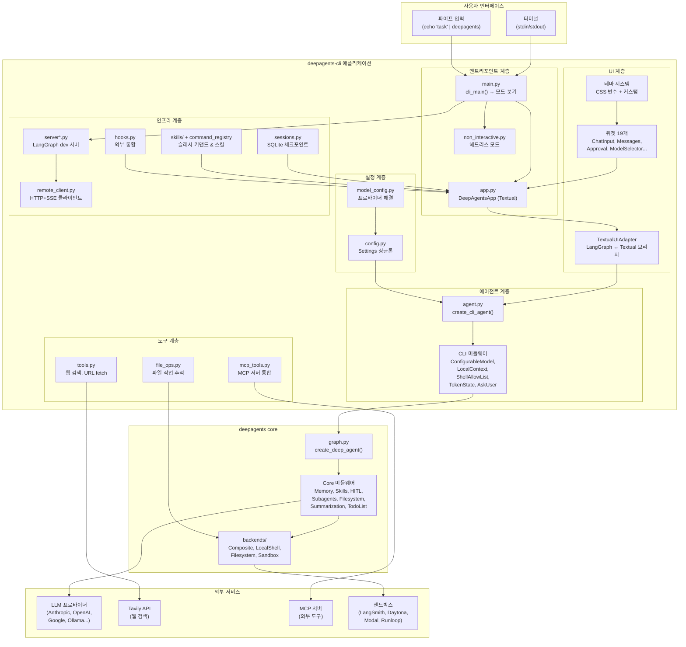

# 06. 아키텍처 종합 & 패턴 레퍼런스

> **분석 대상**: langchain-ai/deepagents@26647a346cd3c71ca223ad2dc17db812f7203b0f
> **CLI 버전**: deepagents-cli v0.0.34 | **Core 버전**: deepagents v0.5.0a4
> **분석일**: 2026-04-04
> **관련 문서**: [00-구조](./00-프로젝트-구조-개요.md) | [01-엔트리포인트](./01-엔트리포인트-앱-라이프사이클.md) | [02a-미들웨어](./02a-에이전트-그래프-미들웨어.md) | [02b-도구](./02b-도구-MCP-백엔드.md) | [03-설정](./03-설정-모델-관리.md) | [04-UI](./04-UI-위젯-시스템.md) | [05-인프라](./05-인프라-세션-서버.md)

---

## 1. 전체 시스템 아키텍처

### 1.1 시스템 경계 다이어그램



### 1.2 데이터 흐름 요약

```
사용자 입력
  → main.py (모드 분기)
    → app.py (메시지 큐에 추가)
      → TextualUIAdapter (astream 시작)
        → agent.py (CLI 미들웨어 적용)
          → core graph.py (LangGraph 그래프 실행)
            → LLM 호출 (도구 필요?)
              → [도구 실행 → HITL 승인 → 결과 반환]
            → 응답 생성
          → 미들웨어 후처리 (메모리 저장, 토큰 집계)
        → 스트리밍 토큰 → 위젯 렌더링
      → 체크포인트 저장 (SQLite)
    → 사용자에게 표시
```

---

## 2. 핵심 디자인 패턴 8가지

### 패턴 1: Lazy Loading (지연 로딩)

**문제**: AI 에이전트 CLI는 수십 개의 무거운 의존성(LangChain, Textual, PIL 등)을 가지며, 모두 임포트하면 시작 시간이 수 초로 늘어남.

**해결**: `__getattr__` 기반 지연 임포트로 실제 사용 시점까지 로딩을 지연.

**구현 위치**: `__init__.py:18-36`, `main.py` (조건부 임포트)

```python
# __init__.py — 패키지 수준 lazy loading
def __getattr__(name: str) -> Callable[[], None]:
    if name == "cli_main":
        from deepagents_cli.main import cli_main  # 실제 사용 시점에만 임포트
        return cli_main
    raise AttributeError(...)
```

**왜 이렇게 했는가?**
- `deepagents --version` 같은 빠른 경로는 Textual이나 LangGraph를 로드할 필요가 없음
- `main.py`에서도 argparse로 모드를 먼저 판단한 후, 해당 모드에 필요한 모듈만 조건부 임포트
- 예: 비대화형 모드에서는 Textual UI 코드 전체를 건너뜀

**자체 CLI 적용 가이드**:
- `__init__.py`에서 `__getattr__` 패턴으로 진입점 지연 로딩
- 무거운 의존성(LLM 클라이언트, UI 프레임워크)은 모드 분기 후 조건부 임포트
- `--version`, `--help` 등 빠른 경로는 최소 임포트로 처리

---

### 패턴 2: Async/Await (비동기 아키텍처)

**문제**: LLM 호출, 웹 검색, 파일 I/O 등 대부분의 작업이 I/O 바운드이며, 동기 처리 시 UI가 블로킹됨.

**해결**: 전체 아키텍처를 `asyncio` 기반으로 설계. Textual의 이벤트 루프와 LangGraph의 비동기 스트리밍을 통합.

**구현 위치**: 전체 코드베이스 (특히 `app.py`, `textual_adapter.py`, `sessions.py`)

**핵심 패턴들**:
1. **Worker 스레드**: `app.py`에서 `self.run_worker()`로 무거운 작업을 별도 스레드에서 실행
2. **`asyncio.gather()`**: `app.py`의 `_start_server_background()`에서 서버 시작과 UI 초기화를 병렬 실행
3. **`aiosqlite`**: `sessions.py`에서 SQLite 체크포인트를 비동기로 처리
4. **SSE 스트리밍**: `remote_client.py`에서 `astream_events()`로 서버로부터 실시간 이벤트 수신

**자체 CLI 적용 가이드**:
- UI 프레임워크(Textual)는 자체 이벤트 루프를 가지므로, LLM 호출은 반드시 비동기로 처리
- SQLite 같은 블로킹 I/O는 `aiosqlite`로 래핑
- 서버 시작, 환경 탐지 등 독립적 작업은 `asyncio.gather()`로 병렬화

---

### 패턴 3: Message Queue Pipeline (메시지 큐 파이프라인)

**문제**: 사용자가 빠르게 여러 메시지를 입력하면 동시에 여러 LLM 호출이 발생하여 상태가 꼬일 수 있음.

**해결**: `asyncio.Queue`를 사용한 FIFO 메시지 파이프라인으로 요청을 순차 처리.

**구현 위치**: `app.py`의 메시지 큐 시스템

**동작 흐름**:
```
사용자 메시지 1 ──→ Queue ──→ Worker 처리 (LLM 호출)
사용자 메시지 2 ──→ Queue     ├─ 완료 후 다음 메시지 처리
사용자 메시지 3 ──→ Queue     └─ 순서 보장
```

**왜 이렇게 했는가?**
- LangGraph의 체크포인트 시스템은 순차적 상태 전이를 전제로 함
- 동시 실행 시 같은 스레드의 체크포인트가 충돌
- 큐를 통해 "하나씩 처리"를 보장하면서도 UI는 논블로킹으로 유지

**자체 CLI 적용 가이드**:
- 사용자 입력을 `asyncio.Queue`에 넣고 단일 Consumer 루프에서 처리
- 처리 중에도 UI 입력은 받되, 큐에 대기시킴
- 취소 메커니즘: 현재 처리 중인 작업을 취소하고 큐를 비우는 로직 필요

---

### 패턴 4: LangGraph Agent Orchestration (에이전트 오케스트레이션)

**문제**: AI 에이전트는 "사고 → 도구 사용 → 결과 반영 → 다시 사고"의 반복 루프가 필요하며, 각 단계에서 상태를 관리하고 중단/재개가 가능해야 함.

**해결**: LangGraph의 `StateGraph`를 활용한 그래프 기반 상태 머신으로 에이전트 루프를 구현.

**구현 위치**: `[core] graph.py`, `agent.py`

**그래프 구조**:
```
__start__ → before_agent → agent (LLM) → tools → agent → ... → __end__
                                  ↓
                            (HITL interrupt)
```

**3단계 생성 체인**:
1. `create_cli_agent()` (CLI) — CLI 전용 미들웨어와 도구 조립
2. `create_deep_agent()` (Core) — 백엔드 생성, Core 미들웨어 적용
3. `create_agent()` (Core) — LangGraph `StateGraph` 컴파일, 노드/엣지 정의

**핵심 설계 결정**:
- `recursion_limit: 9999` — 에이전트가 복잡한 작업에서 충분히 많은 도구 호출을 할 수 있도록
- `before_agent` 노드 — 미들웨어가 LLM 호출 전에 상태를 수정할 수 있는 훅 포인트
- 조건부 엣지 — `tools` 노드 실행 후 다시 `agent`로 돌아갈지 종료할지 결정

**자체 CLI 적용 가이드**:
- LangGraph `StateGraph`로 에이전트 루프 구축 (노드: agent, tools, before_agent)
- `interrupt()` 함수로 HITL 분기점 삽입
- 체크포인트 저장소(SQLite)와 통합하여 세션 영속성 확보
- `before_agent` 훅을 통한 컨텍스트 주입 (로컬 파일 정보, 이전 대화 요약 등)

---

### 패턴 5: Middleware Chain (미들웨어 체인)

**문제**: 에이전트의 동작을 커스터마이즈하려면 (메모리, 스킬, 파일시스템 등) 매번 그래프를 수정하는 것은 비실용적. 기능을 독립적으로 추가/제거할 수 있는 확장 메커니즘이 필요.

**해결**: 미들웨어 패턴으로 에이전트 그래프의 동작을 투명하게 수정. 각 미들웨어는 3개 훅 중 필요한 것만 구현.

**구현 위치**: `[core] middleware/`, `agent.py`

**미들웨어 훅 인터페이스**:
| 훅 | 시점 | 역할 |
|---|---|---|
| `wrap_model_call` | LLM 호출 직전 | 시스템 프롬프트 수정, 도구 목록 조정 |
| `before_agent` | 그래프 `before_agent` 노드 | 상태 전처리 (컨텍스트 수집, 요약) |
| `wrap_tool_call` | 도구 실행 직전 | 도구 호출 가로채기, 검증, 로깅 |

**Core 미들웨어 (8개)**:
| 미들웨어 | 역할 |
|----------|------|
| `MemoryMiddleware` | 크로스 세션 메모리 관리 |
| `SkillsMiddleware` | 스킬 시스템 통합, 프롬프트 주입 |
| `SubAgentMiddleware` | 서브에이전트 생성/관리 |
| `AsyncSubAgentMiddleware` | 비동기 서브에이전트 |
| `FilesystemMiddleware` | 파일시스템 작업 추상화 |
| `SummarizationMiddleware` | 긴 대화 자동 요약 |
| `TodoListMiddleware` | 작업 목록 관리 |
| `PatchToolCallsMiddleware` | 도구 호출 패치/수정 |

**CLI 전용 미들웨어 (5개)**:
| 미들웨어 | 역할 |
|----------|------|
| `ConfigurableModelMiddleware` | 런타임 모델 교체 (재컴파일 없이) |
| `LocalContextMiddleware` | 로컬 프로젝트 컨텍스트 수집 |
| `ShellAllowListMiddleware` | 셸 명령 허용 목록 게이팅 |
| `TokenStateMiddleware` | 토큰 사용량 추적 |
| `AskUserMiddleware` | HITL 사용자 질의 |

**왜 미들웨어인가?**
- 기능별 독립적 개발/테스트 가능
- 조건부 활성화 (예: 비대화형 모드에서는 AskUser 비활성화)
- 순서 의존성 관리 (예: Summarization은 Memory 이후에 실행)
- Core와 CLI 간 관심사 분리

**자체 CLI 적용 가이드**:
- 미들웨어 프로토콜 정의: `wrap_model_call`, `before_agent`, `wrap_tool_call` 3개 훅
- Core 미들웨어 (범용) vs CLI 미들웨어 (UI 특화)를 분리
- 미들웨어 합성 순서를 명시적으로 관리 (리스트로 전달)
- 새 기능 추가 시 미들웨어 하나만 작성 → 에이전트 코드 수정 없이 확장

---

### 패턴 6: HITL Approval (Human-In-The-Loop 승인)

**문제**: AI 에이전트가 파일 수정, 셸 명령 실행 등 위험한 작업을 수행할 때, 사용자 확인 없이 실행하면 심각한 문제가 발생할 수 있음.

**해결**: LangGraph의 `interrupt()` 메커니즘을 활용한 승인 게이트. 위험 작업 전 그래프 실행을 중단하고 사용자에게 승인을 요청.

**구현 위치**: `ask_user.py` (미들웨어), `widgets/approval.py` (UI), `[core] middleware/` (HITL 훅)

**승인 흐름**:
```
에이전트 → 도구 호출 결정 → interrupt() 발동
  → 그래프 실행 중단 → 체크포인트 저장
  → UI에 승인 요청 표시 (ApprovalMenu 위젯)
  → 사용자 선택 (승인/거부/수정)
  → Command(resume=True/False)로 그래프 재개
  → 승인 시 도구 실행, 거부 시 에이전트에 거부 사유 전달
```

**승인 대상 작업들**:
| 작업 유형 | 승인 여부 | 근거 |
|-----------|-----------|------|
| 파일 읽기 | ❌ 불필요 | 비파괴적 |
| 파일 쓰기/수정 | ✅ 필요 | 파괴적, diff 미리보기 제공 |
| 셸 명령 실행 | ✅ 필요 (허용 목록 외) | 시스템 영향 |
| 웹 검색 | ❌ 불필요 | 비파괴적 |
| MCP 도구 | ✅ 신뢰 수준에 따라 | 외부 시스템 접근 |

**핵심 기술**: `asyncio.Future` 기반 인터럽트
- `approval.py`에서 `Future`를 생성하고 UI에 승인 위젯을 표시
- 사용자가 버튼을 클릭하면 `Future.set_result()`로 결과 전달
- 이 패턴으로 비동기 UI와 동기적 승인 흐름을 깔끔하게 연결

**자체 CLI 적용 가이드**:
- LangGraph `interrupt()`로 승인 포인트 정의
- 도구별 위험도 분류: 자동 승인 vs 수동 승인
- `asyncio.Future`로 UI ↔ 에이전트 간 승인 통신
- 허용 목록(allow-list)으로 반복 승인 피로도 감소 (`--shell-allow-list` 참고)
- diff 미리보기로 사용자가 변경 내용을 확인할 수 있도록

---

### 패턴 7: MCP Tool Integration (MCP 도구 통합)

**문제**: AI 에이전트가 다양한 외부 도구(데이터베이스, API, 파일 시스템 등)를 사용하려면 각 도구마다 커스텀 통합이 필요하며, 이는 유지보수 부담을 증가시킴.

**해결**: Model Context Protocol(MCP) 표준을 통해 외부 도구 서버를 플러그인 방식으로 통합.

**구현 위치**: `mcp_tools.py`, `mcp_trust.py`

**MCP 통합 흐름**:
```
1. 설정 파일 탐색 (프로젝트 .mcp.json → ~/.deepagents/.mcp.json)
2. 서버 설정 병합 (프로젝트 우선, 사용자 설정 폴백)
3. 신뢰 검증 (SHA-256 지문 기반 TOML 저장소)
4. 서버 건강 검사 (사전 헬스체크)
5. 세션 생성 (각 서버별 독립 세션)
6. 도구 노출 (LangChain Tool 인터페이스로 변환)
```

**신뢰 모델**:
- 새 MCP 서버 발견 시 사용자에게 신뢰 확인 요청
- 설정 변경 감지 (SHA-256 해시 비교) → 재확인 요청
- 신뢰 정보는 `~/.deepagents/mcp-trust.toml`에 저장
- 원자적 파일 쓰기로 동시 접근 안전성 확보

**자체 CLI 적용 가이드**:
- `langchain-mcp-adapters` 패키지로 MCP 통합 시작
- 설정 파일 계층: 프로젝트 레벨 → 사용자 레벨
- 신뢰 모델 구현: 새 서버/변경된 설정에 대한 사용자 확인
- 세션 관리: 서버 프로세스 라이프사이클 관리 (시작/종료/재시작)

---

### 패턴 8: Client-Server Architecture (클라이언트-서버)

**문제**: UI와 에이전트 로직을 같은 프로세스에서 실행하면, 에이전트의 무거운 작업이 UI를 블로킹하고, 원격 실행이 불가능.

**해결**: `langgraph-cli`의 로컬 dev 서버를 분리 프로세스로 실행하고, HTTP+SSE로 통신.

**구현 위치**: `server.py`, `server_manager.py`, `server_graph.py`, `remote_client.py`

**아키텍처**:
```
┌─────────────────────┐     HTTP+SSE     ┌─────────────────────┐
│  CLI 프로세스        │ ◄──────────────► │  LangGraph 서버     │
│  (Textual TUI)      │   localhost:N    │  (langgraph dev)    │
│                     │                   │                     │
│  - UI 렌더링        │   POST /runs     │  - 에이전트 실행    │
│  - 사용자 입력      │   ←── SSE ───    │  - 도구 호출        │
│  - 세션 관리        │                   │  - 체크포인트       │
└─────────────────────┘                   └─────────────────────┘
```

**왜 분리했는가?**
- UI 프로세스와 에이전트 프로세스의 관심사 분리
- 원격 서버 연결 가능 (로컬 개발 → 클라우드 배포 전환)
- 서버 프로세스 독립 관리 (크래시 격리, 재시작)
- SSE로 실시간 스트리밍 지원

**서버 생명주기**:
1. `ServerManager`가 워크스페이스 스캐폴딩 (임시 디렉토리, 환경 변수 직렬화)
2. `langgraph dev` 서버를 서브프로세스로 시작
3. 헬스체크 폴링 (`/ok` 엔드포인트)
4. `RemoteAgent`가 `RemoteGraph` 래퍼로 통신
5. 종료 시 SIGTERM → 대기 → SIGKILL 순서

**자체 CLI 적용 가이드**:
- 초기에는 인프로세스 실행으로 시작, 나중에 클라이언트-서버 분리
- SSE(Server-Sent Events)로 LLM 스트리밍 토큰 전달
- 환경 변수 직렬화로 서버 프로세스에 설정 전달
- 헬스체크 폴링으로 서버 준비 상태 확인

---

## 3. 의존성 기술 스택 평가

### 3.1 핵심 프레임워크

| 기술 | DeepAgents에서의 역할 | 강점 | 약점 | 대안 |
|------|----------------------|------|------|------|
| **LangGraph** | 에이전트 오케스트레이션 | 상태 머신, 체크포인트, 스트리밍, HITL `interrupt()` | 학습 곡선, LangChain 생태계에 종속 | Autogen, CrewAI, 직접 구현 |
| **LangChain** | LLM 추상화 | 다양한 프로바이더 지원, 도구 인터페이스 표준화 | 추상화 오버헤드, 빠른 API 변경 | LiteLLM, 직접 SDK 호출 |
| **Textual** | 터미널 UI | 리치 위젯, CSS 스타일링, 비동기 네이티브 | 학습 곡선, 터미널 호환성 | Rich + prompt-toolkit, Blessed, Ink(JS) |
| **SQLite** | 세션 영속성 | 서버리스, 빠른 로컬 I/O, LangGraph 체크포인트 내장 지원 | 동시 쓰기 제한 | PostgreSQL (프로덕션), Redis (캐싱) |

### 3.2 레이어별 의존성 구성

```
Layer 3 — CLI 전용:    textual, rich, prompt-toolkit, pyperclip, tavily-python
Layer 2 — Core 공유:   langchain, langgraph, langchain-mcp-adapters
Layer 1 — 프로바이더:  langchain-anthropic, langchain-openai, langchain-google-genai
Layer 0 — 기반:        asyncio, aiosqlite, httpx, pyyaml, python-dotenv
```

---

## 4. 테스트 전략 패턴

DeepAgents CLI의 테스트 구조에서 참조할 패턴들:

### 4.1 테스트 구조
```
tests/
├── unit_tests/         # 단위 테스트 — 각 모듈 독립 테스트
├── integration_tests/  # 통합 테스트 — 모듈 간 상호작용
└── README.md
```

### 4.2 핵심 테스트 패턴

| 패턴 | 설명 | 적용 모듈 |
|------|------|-----------|
| **Mock LLM** | 실제 LLM 호출 대신 미리 정의된 응답 반환 | `_testing_models.py` |
| **Fixture 기반 설정** | pytest fixtures로 Settings, Session 등 테스트 환경 구성 | 전체 |
| **Socket 차단** | `pytest-socket`으로 실수로 외부 API 호출 방지 | 단위 테스트 |
| **비동기 테스트** | `pytest-asyncio`로 async 함수 직접 테스트 | 전체 |
| **벤치마크** | `pytest-benchmark`로 성능 회귀 감지 | 핵심 경로 |
| **타임아웃** | 기본 30초 타임아웃으로 무한 루프 방지 | 전체 |

### 4.3 자체 CLI 적용 가이드
- `_testing_models.py`처럼 가짜 LLM 응답을 반환하는 테스트 모델 구현
- `pytest-socket`으로 단위 테스트에서 외부 API 호출 차단
- 통합 테스트는 실제 LLM 호출을 포함하되, CI에서는 선택적 실행
- `pytest-xdist`로 테스트 병렬 실행 (속도 개선)

---

## 5. 자체 AI 코딩 에이전트 CLI 구축 로드맵

### Phase 1: 최소 실행 가능 에이전트 (MVP)

**목표**: 터미널에서 대화하고 간단한 도구를 사용하는 에이전트

**구현 순서**:
1. **에이전트 그래프** — LangGraph `StateGraph`로 기본 루프 (agent → tools → agent)
2. **기본 도구** — 파일 읽기/쓰기, 셸 명령 실행
3. **CLI 진입점** — argparse 기반 모드 분기 (대화형/비대화형)
4. **설정 시스템** — TOML 기반 설정 파일, 환경 변수 오버라이드

**참조 패턴**: #4 (LangGraph), #1 (Lazy Loading)

### Phase 2: HITL 안전성

**목표**: 위험한 작업에 대한 사용자 승인 게이트

**구현 순서**:
1. **HITL 미들웨어** — `interrupt()` 기반 승인 시스템
2. **도구별 위험도 분류** — 자동 승인 vs 수동 승인
3. **Diff 미리보기** — 파일 수정 전 변경 내용 표시
4. **허용 목록** — 반복 승인 피로도 감소

**참조 패턴**: #6 (HITL), #5 (Middleware Chain)

### Phase 3: 리치 UI

**목표**: Textual 기반 TUI로 사용자 경험 향상

**구현 순서**:
1. **TextualUIAdapter** — 에이전트 스트리밍 ↔ UI 위젯 브리지
2. **메시지 파이프라인** — 큐 기반 순차 처리
3. **스트리밍 렌더링** — Markdown 증분 렌더링
4. **테마 시스템** — CSS 변수 기반 커스터마이징

**참조 패턴**: #3 (Message Queue), #2 (Async/Await)

### Phase 4: 확장성

**목표**: 외부 도구와 커스텀 기능 통합

**구현 순서**:
1. **MCP 통합** — 외부 도구 서버 플러그인
2. **스킬 시스템** — 파일시스템 기반 스킬 디스커버리
3. **서브에이전트** — 작업 위임 시스템
4. **세션 영속성** — SQLite 체크포인트로 대화 저장/복원

**참조 패턴**: #7 (MCP), #8 (Client-Server)

### Phase 5: 프로덕션 품질

**목표**: 안정성, 보안, 배포 준비

**구현 순서**:
1. **클라이언트-서버 분리** — UI와 에이전트 프로세스 분리
2. **유니코드 보안** — BiDi 공격, 퓨니코드 도메인 검증
3. **토큰 추적** — 사용량 모니터링
4. **자동 업데이트** — 버전 체크 시스템

---

## 6. 아키텍처 결정 레코드 (ADR) 요약

| # | 결정 | 근거 | 대안 | 트레이드오프 |
|---|------|------|------|-------------|
| 1 | LangGraph 기반 에이전트 | 상태 머신, 체크포인트, HITL 내장 | 직접 구현, Autogen | LangChain 생태계 종속 |
| 2 | 미들웨어 체인 패턴 | 관심사 분리, 독립적 확장 | 데코레이터, 이벤트 시스템 | 디버깅 복잡성 |
| 3 | Textual TUI | 리치 위젯, CSS, 비동기 네이티브 | Rich 단독, curses | 의존성 무게 |
| 4 | 클라이언트-서버 분리 | 관심사 분리, 원격 지원 | 인프로세스 | 통신 오버헤드 |
| 5 | SQLite 체크포인트 | 서버리스, LangGraph 내장 지원 | PostgreSQL, 파일 시스템 | 동시성 제한 |
| 6 | MCP 도구 통합 | 표준 프로토콜, 플러그인 확장 | 직접 API 연동 | MCP 생태계 의존 |
| 7 | 6레이어 설정 계층 | 유연성, 환경별 오버라이드 | 단순 환경 변수 | 설정 추적 복잡성 |
| 8 | Lazy Loading | 빠른 시작 시간 | 일괄 임포트 | 첫 호출 지연 |

---

## 7. 결론

DeepAgents CLI는 **97개 Python 파일**에 걸쳐 8가지 핵심 아키텍처 패턴을 구현한 프로덕션급 AI 코딩 에이전트입니다. 이 분석에서 도출된 가장 중요한 인사이트:

1. **미들웨어 체인이 핵심이다** — 에이전트의 동작을 수정하는 가장 깔끔한 방법. Core/CLI 분리로 재사용성 극대화.
2. **HITL은 선택이 아니다** — 코딩 에이전트에서 파일 수정/셸 실행은 반드시 사용자 승인이 필요. LangGraph `interrupt()`가 이를 우아하게 해결.
3. **비동기가 기본이다** — LLM 호출, 파일 I/O, 네트워크 통신 모두 I/O 바운드. `asyncio` 없이는 반응적인 UI 불가.
4. **메시지 큐로 상태를 보호하라** — 동시 LLM 호출은 체크포인트 충돌을 야기. 큐 기반 순차 처리가 해결책.
5. **MCP로 확장하라** — 모든 도구를 직접 구현하지 말고, MCP 표준으로 외부 도구 생태계를 활용.

자체 AI 코딩 에이전트 CLI를 구축할 때, 이 5개 로드맵 단계(MVP → HITL → 리치 UI → 확장성 → 프로덕션)를 따르면 DeepAgents가 겪었던 아키텍처 결정들을 효율적으로 재사용할 수 있습니다.

---

*전체 분석 문서 목록:*
- [00-프로젝트-구조-개요](./00-프로젝트-구조-개요.md) — 전체 지형, CLI-Core 의존성 경계
- [01-엔트리포인트-앱-라이프사이클](./01-엔트리포인트-앱-라이프사이클.md) — 실행 흐름, 메시지 파이프라인
- [02a-에이전트-그래프-미들웨어](./02a-에이전트-그래프-미들웨어.md) — LangGraph 그래프, 미들웨어 체인
- [02b-도구-MCP-백엔드](./02b-도구-MCP-백엔드.md) — MCP 통합, Backend 추상화
- [03-설정-모델-관리](./03-설정-모델-관리.md) — 설정 계층, 모델 프로바이더
- [04-UI-위젯-시스템](./04-UI-위젯-시스템.md) — Textual TUI, 19개 위젯
- [05-인프라-세션-서버](./05-인프라-세션-서버.md) — 세션, 서버, 스킬, 훅
- [06-아키텍처-종합-패턴-레퍼런스](./06-아키텍처-종합-패턴-레퍼런스.md) — 본 문서
