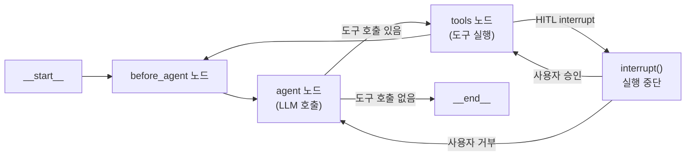
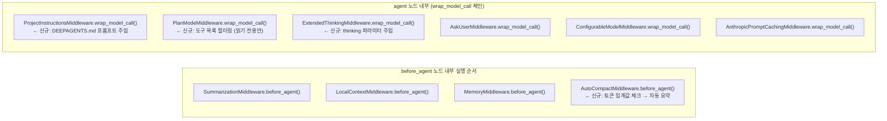
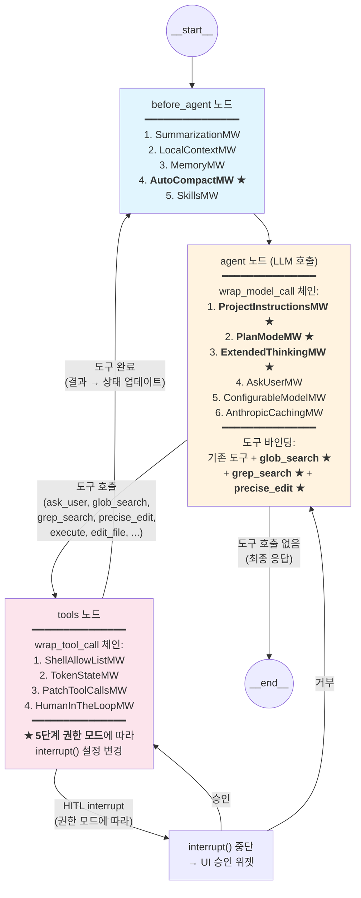
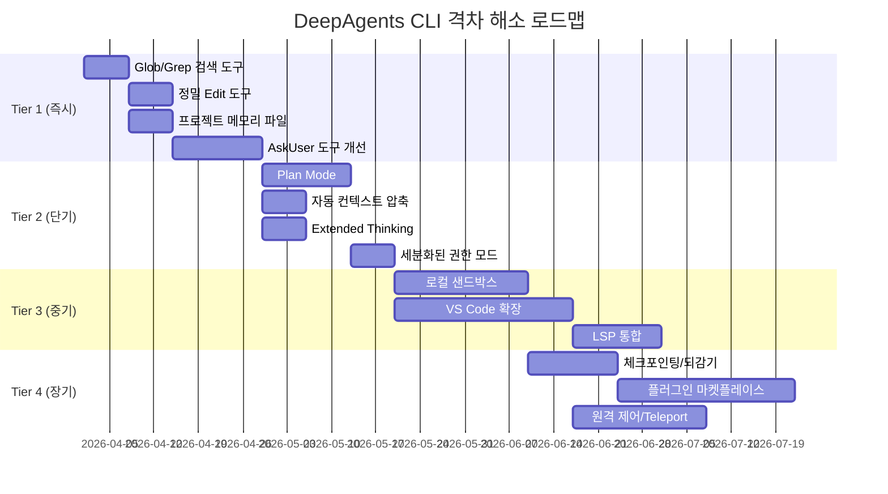

# 08. 격차 해소 구현 설계서

> **분석 대상**: langchain-ai/deepagents@26647a346cd3c71ca223ad2dc17db812f7203b0f
> **CLI 버전**: deepagents-cli v0.0.34 | **Core 버전**: deepagents v0.5.0a4
> **분석일**: 2026-04-04
> **관련 문서**: [07-격차 분석](./07-기능-격차-분석-Claude-Code-vs-Codex-vs-DeepAgents.md) | [02a-미들웨어](./02a-에이전트-그래프-미들웨어.md)

---

## 1. 개요

이 문서는 [07번 격차 분석](./07-기능-격차-분석-Claude-Code-vs-Codex-vs-DeepAgents.md)에서 식별된 18개 기능 격차를 DeepAgents CLI의 기존 아키텍처(미들웨어 체인, Backend 추상화, LangGraph 그래프)를 활용하여 **구체적으로 어떻게 구현할 수 있는지** 설계합니다.

또한 별도 요청된 **AskUserQuestion HITL 도구 개선**에 대한 상세 요구사항 분석과 구현 설계를 포함합니다.

### 구현 원칙

1. **미들웨어 우선**: 새 기능은 가능한 한 미들웨어로 구현하여 핵심 코드 수정 최소화
2. **Backend 확장**: 파일/실행 관련 도구는 Backend 프로토콜을 확장
3. **기존 패턴 준수**: `agent.py:create_cli_agent()`의 도구 등록 패턴, `interrupt()` 기반 HITL 패턴 준수
4. **점진적 도입**: 각 기능은 독립적으로 구현/배포 가능해야 함

---

## 1.5 LangGraph 그래프 구조와 미들웨어의 관계

### 1.5.1 현재 그래프 구조

DeepAgents의 "미들웨어 체인"은 독립적인 레이어가 아니라 **LangGraph `StateGraph`의 노드 내부에서 실행되는 훅(hook)**입니다. `create_agent()` (LangChain 내부)가 생성하는 실제 그래프 구조는 다음과 같습니다:



각 노드에서 미들웨어 훅이 실행되는 시점:

| 그래프 노드 | 미들웨어 훅 | 실행 내용 |
|------------|------------|-----------|
| `before_agent` | `before_agent()` | 상태 전처리: 컨텍스트 수집, 요약 트리거, 스킬 로딩 |
| `agent` (LLM 호출) | `wrap_model_call()` | LLM 호출 가로채기: 시스템 프롬프트 수정, 도구 목록 조정, 모델 교체 |
| `tools` (도구 실행) | `wrap_tool_call()` | 도구 호출 가로채기: 셸 허용 목록 검증, 토큰 집계, HITL `interrupt()` |

### 1.5.2 미들웨어 → 그래프 노드 매핑 (현재 스택)

`create_deep_agent()` (`graph.py:292-322`)에서 조립되는 미들웨어 스택과 각 미들웨어가 영향을 미치는 그래프 노드:

```mermaid
graph TD
    subgraph "create_agent() 가 생성하는 LangGraph StateGraph"
        START(("__start__"))
        BA["before_agent 노드"]
        AGENT["agent 노드 (LLM 호출)"]
        TOOLS["tools 노드 (도구 실행)"]
        END_(("__end__"))

        START --> BA
        BA --> AGENT
        AGENT -->|tool_calls| TOOLS
        AGENT -->|no tools| END_
        TOOLS --> BA
    end

    subgraph "Core 미들웨어 (graph.py:292-307)"
        MW1["1. TodoListMiddleware<br/>→ agent: 도구 주입 (write_todos)"]
        MW2["2. SkillsMiddleware<br/>→ before_agent: 스킬 로딩<br/>→ agent: 프롬프트 주입"]
        MW3["3. FilesystemMiddleware<br/>→ agent: 파일 도구 주입<br/>(ls, read_file, write_file, edit_file, glob, grep)"]
        MW4["4. SubAgentMiddleware<br/>→ agent: task 도구 주입"]
        MW5["5. SummarizationMiddleware<br/>→ before_agent: 대화 요약 트리거"]
        MW6["6. PatchToolCallsMiddleware<br/>→ tools: 도구 호출 패치"]
    end

    subgraph "CLI 미들웨어 (agent.py:1031+)"
        MW7["7. AskUserMiddleware<br/>→ agent: ask_user 도구 주입<br/>→ tools: interrupt() 발동"]
        MW8["8. ConfigurableModelMiddleware<br/>→ agent: 런타임 모델 교체"]
        MW9["9. LocalContextMiddleware<br/>→ before_agent: 환경 컨텍스트 수집"]
        MW10["10. ShellAllowListMiddleware<br/>→ tools: 셸 명령 검증"]
        MW11["11. TokenStateMiddleware<br/>→ tools: 토큰 사용량 집계"]
    end

    subgraph "후처리 미들웨어 (graph.py:318-322)"
        MW12["12. AnthropicPromptCachingMiddleware<br/>→ agent: 프롬프트 캐시 최적화"]
        MW13["13. MemoryMiddleware<br/>→ before_agent: 메모리 로딩<br/>→ agent: 메모리 프롬프트 주입"]
        MW14["14. HumanInTheLoopMiddleware<br/>→ tools: interrupt_on 설정 적용"]
    end

    MW1 -.-> AGENT
    MW2 -.-> BA
    MW2 -.-> AGENT
    MW3 -.-> AGENT
    MW4 -.-> AGENT
    MW5 -.-> BA
    MW6 -.-> TOOLS
    MW7 -.-> AGENT
    MW7 -.-> TOOLS
    MW8 -.-> AGENT
    MW9 -.-> BA
    MW10 -.-> TOOLS
    MW11 -.-> TOOLS
    MW12 -.-> AGENT
    MW13 -.-> BA
    MW13 -.-> AGENT
    MW14 -.-> TOOLS
```



**핵심 포인트**: 미들웨어는 **새 노드를 추가하는 것이 아니라** 기존 3개 노드(`before_agent`, `agent`, `tools`)의 동작을 래핑합니다. 미들웨어가 `tools` 속성에 도구를 추가하면, 그 도구는 자동으로 `agent` 노드의 LLM에 바인딩되고 `tools` 노드에서 실행됩니다.

### 1.5.3 새 기능 추가 시 그래프 변화

각 격차 해소 기능이 그래프 구조에 미치는 영향:

#### A. 새 도구 추가 (Glob, Grep, Edit)

**그래프 노드 변화: 없음** — 도구만 추가되므로 그래프 토폴로지는 동일.

```
변경 전:  agent → [read_file, write_file, edit_file, execute, web_search, ...]
변경 후:  agent → [read_file, write_file, edit_file, execute, web_search,
                    glob_search, grep_search, precise_edit, ...]
                    ↑ 새 도구 3개 추가
```

- `glob_search`, `grep_search`: `tools` 노드에서 실행, HITL 불필요 (읽기 전용)
- `precise_edit`: `tools` 노드에서 실행, `HumanInTheLoopMiddleware`가 `interrupt()` 발동

도구는 `create_cli_agent()`의 `tools` 파라미터로 전달되어 `create_deep_agent()` → `create_agent()`로 전파됩니다.

```python
# agent.py — 도구 등록 흐름
def create_cli_agent(..., tools=None, ...):
    all_tools = [*tools, glob_search, grep_search, precise_edit]
    #                      ↑ 새 도구들

    agent, backend = create_deep_agent(
        model=model,
        tools=all_tools,  # → create_agent()의 tools 파라미터로 전달
        middleware=cli_middlewares,
        interrupt_on=interrupt_on,
        ...
    )
```

#### B. 새 미들웨어 추가 (PlanMode, ProjectInstructions, AutoCompact, ExtendedThinking)

**그래프 노드 변화: 없음** — 기존 노드의 동작만 수정.



각 새 미들웨어의 그래프 노드별 영향:

| 새 미들웨어 | `before_agent` | `agent` (wrap_model_call) | `tools` (wrap_tool_call) |
|------------|----------------|--------------------------|-------------------------|
| **ProjectInstructionsMiddleware** | — | ✅ 시스템 프롬프트에 DEEPAGENTS.md 주입 | — |
| **PlanModeMiddleware** | — | ✅ 도구 목록을 읽기 전용만 필터링 | ✅ 쓰기 도구 호출 시 차단 |
| **AutoCompactMiddleware** | ✅ 토큰 수 체크 → 자동 요약 | — | — |
| **ExtendedThinkingMiddleware** | — | ✅ `thinking` 파라미터 주입 | — |

#### C. AskUser 도구 개선

**그래프 노드 변화: 없음** — 기존 `ask_user` 도구의 스키마만 확장.

```
변경 전:  ask_user(questions: list[Question])
          Question = {question, type, choices?, required?}

변경 후:  ask_user(questions: list[Question])  # 최대 4개로 제한
          Question = {question, type, header?, choices?, multi_select?, required?}
          Choice = {value, description?, preview?}
```

`tools` 노드에서의 실행 흐름은 동일:
```
agent 노드 → ask_user 도구 호출 결정
  → tools 노드 → AskUserMiddleware._ask_user() 실행
    → _validate_questions() (강화된 검증)
    → interrupt(AskUserRequest) → 그래프 실행 중단
    → [UI가 AskUserMenu 위젯 표시]
    → [사용자 답변]
    → Command(resume) → 그래프 재개
    → _parse_answers() → ToolMessage 반환
  → before_agent 노드로 복귀 (다음 루프)
```

#### D. 세분화된 권한 모드

**그래프 노드 변화: 조건부** — 권한 모드에 따라 `HumanInTheLoopMiddleware`의 `interrupt_on` 설정이 변경.

```python
# 모드별 interrupt_on 설정
PERMISSION_CONFIGS = {
    "plan": {},                    # interrupt_on 없음 (PlanModeMiddleware가 도구 필터)
    "suggest": {                   # 모든 변경 도구에 interrupt
        "edit_file": True, "write_file": True, "execute": True,
        "precise_edit": True, "web_search": True,
    },
    "auto-edit": {                 # 파일 편집 자동, 셸만 interrupt
        "execute": True,
    },
    "auto": {                      # 위험한 작업만 interrupt
        "execute": {"condition": lambda tc: _is_dangerous(tc)},
    },
    "full-auto": {},               # interrupt 없음 (샌드박스 권장)
}
```

`tools` 노드에서의 변화:
- `suggest` 모드: `tools` 노드에서 거의 모든 도구 호출 시 `interrupt()` 발동
- `full-auto` 모드: `tools` 노드에서 `interrupt()` 없이 모든 도구 자동 실행

### 1.5.4 격차 해소 후 전체 그래프 구조

모든 Tier 1~2 기능이 구현된 후의 그래프:



**★ 표시 = 새로 추가되는 기능**

### 1.5.5 핵심 설계 원칙 재확인

> **미들웨어는 그래프의 노드를 추가하지 않습니다.** 기존 3개 노드(`before_agent`, `agent`, `tools`)의 동작을 래핑하여 기능을 확장합니다. 새 도구는 `agent` 노드의 LLM에 바인딩되어 `tools` 노드에서 실행됩니다. 이 구조 덕분에 **그래프 토폴로지를 변경하지 않고도** 검색, 편집, 계획 모드, 컨텍스트 압축 등의 기능을 추가할 수 있습니다.

---

## 2. Tier 1: 즉시 구현 (Critical Gap 해소)

### 2.1 전문 파일 검색 도구 (Glob)

**현재 상태**: 에이전트가 `execute` 도구(셸)로 `find`, `ls` 등을 직접 실행해야 함.

**목표**: Claude Code의 `Glob` 도구처럼, 파일 패턴 매칭 전용 도구 제공.

#### 구현 설계

**파일**: `deepagents_cli/tools_search.py` (신규)

```python
"""전문 파일/코드 검색 도구."""
from __future__ import annotations

import fnmatch
import os
from pathlib import Path
from typing import Literal

from langchain_core.tools import tool


@tool
def glob_search(
    pattern: str,
    path: str = ".",
    max_results: int = 200,
) -> str:
    """파일 패턴 매칭으로 파일을 검색합니다.

    Glob 패턴(예: "**/*.py", "src/**/*.ts")을 사용하여 파일을 찾습니다.
    결과는 수정 시간 기준 내림차순 정렬됩니다.

    Args:
        pattern: Glob 패턴 (예: "**/*.py", "src/**/test_*.py")
        path: 검색 시작 디렉토리 (기본: 현재 디렉토리)
        max_results: 최대 결과 수 (기본: 200)

    Returns:
        매칭된 파일 경로 목록 (줄바꿈 구분)
    """
    base = Path(path).resolve()
    matches = []

    for match in base.glob(pattern):
        if match.is_file():
            matches.append(match)

    # 수정 시간 기준 정렬 (최신 우선)
    matches.sort(key=lambda p: p.stat().st_mtime, reverse=True)

    if len(matches) > max_results:
        truncated = len(matches) - max_results
        matches = matches[:max_results]
        result = "\n".join(str(m.relative_to(base)) for m in matches)
        return f"{result}\n\n... and {truncated} more files (truncated)"

    return "\n".join(str(m.relative_to(base)) for m in matches) or "(no matches)"
```

**등록 위치**: `agent.py:create_cli_agent()` 내 도구 목록에 추가

```python
# agent.py 수정 (create_cli_agent 함수 내부)
from deepagents_cli.tools_search import glob_search, grep_search

all_tools = [*tools, glob_search, grep_search]
```

**HITL 정책**: 읽기 전용이므로 **자동 승인** (interrupt 불필요)

**테스트 전략**:
- 단위: 다양한 glob 패턴 매칭 테스트
- 통합: 에이전트가 `glob_search`를 올바르게 호출하는지 확인

---

### 2.2 전문 코드 검색 도구 (Grep)

**현재 상태**: 에이전트가 셸에서 `grep`, `rg`를 직접 실행해야 함.

**목표**: 파일 내용 검색 전용 도구. ripgrep이 있으면 활용, 없으면 Python 폴백.

#### 구현 설계

**파일**: `deepagents_cli/tools_search.py` (위 파일에 추가)

```python
import re
import shutil
import subprocess


@tool
def grep_search(
    pattern: str,
    path: str = ".",
    file_type: str | None = None,
    max_results: int = 250,
    context_lines: int = 0,
    case_insensitive: bool = False,
    output_mode: Literal["content", "files_with_matches", "count"] = "files_with_matches",
) -> str:
    """파일 내용에서 정규식 패턴을 검색합니다.

    ripgrep(rg)이 설치되어 있으면 활용하고, 없으면 Python 폴백을 사용합니다.

    Args:
        pattern: 검색할 정규식 패턴
        path: 검색 대상 디렉토리 또는 파일
        file_type: 파일 유형 필터 (예: "py", "ts", "js")
        max_results: 최대 결과 수
        context_lines: 매칭 전후 표시할 줄 수
        case_insensitive: 대소문자 무시 여부
        output_mode: "content"(내용), "files_with_matches"(파일 목록), "count"(횟수)

    Returns:
        검색 결과 (출력 모드에 따라 형식이 다름)
    """
    rg_path = shutil.which("rg")

    if rg_path:
        return _grep_ripgrep(
            rg_path, pattern, path, file_type,
            max_results, context_lines, case_insensitive, output_mode,
        )
    return _grep_python(
        pattern, path, file_type,
        max_results, context_lines, case_insensitive, output_mode,
    )


def _grep_ripgrep(
    rg: str, pattern: str, path: str, file_type: str | None,
    max_results: int, context: int, ignore_case: bool,
    mode: str,
) -> str:
    """ripgrep 기반 검색."""
    cmd = [rg, "--no-heading"]

    if mode == "files_with_matches":
        cmd.append("--files-with-matches")
    elif mode == "count":
        cmd.append("--count")
    else:
        cmd.extend(["-n", f"--max-count={max_results}"])

    if context > 0:
        cmd.append(f"-C{context}")
    if ignore_case:
        cmd.append("-i")
    if file_type:
        cmd.extend(["--type", file_type])

    cmd.extend([pattern, path])

    result = subprocess.run(
        cmd, capture_output=True, text=True, timeout=30,
    )
    output = result.stdout.strip()

    # 결과 수 제한
    lines = output.split("\n")
    if len(lines) > max_results:
        return "\n".join(lines[:max_results]) + f"\n\n... truncated ({len(lines)} total)"
    return output or "(no matches)"


def _grep_python(
    pattern: str, path: str, file_type: str | None,
    max_results: int, context: int, ignore_case: bool,
    mode: str,
) -> str:
    """Python 폴백 검색 (ripgrep 미설치 시)."""
    flags = re.IGNORECASE if ignore_case else 0
    regex = re.compile(pattern, flags)
    results = []
    base = Path(path).resolve()

    glob_pattern = f"**/*.{file_type}" if file_type else "**/*"

    for filepath in base.glob(glob_pattern):
        if not filepath.is_file():
            continue
        try:
            text = filepath.read_text(errors="replace")
            matches = list(regex.finditer(text))
            if matches:
                rel = str(filepath.relative_to(base))
                if mode == "files_with_matches":
                    results.append(rel)
                elif mode == "count":
                    results.append(f"{rel}:{len(matches)}")
                else:
                    lines = text.splitlines()
                    for m in matches[:5]:  # 파일당 최대 5개
                        lineno = text[:m.start()].count("\n") + 1
                        results.append(f"{rel}:{lineno}:{lines[lineno-1]}")
        except (OSError, UnicodeDecodeError):
            continue

        if len(results) >= max_results:
            break

    return "\n".join(results) or "(no matches)"
```

**HITL 정책**: 읽기 전용 → **자동 승인**

---

### 2.3 정밀 편집 도구 (Edit)

**현재 상태**: `edit_file` 도구가 존재하지만 전체 파일을 다시 쓰는 방식이 주력.

**목표**: Claude Code의 `Edit` 도구처럼 특정 문자열을 정확히 교체하는 도구.

#### 구현 설계

**파일**: `deepagents_cli/tools_edit.py` (신규)

```python
"""정밀 파일 편집 도구 — 대상 문자열만 교체."""
from __future__ import annotations

from pathlib import Path

from langchain_core.tools import tool


@tool
def precise_edit(
    file_path: str,
    old_string: str,
    new_string: str,
    replace_all: bool = False,
) -> str:
    """파일에서 특정 문자열을 정확히 교체합니다.

    전체 파일을 다시 쓰지 않고, 변경 대상 부분만 교체합니다.
    old_string이 파일 내에서 유일해야 합니다 (replace_all=False일 때).

    Args:
        file_path: 수정할 파일의 절대 경로
        old_string: 교체할 기존 문자열 (정확히 일치해야 함)
        new_string: 교체할 새 문자열 (old_string과 달라야 함)
        replace_all: True면 모든 발생을 교체, False면 유일해야 함

    Returns:
        성공 메시지 또는 에러 설명
    """
    path = Path(file_path)

    if not path.exists():
        return f"Error: File not found: {file_path}"
    if not path.is_file():
        return f"Error: Not a file: {file_path}"
    if old_string == new_string:
        return "Error: old_string and new_string must be different"

    content = path.read_text()

    count = content.count(old_string)
    if count == 0:
        return f"Error: old_string not found in {file_path}"

    if not replace_all and count > 1:
        return (
            f"Error: old_string appears {count} times in {file_path}. "
            f"Provide more surrounding context to make it unique, "
            f"or set replace_all=True."
        )

    new_content = content.replace(old_string, new_string, -1 if replace_all else 1)
    path.write_text(new_content)

    replaced = count if replace_all else 1
    return f"Successfully replaced {replaced} occurrence(s) in {file_path}"
```

**HITL 정책**: 파일 수정 → **승인 필요** (기존 `edit_file` 인터럽트 설정 재활용)

```python
# agent.py에 인터럽트 설정 추가
precise_edit_interrupt_config: InterruptOnConfig = {
    "always": True,
    "description": _format_precise_edit_description,
}
interrupt_on["precise_edit"] = precise_edit_interrupt_config
```

**Diff 미리보기**: 기존 `file_ops.py`의 `FileOpTracker`를 활용하여 변경 전/후 unified diff 표시.

---

### 2.4 프로젝트 메모리 파일 (DEEPAGENTS.md)

**현재 상태**: `MemoryMiddleware`로 크로스 세션 메모리는 있지만, 프로젝트 루트에 체크인 가능한 지시사항 파일 없음.

**목표**: `DEEPAGENTS.md` (또는 `AGENTS.md` — 이미 agent.py에서 `AGENTS.md` 참조를 발견!) 파일을 시스템 프롬프트에 자동 주입.

#### 현재 코드 분석

`agent.py:933-934`에서 이미 `AGENTS.md` 파일 관련 로직이 있음:
```python
agent_md = agent_dir / "AGENTS.md"
if not agent_md.exists():
    agent_md.touch()
```

그러나 이것은 `~/.deepagents/{assistant_id}/AGENTS.md`에 있는 **에이전트별** 설정 파일이며, **프로젝트 루트**의 파일이 아닙니다.

#### 구현 설계

**파일**: `deepagents_cli/project_instructions.py` (신규)

```python
"""프로젝트 지시사항 파일 로더.

DEEPAGENTS.md 또는 AGENTS.md 파일을 프로젝트 디렉토리 계층에서 탐색하여
시스템 프롬프트에 주입합니다.
"""
from __future__ import annotations

from pathlib import Path


# 탐색할 파일명 (우선순위 순)
INSTRUCTION_FILENAMES = [
    "DEEPAGENTS.md",
    ".deepagents/instructions.md",
    "AGENTS.md",
]


def find_project_instructions(project_root: Path) -> list[tuple[Path, str]]:
    """프로젝트 루트부터 상위로 지시사항 파일을 탐색합니다.

    Args:
        project_root: 프로젝트 루트 디렉토리 (git root)

    Returns:
        [(파일 경로, 내용)] 리스트 (하위→상위 순)
    """
    results = []
    current = project_root.resolve()
    home = Path.home()

    # 프로젝트 루트에서만 탐색 (상위로 올라가지 않음)
    for filename in INSTRUCTION_FILENAMES:
        filepath = current / filename
        if filepath.is_file():
            content = filepath.read_text(errors="replace").strip()
            if content:
                results.append((filepath, content))
            break  # 첫 번째 매칭 파일만 사용

    # 사용자 홈의 글로벌 지시사항
    for filename in INSTRUCTION_FILENAMES:
        global_path = home / ".deepagents" / filename
        if global_path.is_file():
            content = global_path.read_text(errors="replace").strip()
            if content:
                results.append((global_path, content))
            break

    return results


def format_instructions_for_prompt(
    instructions: list[tuple[Path, str]],
) -> str:
    """지시사항을 시스템 프롬프트 삽입용으로 포맷합니다."""
    if not instructions:
        return ""

    sections = []
    for path, content in instructions:
        sections.append(
            f"## Project Instructions ({path})\n\n{content}"
        )

    return "\n\n---\n\n".join(sections)
```

**미들웨어 구현**: `ProjectInstructionsMiddleware`

```python
class ProjectInstructionsMiddleware(AgentMiddleware):
    """프로젝트 지시사항 파일을 시스템 프롬프트에 자동 주입하는 미들웨어."""

    def __init__(self, project_root: Path) -> None:
        super().__init__()
        self.instructions = find_project_instructions(project_root)
        self.prompt_text = format_instructions_for_prompt(self.instructions)

    def wrap_model_call(self, request, handler):
        if self.prompt_text:
            # 기존 시스템 프롬프트에 지시사항 추가
            new_content = [
                *request.system_message.content_blocks,
                {"type": "text", "text": f"\n\n{self.prompt_text}"},
            ]
            new_msg = SystemMessage(content=new_content)
            return handler(request.override(system_message=new_msg))
        return handler(request)
```

**등록**: `agent.py:create_cli_agent()`에서 `enable_project_instructions=True` 파라미터 추가

**계층 구조**:
```
~/.deepagents/DEEPAGENTS.md          # 글로벌 (모든 프로젝트)
<project-root>/DEEPAGENTS.md         # 프로젝트 공유 (git 추적)
<project-root>/.deepagents/local.md  # 프로젝트 개인 (.gitignore)
```

---

## 3. Tier 2: 단기 구현 (Important Gap 해소)

### 3.1 구조화된 계획 모드 (Plan Mode)

**구현 전략**: 미들웨어로 도구 사용을 제한하는 방식.

**파일**: `deepagents_cli/plan_mode.py` (신규)

```python
class PlanModeMiddleware(AgentMiddleware):
    """에이전트를 읽기 전용 모드로 제한하는 미들웨어.

    Plan Mode가 활성화되면:
    - 파일 쓰기/수정 도구 비활성화
    - 셸 명령 실행 비활성화
    - 파일 읽기, 검색, 웹 검색만 허용
    - 계획 파일(.deepagents/plans/)에만 쓰기 허용
    """

    ALLOWED_TOOLS = {
        "read_file", "list_directory", "glob_search", "grep_search",
        "web_search", "fetch_url", "ask_user",
    }

    PLAN_ONLY_TOOLS = {"write_plan"}  # 계획 파일에만 쓸 수 있는 전용 도구

    def wrap_model_call(self, request, handler):
        # 도구 목록에서 허용된 도구만 남김
        filtered_tools = [
            t for t in request.tools
            if t.name in self.ALLOWED_TOOLS | self.PLAN_ONLY_TOOLS
        ]
        # 시스템 프롬프트에 Plan Mode 안내 추가
        plan_prompt = (
            "\n\n## Plan Mode Active\n"
            "You are in read-only planning mode. "
            "Analyze the codebase and create a plan. "
            "You CANNOT modify files or run commands. "
            "Use the write_plan tool to save your plan."
        )
        return handler(request.override(
            tools=filtered_tools,
            system_message=_append_to_system(request.system_message, plan_prompt),
        ))
```

**UI 연동**:
- 슬래시 커맨드 `/plan` 으로 Plan Mode 진입
- 상태 바에 "PLAN MODE" 표시
- Plan 완료 시 사용자 승인 → 실행 모드로 전환

**활성화**: `agent.py`에서 `plan_mode=True` 파라미터 → `PlanModeMiddleware` 추가

---

### 3.2 자동 컨텍스트 압축 강화

**현재**: `SummarizationMiddleware`가 Core에 존재하나, 자동 트리거 없음.

**구현 전략**: `TokenStateMiddleware`의 토큰 추적 + `SummarizationMiddleware` 연동.

```python
class AutoCompactMiddleware(AgentMiddleware):
    """토큰 임계값 도달 시 자동 대화 요약을 트리거하는 미들웨어."""

    def __init__(
        self,
        threshold_ratio: float = 0.75,  # 컨텍스트 윈도우의 75%
        pin_last_n: int = 5,            # 최근 N개 메시지는 요약에서 제외
    ):
        self.threshold_ratio = threshold_ratio
        self.pin_last_n = pin_last_n

    def before_agent(self, state):
        total_tokens = state.get("token_count", 0)
        max_tokens = state.get("max_context_tokens", 200_000)

        if total_tokens > max_tokens * self.threshold_ratio:
            # 자동 요약 트리거
            messages = state["messages"]
            pinned = messages[-self.pin_last_n:]
            to_summarize = messages[:-self.pin_last_n]
            summary = self._summarize(to_summarize)
            return {"messages": [summary, *pinned]}

        return state
```

**슬래시 커맨드**: `/compact [instructions]` 명령 추가 (`command_registry.py`)

---

### 3.3 Extended Thinking 지원

**구현 전략**: Anthropic API의 `thinking` 파라미터를 모델 호출 시 전달.

```python
class ExtendedThinkingMiddleware(AgentMiddleware):
    """Extended Thinking을 모델 호출에 활성화하는 미들웨어."""

    def __init__(self, budget_tokens: int = 10000):
        self.budget_tokens = budget_tokens

    def wrap_model_call(self, request, handler):
        # Anthropic 모델인 경우에만 활성화
        if self._is_anthropic_model(request):
            request = request.override(
                model_kwargs={
                    **request.model_kwargs,
                    "thinking": {
                        "type": "enabled",
                        "budget_tokens": self.budget_tokens,
                    },
                }
            )
        return handler(request)
```

**UI**: 사고 과정을 별도 위젯(접히는 패널)으로 표시.

---

### 3.4 세분화된 권한 모드

**현재**: `auto_approve=True/False`의 2단계.

**목표**: 5단계 권한 모드.

| 모드 | 설명 |
|------|------|
| `plan` | 읽기 전용 (PlanModeMiddleware 활용) |
| `suggest` | 모든 변경 승인 필요 (현재 기본값) |
| `auto-edit` | 파일 편집 자동, 셸은 승인 |
| `auto` | 대부분 자동, 위험한 작업만 승인 |
| `full-auto` | 모든 작업 자동 (샌드박스 권장) |

**구현**: `config.py`에 `PermissionMode` enum 추가, `agent.py`에서 모드별 `interrupt_on` 설정 분기.

---

## 4. AskUserQuestion HITL 도구 — 상세 요구사항 분석 및 구현 설계

### 4.1 현재 상태 분석

DeepAgents CLI에는 이미 `ask_user` 도구가 **잘 구현**되어 있습니다:

| 구성요소 | 파일 | 현재 상태 |
|----------|------|-----------|
| **미들웨어** | `ask_user.py` | `AskUserMiddleware` — `interrupt()` 기반 |
| **타입 정의** | `_ask_user_types.py` | `Question`, `AskUserRequest`, `AskUserWidgetResult` |
| **UI 위젯** | `widgets/ask_user.py` | `AskUserMenu` — text + multiple_choice |
| **등록** | `agent.py:1031-1033` | `enable_ask_user=True`로 활성화 |
| **시스템 프롬프트** | `ask_user.py:50-60` | 사용 가이드라인 주입 |

**현재 지원 질문 유형:**
- `text`: 자유 입력
- `multiple_choice`: 선택지 + "Other" 옵션

### 4.2 Claude Code의 AskUserQuestion과의 격차

Claude Code의 `AskUserQuestion` 도구와 비교 시 DeepAgents의 `ask_user`에 **부족한 점**:

| 기능 | Claude Code | DeepAgents CLI |
|------|-------------|----------------|
| 질문 1~4개 제한 | ✅ (1-4개) | ❌ (무제한, 남용 위험) |
| `header` 필드 (칩/태그) | ✅ (max 12자) | ❌ |
| `description` 필드 (옵션 설명) | ✅ | ❌ (선택지에 `value`만) |
| `multiSelect` (복수 선택) | ✅ | ❌ (단일 선택만) |
| `preview` (옵션별 미리보기) | ✅ (코드/UI 미리보기) | ❌ |
| 옵션 수 제한 (2-4개) | ✅ | ❌ (무제한) |
| `required` 필드 | ✅ | ✅ |
| 취소 처리 | ✅ | ✅ (`AskUserCancelled`) |
| **비대화형 모드 처리** | ✅ (자동 비활성화) | ✅ (`enable_ask_user=False`) |

### 4.3 개선 요구사항

#### R1: 질문 수 제한 (1~4개)
- **이유**: LLM이 10개 이상의 질문을 한꺼번에 보내면 사용자 경험 저하
- **구현**: `_validate_questions()`에 `len(questions) > 4` 검증 추가

#### R2: `header` 필드 추가
- **이유**: 질문의 카테고리를 시각적으로 구분 (예: "Auth 방식", "DB 선택")
- **구현**: `Question` TypedDict에 `header: NotRequired[str]` 추가

#### R3: `description` 필드 추가
- **이유**: 각 선택지의 맥락과 트레이드오프 설명
- **구현**: `Choice` TypedDict에 `description: NotRequired[str]` 추가

#### R4: `multiSelect` 지원
- **이유**: "어떤 기능을 포함할까요?" 같은 복수 선택 질문
- **구현**: `Question`에 `multi_select: NotRequired[bool]` 추가, 위젯에 체크박스 UI

#### R5: `preview` 필드 (옵션별 미리보기)
- **이유**: 코드 스니펫, UI 목업, 설정 예시를 비교하며 선택
- **구현**: `Choice`에 `preview: NotRequired[str]` 추가, 위젯에 사이드 패널

#### R6: 옵션 수 제한 (2~4개)
- **이유**: 너무 많은 선택지는 의사결정을 방해
- **구현**: `_validate_questions()`에 `len(choices) > 4` 검증 추가

### 4.4 구현 설계 — 타입 정의 변경

**파일**: `_ask_user_types.py` 수정

```python
class Choice(TypedDict):
    """선택지 정의."""

    value: Annotated[str, Field(
        description="선택지 표시 레이블 (1-5 단어, 간결하게)."
    )]

    description: NotRequired[Annotated[str, Field(
        description="선택지의 상세 설명. 트레이드오프나 함의를 설명."
    )]]

    preview: NotRequired[Annotated[str, Field(
        description="선택 시 사이드 패널에 표시할 미리보기 (코드 스니펫, 설정 예시 등). "
                    "Markdown 포맷 지원."
    )]]


class Question(TypedDict):
    """질문 정의."""

    question: Annotated[str, Field(
        description="질문 텍스트. 명확하고 구체적이어야 하며 물음표로 끝나야 합니다."
    )]

    type: Annotated[
        Literal["text", "multiple_choice"],
        Field(description="질문 유형.")
    ]

    header: NotRequired[Annotated[str, Field(
        description="칩/태그로 표시되는 짧은 라벨 (최대 12자). "
                    "예: 'Auth 방식', '라이브러리', '접근법'"
    )]]

    choices: NotRequired[Annotated[list[Choice], Field(
        description="multiple_choice 질문의 선택지 (2-4개). "
                    "'Other' 옵션은 자동 추가됩니다.",
        min_length=2,
        max_length=4,
    )]]

    multi_select: NotRequired[Annotated[bool, Field(
        description="True면 복수 선택 가능. multiple_choice에서만 유효."
    )]]

    required: NotRequired[Annotated[bool, Field(
        description="필수 답변 여부. 기본값: true."
    )]]
```

### 4.5 구현 설계 — 검증 로직 강화

**파일**: `ask_user.py`의 `_validate_questions()` 수정

```python
MAX_QUESTIONS = 4
MAX_CHOICES = 4
MIN_CHOICES = 2
MAX_HEADER_LENGTH = 12


def _validate_questions(questions: list[Question]) -> None:
    """강화된 ask_user 질문 검증."""

    if not questions:
        raise ValueError("ask_user requires at least one question")

    if len(questions) > MAX_QUESTIONS:
        raise ValueError(
            f"ask_user allows at most {MAX_QUESTIONS} questions per call, "
            f"got {len(questions)}. Group related questions or ask in rounds."
        )

    for q in questions:
        # 기본 검증 (기존)
        question_text = q.get("question")
        if not isinstance(question_text, str) or not question_text.strip():
            raise ValueError("ask_user questions must have non-empty 'question' text")

        question_type = q.get("type")
        if question_type not in {"text", "multiple_choice"}:
            raise ValueError(f"unsupported ask_user question type: {question_type!r}")

        # header 길이 검증 (신규)
        header = q.get("header")
        if header and len(header) > MAX_HEADER_LENGTH:
            raise ValueError(
                f"header must be at most {MAX_HEADER_LENGTH} chars, "
                f"got {len(header)}: {header!r}"
            )

        # 선택지 검증 (강화)
        choices = q.get("choices")
        if question_type == "multiple_choice":
            if not choices:
                raise ValueError(
                    f"multiple_choice question requires choices: {question_text!r}"
                )
            if len(choices) < MIN_CHOICES:
                raise ValueError(
                    f"multiple_choice requires at least {MIN_CHOICES} choices"
                )
            if len(choices) > MAX_CHOICES:
                raise ValueError(
                    f"multiple_choice allows at most {MAX_CHOICES} choices, "
                    f"got {len(choices)}"
                )
        elif question_type == "text" and choices:
            raise ValueError(
                f"text question must not define 'choices': {question_text!r}"
            )
```

### 4.6 구현 설계 — UI 위젯 확장

**파일**: `widgets/ask_user.py` 수정 사항

```
변경 1: header 표시
- 질문 위에 태그/칩 스타일의 header 렌더링
- 예: [Auth 방식] 어떤 인증 방식을 사용할까요?

변경 2: description 표시
- 각 선택지 아래에 설명 텍스트 (회색, 작은 글씨)
- 예:
  ○ JWT 토큰
    세션리스, 마이크로서비스에 적합
  ○ 세션 기반
    서버 사이드 상태, 전통적 웹앱에 적합

변경 3: multiSelect 지원
- multi_select=True일 때 라디오 버튼(○) → 체크박스(□)로 전환
- Space로 토글, Enter로 제출
- 최소 1개 선택 필수 (required=True일 때)

변경 4: preview 사이드 패널
- 선택지에 preview가 있으면 화면을 좌우 분할
- 좌: 선택지 목록 | 우: 선택된 항목의 preview (Markdown 렌더링)
- 커서 이동 시 preview 자동 갱신
```

**위젯 레이아웃** (preview 활성 시):

```
┌─ Ask User ────────────────────────────────────��────┐
│ [Auth 방식] 어떤 인증 방식을 사용할까요?              │
│                                                     │
│ ┌─ Options ──────────┐ ┌─ Preview ────────────────┐ │
│ │ ● JWT 토큰         │ │ ```python                │ │
│ │   세션리스 인증     │ │ from jwt import encode   │ │
│ │ ○ 세션 기반        │ │                          │ │
│ │   서버사이드 상태   │ │ token = encode(          │ │
│ │ ○ OAuth 2.0       │ │   {"user_id": 1},        │ │
│ │   소셜 로그인      │ │   SECRET_KEY,            │ │
│ │ ○ Other           │ │ )                         │ │
│ └────────────────────┘ └──────────────────────────┘ │
│                                                     │
│ [Tab] Next  [Enter] Submit  [Esc] Cancel            │
└─────────────────────────────────────────────────────┘
```

### 4.7 구현 설계 — 시스템 프롬프트 개선

**파일**: `ask_user.py`의 `ASK_USER_TOOL_DESCRIPTION` 업데이트

```python
ASK_USER_TOOL_DESCRIPTION = """Ask the user 1-4 questions when you need clarification or input.

Each question can be:
- "text": Free-form text response
- "multiple_choice": User selects from 2-4 predefined options

Features:
- header: Short label (max 12 chars) displayed as a chip/tag
- description: Explanation of what each option means
- preview: Code/config preview shown when an option is focused
- multi_select: Allow multiple selections (for multiple_choice)

Guidelines:
- Maximum 4 questions per call
- Maximum 4 choices per multiple_choice question
- If you recommend a specific option, make it the first choice
- Add description to explain trade-offs between options
- Use preview when comparing code implementations or configurations
- Group related questions into a single call

Do NOT use for:
- Simple yes/no (proceed with best judgment)
- Questions answerable from context
- Trivial decisions"""
```

### 4.8 비대화형 모드 호환성

**현재**: `enable_ask_user=False`로 비대화형 모드에서 완전 비활성화.

**개선**: 비대화형 모드에서도 기본 응답 자동 생성 옵션 추가.

```python
class AskUserMiddleware(AgentMiddleware):
    def __init__(
        self,
        *,
        non_interactive_strategy: Literal["disable", "auto_first", "auto_skip"] = "disable",
    ):
        # "disable": 도구 자체를 제거 (현재 동작)
        # "auto_first": 항상 첫 번째 선택지를 자동 선택
        # "auto_skip": "(skipped - non-interactive)" 응답 반환
        self.non_interactive_strategy = non_interactive_strategy
```

### 4.9 구현 체크리스트

| # | 작업 | 파일 | 난이도 |
|---|------|------|--------|
| 1 | `Question`, `Choice` TypedDict 확장 | `_ask_user_types.py` | 낮음 |
| 2 | `_validate_questions()` 강화 | `ask_user.py` | 낮음 |
| 3 | `ASK_USER_TOOL_DESCRIPTION` 업데이트 | `ask_user.py` | 낮음 |
| 4 | `AskUserMenu` 위젯 — header 표시 | `widgets/ask_user.py` | 낮음 |
| 5 | `AskUserMenu` 위젯 — description 표시 | `widgets/ask_user.py` | 낮음 |
| 6 | `AskUserMenu` 위젯 — multiSelect 체크박스 | `widgets/ask_user.py` | 중간 |
| 7 | `AskUserMenu` 위젯 — preview 사이드 패널 | `widgets/ask_user.py` | 높음 |
| 8 | 비대화형 모드 전략 옵션 | `ask_user.py` | 낮음 |
| 9 | 단위 테스트 (검증 로직) | `tests/unit_tests/` | 중간 |
| 10 | 통합 테스트 (위젯 렌더링) | `tests/integration_tests/` | 중간 |

---

## 5. Tier 3-4: 중장기 구현 요약

### 5.1 로컬 샌드박스 (`LocalSandboxBackend`)

```python
class LocalSandboxBackend(SandboxBackendProtocol):
    """OS 레벨 격리를 제공하는 로컬 샌드박스 백엔드."""

    def __init__(self, config: SandboxConfig):
        if sys.platform == "darwin":
            self.engine = SeatbeltEngine(config)  # macOS
        elif sys.platform == "linux":
            self.engine = BubblewrapEngine(config)  # Linux
        else:
            raise UnsupportedPlatformError(sys.platform)

    async def execute(self, command: str) -> ExecutionResult:
        """격리된 환경에서 명령을 실행합니다."""
        return await self.engine.run(command)
```

### 5.2 VS Code 확장

```
deepagents-vscode/
├── src/
│   ├── extension.ts          # 확장 활성화/비활성화
│   ├── terminal-provider.ts  # DeepAgents CLI 터미널 통합
│   ├── sidebar-panel.ts      # 사이드바 채팅 패널
│   └── diff-viewer.ts        # 인라인 diff 표시
├── package.json
└── README.md
```

- `langgraph-sdk`를 활용하여 로컬 서버와 HTTP+SSE 통신
- DeepAgents CLI의 클라이언트-서버 아키텍처를 그대로 활용

### 5.3 체크포인팅 / 되감기

- LangGraph 체크포인트 시스템이 이미 모든 상태를 SQLite에 저장
- `/rewind` 슬래시 커맨드: 체크포인트 목록 → 선택 → 상태 복원
- `/branch`: 현재 체크포인트에서 새 스레드 생성

```python
# sessions.py에 추가
async def list_checkpoints(thread_id: str) -> list[Checkpoint]:
    """스레드의 모든 체크포인트를 시간순으로 반환."""
    ...

async def rewind_to_checkpoint(thread_id: str, checkpoint_id: str) -> None:
    """특정 체크포인트로 되감기 (이후 메시지 제거)."""
    ...

async def branch_at_checkpoint(thread_id: str, checkpoint_id: str) -> str:
    """체크포인트에서 새 스레드를 분기하고 새 thread_id 반환."""
    ...
```

### 5.4 플러그인 마켓플레이스

- 현재 `built_in_skills/`와 `skills/load.py` 확장
- 플러그인 = 스킬 + 미들웨어 + 도구의 번들
- `deepagents plugin install <name>` CLI 커맨드
- PyPI 또는 GitHub 기반 레지스트리

---

## 6. 전체 구현 로드맵 요약



---

## 7. 결론

### 구현 전략의 핵심

DeepAgents CLI의 **미들웨어 체인 아키텍처**가 격차 해소의 최대 자산입니다:

| 격차 유형 | 구현 방식 | 핵심 코드 변경 |
|-----------|-----------|---------------|
| 새 도구 (Glob, Grep, Edit) | `@tool` 데코레이터 + `agent.py` 등록 | 최소 |
| 동작 수정 (Plan Mode, 압축) | 새 미들웨어 클래스 | 없음 |
| UI 확장 (AskUser 개선) | 위젯 수정 + 타입 확장 | 없음 |
| 인프라 (샌드박스, IDE) | Backend/서버 확장 | 중간 |

**AskUserQuestion 도구 개선**은 기존 구현이 이미 우수하며, `header`/`description`/`multiSelect`/`preview` 4개 필드 추가와 검증 강화로 Claude Code 수준에 도달할 수 있습니다.

가장 투자 대비 효과가 높은 작업은 **Tier 1의 3개 도구 추가** (Glob, Grep, Edit)로, 이것만으로 코딩 에이전트로서의 기본 역량이 크게 향상됩니다.

---

*관련 문서:*
- [07-격차 분석](./07-기능-격차-분석-Claude-Code-vs-Codex-vs-DeepAgents.md) — 18개 기능 격차 식별
- [02a-미들웨어](./02a-에이전트-그래프-미들웨어.md) — 미들웨어 체인 아키텍처 상세
- [02b-도구-MCP](./02b-도구-MCP-백엔드.md) — 도구 등록/바인딩 메커니즘
