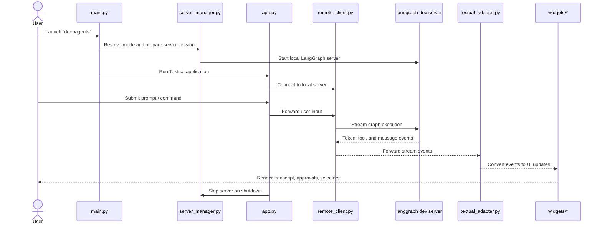
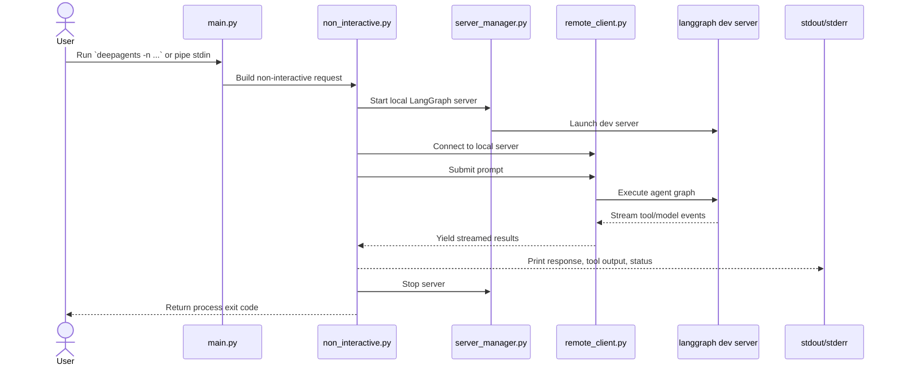
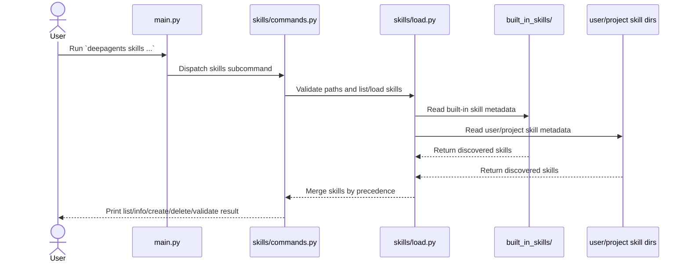

# deepagents-cli Architecture

## Purpose
This document explains how the `libs/cli` package is structured, how its major runtime flows work, and where to start when you need to change behavior. It complements `README.md`, `THREAT_MODEL.md`, and the hierarchical `AGENTS.md` files.

## Package Boundary
`libs/cli` is the package root for the published `deepagents-cli` distribution.

It contains:
- Shipped runtime code in `deepagents_cli/`
- Validation in `tests/`
- Example extension material in `examples/`
- Developer/install scripts in `scripts/`

The package depends heavily on the sibling `libs/deepagents` SDK, but the CLI-specific orchestration, UI, persistence, and extension wiring live here.

## Top-Level Layout

| Path | Role |
|------|------|
| `pyproject.toml` | Packaging metadata, dependency graph, lint/test/type-check settings |
| `Makefile` | Canonical developer commands |
| `deepagents_cli/` | Shipped runtime package |
| `tests/` | Unit/integration/benchmark coverage |
| `examples/` | Example skill assets and patterns |
| `scripts/` | Installer and developer utilities |

## Runtime Layers

### 1. Entry and Mode Dispatch
`deepagents_cli/main.py` is the top-level boundary from shell invocation into the runtime.

It is responsible for:
- Dependency checks
- CLI argument parsing
- Deciding between interactive TUI mode, ACP mode, and non-interactive mode
- Building the minimal startup configuration before heavier modules are imported

This file intentionally uses deferred imports so fast-path commands like `--help` and `--version` stay cheap.

### 2. Runtime Modes

#### Interactive TUI
- `deepagents_cli/app.py` runs the Textual application
- `deepagents_cli/widgets/` renders all user-facing UI
- `deepagents_cli/textual_adapter.py` translates stream events into widget updates

#### Non-interactive
- `deepagents_cli/non_interactive.py` runs one prompt, streams to stdout/stderr, and exits with a status code

#### ACP mode
- `main.py` also supports ACP server mode for protocol-driven external clients

All three modes converge on the same local LangGraph-backed execution boundary described below.

### 3. Agent Assembly
`deepagents_cli/agent.py` assembles the actual CLI agent.

It wires together:
- Model creation
- Base tools and CLI-specific tools
- Memory, skills, and subagents
- HITL approval middleware
- Optional sandbox integrations
- Local context collection

This file is the main “policy assembly” layer for what the CLI agent can do.

### 4. Local LangGraph Server Boundary
The CLI does not run the full graph inline in the TUI process.

Instead:
1. `deepagents_cli/server_manager.py` prepares a temporary LangGraph workspace and startup configuration
2. `deepagents_cli/server.py` launches `langgraph dev`
3. `deepagents_cli/remote_client.py` connects back to that server over HTTP/SSE

This split gives the CLI a stable process boundary between UI/control flow and graph execution.

### 5. Configuration and Model Selection
Configuration is split across two layers:

- `deepagents_cli/config.py`
  - Runtime settings
  - Glyph/console helpers
  - Model bootstrap helpers
  - Shell allow-list and safety checks
- `deepagents_cli/model_config.py`
  - Persistent TOML-backed model preferences
  - Provider profile loading
  - UI preference persistence around models and thread-table settings

The practical rule is:
- `config.py` is for live runtime behavior
- `model_config.py` is for persisted user configuration and profile metadata

### 6. State and Persistence
`deepagents_cli/sessions.py` is the session/thread metadata layer.

It does not run the graph itself. Instead, it:
- Reads checkpoint-derived metadata from SQLite
- Formats thread rows for the UI and CLI
- Generates thread IDs
- Maintains caches for message counts and recent threads

This is the main bridge between persisted LangGraph state and user-visible thread navigation.

### 7. UI Layer
The Textual UI is intentionally decomposed:

| Module area | Main responsibility |
|-------------|---------------------|
| `widgets/chat_input.py` | Input, completion, history, paste heuristics |
| `widgets/messages.py` | Transcript rendering |
| `widgets/thread_selector.py` | Thread browsing/resume/delete |
| `widgets/model_selector.py` | Model switching UI |
| `widgets/approval.py` | HITL approval UI |
| `widgets/ask_user.py` | Structured user question prompts |
| `widgets/message_store.py` | Virtualized transcript backing store |

`app.py` coordinates these pieces, but the local state and behavior live mostly in the individual widget modules.

### 8. Extensibility Surface
The CLI exposes several extension axes:

- Skills
  - `deepagents_cli/skills/`
  - `deepagents_cli/built_in_skills/`
- MCP
  - `deepagents_cli/mcp_tools.py`
  - `deepagents_cli/mcp_trust.py`
- Subagents and local context
  - `deepagents_cli/subagents.py`
  - `deepagents_cli/local_context.py`
- Sandbox integrations
  - `deepagents_cli/integrations/`
- Hooks
  - `deepagents_cli/hooks.py`

If a task is about “how users extend the CLI”, this is the part of the package to start from.

## Main Execution Flows

### Mermaid Sequence Diagrams

#### Interactive TUI Sequence

#### Non-interactive Sequence

#### Skill Management Sequence

### Interactive TUI Flow
1. `main.py` parses args and resolves startup settings
2. `server_manager.py` prepares the local LangGraph server session
3. `app.py` starts the Textual app
4. `remote_client.py` streams graph events from the server
5. `textual_adapter.py` converts events into UI updates
6. `widgets/*` render the transcript, approval prompts, and selector modals
7. `sessions.py` provides thread metadata when the user browses history

### Non-interactive Flow
1. `main.py` receives `-n` or piped stdin
2. `non_interactive.py` builds the request loop
3. The local server is started the same way as interactive mode
4. `remote_client.py` streams tool/model output to stdout/stderr
5. Exit code reflects success/failure

### Skill Management Flow
1. `main.py` routes to the skills subcommand
2. `deepagents_cli/skills/commands.py` validates intent and paths
3. `deepagents_cli/skills/load.py` discovers built-in, user, and project skills in precedence order

## Where To Start For Common Tasks

| Task | Best entrypoint |
|------|-----------------|
| Add/change a CLI flag | `deepagents_cli/main.py` |
| Change interactive UI behavior | `deepagents_cli/app.py` plus the relevant widget file |
| Change stream rendering or token handling | `deepagents_cli/textual_adapter.py` |
| Change tool approval logic | `deepagents_cli/agent.py`, `deepagents_cli/widgets/approval.py` |
| Change model/provider configuration | `deepagents_cli/config.py`, `deepagents_cli/model_config.py` |
| Change thread persistence or `/threads` UI | `deepagents_cli/sessions.py`, `deepagents_cli/widgets/thread_selector.py` |
| Change skill discovery/commands | `deepagents_cli/skills/` |
| Change MCP behavior | `deepagents_cli/mcp_tools.py`, `deepagents_cli/mcp_trust.py` |

## Test Strategy

### Unit tests
`tests/unit_tests/` mirrors the runtime package closely. This is the main place to validate behavior changes.

### Integration tests
`tests/integration_tests/` covers ACP mode, sandbox behavior, and resume flows that cross real process/provider boundaries.

### Benchmarks
`tests/integration_tests/benchmarks/` protects startup speed and import laziness.

## Related Documents
- `AGENTS.md`: package-level AI-readable guidance
- `THREAT_MODEL.md`: trust boundaries and security perspective
- `DEV.md`: Textual live-reload workflow
- `COMMENTING_GUIDE.ko.md`: Korean reading guide for the code-commenting pass
